# CamFlow LSM hooks coverage

Automatically generated do not edit!

We build uppon [INRIA tools](http://kayrebt.gforge.inria.fr/).

The following hooks are ignored in this report: ["audit_rule_init", "audit_rule_match", "capable", "capable_noaudit", "capget", "capset", "cred_getsecid", "file_alloc", "file_free", "inode_getsecid", "ipc_getsecid", "path_chmod", "path_chown", "path_chroot", "path_link", "path_mkdir", "path_mknod", "path_rename", "path_rmdir", "path_symlink", "path_truncate", "path_unlink", "prepare_creds", "release_secctx", "secid_to_secctx", "sk_free", "task_getsecid"]

System Call|Hooks Called|Hooks Implemented|Hooks Not Implemented|Coverage (implemented / total)| Model |
-----------|------------|-----------------|---------------------|------------------------------|-------|
__x64_sys_open|["file_open", "file_send_sigiotask", "inode_create", "inode_follow_link", "inode_free", "inode_killpriv", "inode_need_killpriv", "inode_permission", "inode_setattr", "kernel_module_request", "sb_free", "task_free"]|["file_open", "file_send_sigiotask", "inode_create", "inode_free", "inode_permission", "inode_setattr", "sb_free", "task_free"]|["inode_follow_link", "inode_killpriv", "inode_need_killpriv", "kernel_module_request"]|8/12|  |
__x64_sys_openat|["file_open", "file_send_sigiotask", "inode_create", "inode_follow_link", "inode_free", "inode_killpriv", "inode_need_killpriv", "inode_permission", "inode_setattr", "kernel_module_request", "sb_free", "task_free"]|["file_open", "file_send_sigiotask", "inode_create", "inode_free", "inode_permission", "inode_setattr", "sb_free", "task_free"]|["inode_follow_link", "inode_killpriv", "inode_need_killpriv", "kernel_module_request"]|8/12|  |
__x64_sys_execve|["bprm_check", "bprm_set_creds", "file_open", "file_permission", "file_send_sigiotask", "inode_create", "inode_follow_link", "inode_free", "inode_killpriv", "inode_need_killpriv", "inode_permission", "inode_setattr", "kernel_module_request", "mmap_addr", "mmap_munmap", "sb_free", "socket_sock_rcv_skb", "task_free", "vm_enough_memory_mm"]|["bprm_check", "bprm_set_creds", "file_open", "file_permission", "file_send_sigiotask", "inode_create", "inode_free", "inode_permission", "inode_setattr", "mmap_munmap", "sb_free", "socket_sock_rcv_skb", "task_free"]|["inode_follow_link", "inode_killpriv", "inode_need_killpriv", "kernel_module_request", "mmap_addr", "vm_enough_memory_mm"]|13/19|  |
__x64_sys_execveat|["bprm_check", "bprm_set_creds", "file_open", "file_permission", "file_send_sigiotask", "inode_create", "inode_follow_link", "inode_free", "inode_killpriv", "inode_need_killpriv", "inode_permission", "inode_setattr", "kernel_module_request", "mmap_addr", "mmap_munmap", "sb_free", "socket_sock_rcv_skb", "task_free", "vm_enough_memory_mm"]|["bprm_check", "bprm_set_creds", "file_open", "file_permission", "file_send_sigiotask", "inode_create", "inode_free", "inode_permission", "inode_setattr", "mmap_munmap", "sb_free", "socket_sock_rcv_skb", "task_free"]|["inode_follow_link", "inode_killpriv", "inode_need_killpriv", "kernel_module_request", "mmap_addr", "vm_enough_memory_mm"]|13/19|  |
__x64_sys_fork|["d_instantiate", "file_send_sigiotask", "inode_alloc", "inode_free", "key_alloc", "mmap_addr", "mmap_munmap", "sb_copy_data", "sb_free", "sb_kern_mount", "socket_sock_rcv_skb", "task_alloc", "task_free", "vm_enough_memory_mm"]|["file_send_sigiotask", "inode_alloc", "inode_free", "mmap_munmap", "sb_free", "socket_sock_rcv_skb", "task_alloc", "task_free"]|["d_instantiate", "key_alloc", "mmap_addr", "sb_copy_data", "sb_kern_mount", "vm_enough_memory_mm"]|8/14|  |
__x64_sys_vfork|["d_instantiate", "file_send_sigiotask", "inode_alloc", "inode_free", "key_alloc", "mmap_addr", "mmap_munmap", "sb_copy_data", "sb_free", "sb_kern_mount", "socket_sock_rcv_skb", "task_alloc", "task_free", "vm_enough_memory_mm"]|["file_send_sigiotask", "inode_alloc", "inode_free", "mmap_munmap", "sb_free", "socket_sock_rcv_skb", "task_alloc", "task_free"]|["d_instantiate", "key_alloc", "mmap_addr", "sb_copy_data", "sb_kern_mount", "vm_enough_memory_mm"]|8/14|  |
__x64_sys_clone|["d_instantiate", "file_send_sigiotask", "inode_alloc", "inode_free", "key_alloc", "mmap_addr", "mmap_munmap", "sb_copy_data", "sb_free", "sb_kern_mount", "socket_sock_rcv_skb", "task_alloc", "task_free", "vm_enough_memory_mm"]|["file_send_sigiotask", "inode_alloc", "inode_free", "mmap_munmap", "sb_free", "socket_sock_rcv_skb", "task_alloc", "task_free"]|["d_instantiate", "key_alloc", "mmap_addr", "sb_copy_data", "sb_kern_mount", "vm_enough_memory_mm"]|8/14| 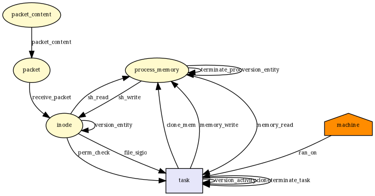 |
__x64_sys_unshare|["d_instantiate", "file_send_sigiotask", "inode_alloc", "inode_free", "sb_copy_data", "sb_free", "sb_kern_mount", "socket_sock_rcv_skb", "task_free"]|["file_send_sigiotask", "inode_alloc", "inode_free", "sb_free", "socket_sock_rcv_skb", "task_free"]|["d_instantiate", "sb_copy_data", "sb_kern_mount"]|6/9|  |
__x64_sys_dup3|["file_send_sigiotask", "inode_free", "task_free"]|["file_send_sigiotask", "inode_free", "task_free"]|[]|3/3|  |
__x64_sys_dup2|["file_send_sigiotask", "inode_free", "task_free"]|["file_send_sigiotask", "inode_free", "task_free"]|[]|3/3|  |
__x64_sys_dup|["file_send_sigiotask", "task_free"]|["file_send_sigiotask", "task_free"]|[]|2/2|  |
__x64_sys_sysfs|["file_send_sigiotask", "task_free"]|["file_send_sigiotask", "task_free"]|[]|2/2|  |
__x64_sys_ioctl|["file_ioctl", "file_permission", "file_send_sigiotask", "inode_free", "sb_free", "task_free"]|["file_ioctl", "file_permission", "file_send_sigiotask", "inode_free", "sb_free", "task_free"]|[]|6/6|  |
__x64_sys_flock|["file_lock", "file_send_sigiotask", "task_free"]|["file_lock", "file_send_sigiotask", "task_free"]|[]|3/3| 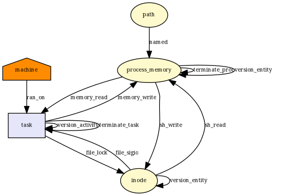 |
__x64_sys_mknodat|["file_send_sigiotask", "inode_create", "inode_follow_link", "inode_free", "inode_mknod", "inode_permission", "sb_free", "task_free"]|["file_send_sigiotask", "inode_create", "inode_free", "inode_permission", "sb_free", "task_free"]|["inode_follow_link", "inode_mknod"]|6/8|  |
__x64_sys_mknod|["file_send_sigiotask", "inode_create", "inode_follow_link", "inode_free", "inode_mknod", "inode_permission", "sb_free", "task_free"]|["file_send_sigiotask", "inode_create", "inode_free", "inode_permission", "sb_free", "task_free"]|["inode_follow_link", "inode_mknod"]|6/8|  |
__x64_sys_mkdir|["file_send_sigiotask", "inode_follow_link", "inode_free", "inode_mkdir", "inode_permission", "sb_free", "task_free"]|["file_send_sigiotask", "inode_free", "inode_permission", "sb_free", "task_free"]|["inode_follow_link", "inode_mkdir"]|5/7|  |
__x64_sys_mkdirat|["file_send_sigiotask", "inode_follow_link", "inode_free", "inode_mkdir", "inode_permission", "sb_free", "task_free"]|["file_send_sigiotask", "inode_free", "inode_permission", "sb_free", "task_free"]|["inode_follow_link", "inode_mkdir"]|5/7|  |
__x64_sys_rmdir|["file_send_sigiotask", "inode_follow_link", "inode_free", "inode_permission", "inode_rmdir", "sb_free", "task_free"]|["file_send_sigiotask", "inode_free", "inode_permission", "sb_free", "task_free"]|["inode_follow_link", "inode_rmdir"]|5/7|  |
__x64_sys_unlinkat|["file_send_sigiotask", "inode_follow_link", "inode_free", "inode_permission", "inode_rmdir", "inode_unlink", "sb_free", "task_free"]|["file_send_sigiotask", "inode_free", "inode_permission", "inode_unlink", "sb_free", "task_free"]|["inode_follow_link", "inode_rmdir"]|6/8|  |
__x64_sys_unlink|["file_send_sigiotask", "inode_follow_link", "inode_free", "inode_permission", "inode_unlink", "sb_free", "task_free"]|["file_send_sigiotask", "inode_free", "inode_permission", "inode_unlink", "sb_free", "task_free"]|["inode_follow_link"]|6/7|  |
__x64_sys_symlinkat|["file_send_sigiotask", "inode_follow_link", "inode_free", "inode_permission", "inode_symlink", "sb_free", "task_free"]|["file_send_sigiotask", "inode_free", "inode_permission", "inode_symlink", "sb_free", "task_free"]|["inode_follow_link"]|6/7|  |
__x64_sys_symlink|["file_send_sigiotask", "inode_follow_link", "inode_free", "inode_permission", "inode_symlink", "sb_free", "task_free"]|["file_send_sigiotask", "inode_free", "inode_permission", "inode_symlink", "sb_free", "task_free"]|["inode_follow_link"]|6/7|  |
__x64_sys_linkat|["file_send_sigiotask", "inode_follow_link", "inode_free", "inode_link", "inode_permission", "sb_free", "task_free"]|["file_send_sigiotask", "inode_free", "inode_link", "inode_permission", "sb_free", "task_free"]|["inode_follow_link"]|6/7|  |
__x64_sys_link|["file_send_sigiotask", "inode_follow_link", "inode_free", "inode_link", "inode_permission", "sb_free", "task_free"]|["file_send_sigiotask", "inode_free", "inode_link", "inode_permission", "sb_free", "task_free"]|["inode_follow_link"]|6/7|  |
__x64_sys_renameat2|["file_send_sigiotask", "inode_follow_link", "inode_free", "inode_permission", "inode_rename", "sb_free", "task_free"]|["file_send_sigiotask", "inode_free", "inode_permission", "inode_rename", "sb_free", "task_free"]|["inode_follow_link"]|6/7|  |
__x64_sys_renameat|["file_send_sigiotask", "inode_follow_link", "inode_free", "inode_permission", "inode_rename", "sb_free", "task_free"]|["file_send_sigiotask", "inode_free", "inode_permission", "inode_rename", "sb_free", "task_free"]|["inode_follow_link"]|6/7|  |
__x64_sys_rename|["file_send_sigiotask", "inode_follow_link", "inode_free", "inode_permission", "inode_rename", "sb_free", "task_free"]|["file_send_sigiotask", "inode_free", "inode_permission", "inode_rename", "sb_free", "task_free"]|["inode_follow_link"]|6/7|  |
__x64_sys_lseek|["file_send_sigiotask", "task_free"]|["file_send_sigiotask", "task_free"]|[]|2/2|  |
__x64_sys_llseek|["file_send_sigiotask", "task_free"]|["file_send_sigiotask", "task_free"]|[]|2/2|  |
__x64_sys_read|["file_permission", "file_send_sigiotask", "inode_free", "task_free"]|["file_permission", "file_send_sigiotask", "inode_free", "task_free"]|[]|4/4|  |
__x64_sys_write|["file_permission", "file_send_sigiotask", "inode_free", "task_free"]|["file_permission", "file_send_sigiotask", "inode_free", "task_free"]|[]|4/4|  |
__x64_sys_truncate|["file_send_sigiotask", "inode_follow_link", "inode_free", "inode_killpriv", "inode_need_killpriv", "inode_permission", "inode_setattr", "sb_free", "task_free"]|["file_send_sigiotask", "inode_free", "inode_permission", "inode_setattr", "sb_free", "task_free"]|["inode_follow_link", "inode_killpriv", "inode_need_killpriv"]|6/9|  |
__x64_sys_ftruncate|["file_send_sigiotask", "inode_free", "inode_killpriv", "inode_need_killpriv", "inode_permission", "inode_setattr", "task_free"]|["file_send_sigiotask", "inode_free", "inode_permission", "inode_setattr", "task_free"]|["inode_killpriv", "inode_need_killpriv"]|5/7|  |
__x64_sys_fallocate|["file_permission", "file_send_sigiotask", "inode_free", "task_free"]|["file_permission", "file_send_sigiotask", "inode_free", "task_free"]|[]|4/4|  |
__x64_sys_creat|["file_open", "file_send_sigiotask", "inode_create", "inode_follow_link", "inode_free", "inode_killpriv", "inode_need_killpriv", "inode_permission", "inode_setattr", "kernel_module_request", "sb_free", "task_free"]|["file_open", "file_send_sigiotask", "inode_create", "inode_free", "inode_permission", "inode_setattr", "sb_free", "task_free"]|["inode_follow_link", "inode_killpriv", "inode_need_killpriv", "kernel_module_request"]|8/12|  |
__x64_sys_close|["file_send_sigiotask", "inode_free", "task_free"]|["file_send_sigiotask", "inode_free", "task_free"]|[]|3/3|  |
__x64_sys_access|["file_send_sigiotask", "inode_follow_link", "inode_free", "inode_permission", "sb_free", "task_free"]|["file_send_sigiotask", "inode_free", "inode_permission", "sb_free", "task_free"]|["inode_follow_link"]|5/6|  |
__x64_sys_faccessat|["file_send_sigiotask", "inode_follow_link", "inode_free", "inode_permission", "sb_free", "task_free"]|["file_send_sigiotask", "inode_free", "inode_permission", "sb_free", "task_free"]|["inode_follow_link"]|5/6| 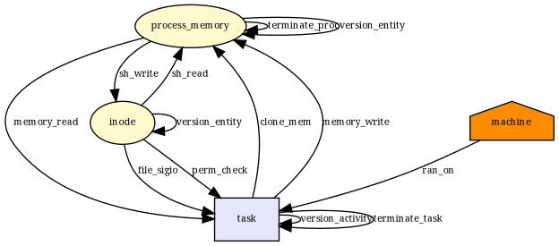 |
__x64_sys_chdir|["file_send_sigiotask", "inode_follow_link", "inode_free", "inode_permission", "sb_free", "task_free"]|["file_send_sigiotask", "inode_free", "inode_permission", "sb_free", "task_free"]|["inode_follow_link"]|5/6|  |
__x64_sys_fchdir|["file_send_sigiotask", "inode_free", "inode_permission", "sb_free", "task_free"]|["file_send_sigiotask", "inode_free", "inode_permission", "sb_free", "task_free"]|[]|5/5|  |
__x64_sys_chroot|["file_send_sigiotask", "inode_follow_link", "inode_free", "inode_permission", "sb_free", "task_free"]|["file_send_sigiotask", "inode_free", "inode_permission", "sb_free", "task_free"]|["inode_follow_link"]|5/6|  |
__x64_sys_fchmod|["file_send_sigiotask", "inode_free", "inode_killpriv", "inode_need_killpriv", "inode_permission", "inode_setattr", "task_free"]|["file_send_sigiotask", "inode_free", "inode_permission", "inode_setattr", "task_free"]|["inode_killpriv", "inode_need_killpriv"]|5/7|  |
__x64_sys_fchmodat|["file_send_sigiotask", "inode_follow_link", "inode_free", "inode_killpriv", "inode_need_killpriv", "inode_permission", "inode_setattr", "sb_free", "task_free"]|["file_send_sigiotask", "inode_free", "inode_permission", "inode_setattr", "sb_free", "task_free"]|["inode_follow_link", "inode_killpriv", "inode_need_killpriv"]|6/9|  |
__x64_sys_chmod|["file_send_sigiotask", "inode_follow_link", "inode_free", "inode_killpriv", "inode_need_killpriv", "inode_permission", "inode_setattr", "sb_free", "task_free"]|["file_send_sigiotask", "inode_free", "inode_permission", "inode_setattr", "sb_free", "task_free"]|["inode_follow_link", "inode_killpriv", "inode_need_killpriv"]|6/9|  |
__x64_sys_chown|["file_send_sigiotask", "inode_follow_link", "inode_free", "inode_killpriv", "inode_need_killpriv", "inode_permission", "inode_setattr", "sb_free", "task_free"]|["file_send_sigiotask", "inode_free", "inode_permission", "inode_setattr", "sb_free", "task_free"]|["inode_follow_link", "inode_killpriv", "inode_need_killpriv"]|6/9|  |
__x64_sys_lchown|["file_send_sigiotask", "inode_follow_link", "inode_free", "inode_killpriv", "inode_need_killpriv", "inode_permission", "inode_setattr", "sb_free", "task_free"]|["file_send_sigiotask", "inode_free", "inode_permission", "inode_setattr", "sb_free", "task_free"]|["inode_follow_link", "inode_killpriv", "inode_need_killpriv"]|6/9|  |
__x64_sys_lchown16|["file_send_sigiotask", "inode_follow_link", "inode_free", "inode_killpriv", "inode_need_killpriv", "inode_permission", "inode_setattr", "sb_free", "task_free"]|["file_send_sigiotask", "inode_free", "inode_permission", "inode_setattr", "sb_free", "task_free"]|["inode_follow_link", "inode_killpriv", "inode_need_killpriv"]|6/9|  |
__x64_sys_fchownat|["file_send_sigiotask", "inode_follow_link", "inode_free", "inode_killpriv", "inode_need_killpriv", "inode_permission", "inode_setattr", "sb_free", "task_free"]|["file_send_sigiotask", "inode_free", "inode_permission", "inode_setattr", "sb_free", "task_free"]|["inode_follow_link", "inode_killpriv", "inode_need_killpriv"]|6/9|  |
__x64_sys_fchown|["file_send_sigiotask", "inode_free", "inode_killpriv", "inode_need_killpriv", "inode_permission", "inode_setattr", "task_free"]|["file_send_sigiotask", "inode_free", "inode_permission", "inode_setattr", "task_free"]|["inode_killpriv", "inode_need_killpriv"]|5/7|  |
__x64_sys_chown16|["file_send_sigiotask", "inode_follow_link", "inode_free", "inode_killpriv", "inode_need_killpriv", "inode_permission", "inode_setattr", "sb_free", "task_free"]|["file_send_sigiotask", "inode_free", "inode_permission", "inode_setattr", "sb_free", "task_free"]|["inode_follow_link", "inode_killpriv", "inode_need_killpriv"]|6/9|  |
__x64_sys_fchown16|["file_send_sigiotask", "inode_free", "inode_killpriv", "inode_need_killpriv", "inode_permission", "inode_setattr", "task_free"]|["file_send_sigiotask", "inode_free", "inode_permission", "inode_setattr", "task_free"]|["inode_killpriv", "inode_need_killpriv"]|5/7|  |
__x64_sys_pipe|["d_instantiate", "file_send_sigiotask", "inode_alloc", "inode_free", "sb_free", "task_free"]|["file_send_sigiotask", "inode_alloc", "inode_free", "sb_free", "task_free"]|["d_instantiate"]|5/6|  |
__x64_sys_pipe2|["d_instantiate", "file_send_sigiotask", "inode_alloc", "inode_free", "sb_free", "task_free"]|["file_send_sigiotask", "inode_alloc", "inode_free", "sb_free", "task_free"]|["d_instantiate"]|5/6|  |
__x64_sys_pread64|["file_permission", "file_send_sigiotask", "inode_free", "task_free"]|["file_permission", "file_send_sigiotask", "inode_free", "task_free"]|[]|4/4|  |
__x64_sys_pwrite64|["file_permission", "file_send_sigiotask", "inode_free", "task_free"]|["file_permission", "file_send_sigiotask", "inode_free", "task_free"]|[]|4/4|  |
__x64_sys_readv|["file_permission", "file_send_sigiotask", "inode_free", "task_free"]|["file_permission", "file_send_sigiotask", "inode_free", "task_free"]|[]|4/4|  |
__x64_sys_writev|["file_permission", "file_send_sigiotask", "inode_free", "task_free"]|["file_permission", "file_send_sigiotask", "inode_free", "task_free"]|[]|4/4|  |
__x64_sys_preadv|["file_permission", "file_send_sigiotask", "inode_free", "task_free"]|["file_permission", "file_send_sigiotask", "inode_free", "task_free"]|[]|4/4|  |
__x64_sys_preadv2|["file_permission", "file_send_sigiotask", "inode_free", "task_free"]|["file_permission", "file_send_sigiotask", "inode_free", "task_free"]|[]|4/4|  |
__x64_sys_pwritev|["file_permission", "file_send_sigiotask", "inode_free", "task_free"]|["file_permission", "file_send_sigiotask", "inode_free", "task_free"]|[]|4/4|  |
__x64_sys_pwritev2|["file_permission", "file_send_sigiotask", "inode_free", "task_free"]|["file_permission", "file_send_sigiotask", "inode_free", "task_free"]|[]|4/4|  |
__x64_sys_sendfile|["file_permission", "file_send_sigiotask", "inode_free", "task_free"]|["file_permission", "file_send_sigiotask", "inode_free", "task_free"]|[]|4/4|  |
__x64_sys_sendfile64|["file_permission", "file_send_sigiotask", "inode_free", "task_free"]|["file_permission", "file_send_sigiotask", "inode_free", "task_free"]|[]|4/4|  |
__x64_sys_copy_file_range|["file_permission", "file_send_sigiotask", "inode_free", "task_free"]|["file_permission", "file_send_sigiotask", "inode_free", "task_free"]|[]|4/4|  |
__x64_sys_select|["file_send_sigiotask", "task_free"]|["file_send_sigiotask", "task_free"]|[]|2/2|  |
__x64_sys_pselect6|["file_send_sigiotask", "task_free"]|["file_send_sigiotask", "task_free"]|[]|2/2|  |
__x64_sys_poll|["file_send_sigiotask", "task_free"]|["file_send_sigiotask", "task_free"]|[]|2/2|  |
__x64_sys_ppoll|["file_send_sigiotask", "task_free"]|["file_send_sigiotask", "task_free"]|[]|2/2|  |
__x64_sys_umount|["file_send_sigiotask", "inode_follow_link", "inode_free", "inode_permission", "sb_free", "sb_umount", "task_free"]|["file_send_sigiotask", "inode_free", "inode_permission", "sb_free", "task_free"]|["inode_follow_link", "sb_umount"]|5/7|  |
__x64_sys_mount|["file_send_sigiotask", "inode_follow_link", "inode_free", "inode_permission", "kernel_module_request", "sb_copy_data", "sb_free", "sb_kern_mount", "sb_mount", "sb_remount", "task_free"]|["file_send_sigiotask", "inode_free", "inode_permission", "sb_free", "task_free"]|["inode_follow_link", "kernel_module_request", "sb_copy_data", "sb_kern_mount", "sb_mount", "sb_remount"]|5/11|  |
__x64_sys_pivot_root|["file_send_sigiotask", "inode_follow_link", "inode_free", "inode_permission", "sb_free", "sb_pivotroot", "task_free"]|["file_send_sigiotask", "inode_free", "inode_permission", "sb_free", "task_free"]|["inode_follow_link", "sb_pivotroot"]|5/7|  |
__x64_sys_delete_module|["file_send_sigiotask", "task_free"]|["file_send_sigiotask", "task_free"]|[]|2/2|  |
__x64_sys_init_module|["file_send_sigiotask", "kernel_load_data", "kernel_module_request", "key_permission", "socket_sock_rcv_skb", "task_free"]|["file_send_sigiotask", "socket_sock_rcv_skb", "task_free"]|["kernel_load_data", "kernel_module_request", "key_permission"]|3/6|  |
__x64_sys_finit_module|["file_permission", "file_send_sigiotask", "inode_free", "kernel_module_request", "kernel_post_read_file", "kernel_read_file", "key_permission", "socket_sock_rcv_skb", "task_free"]|["file_permission", "file_send_sigiotask", "inode_free", "socket_sock_rcv_skb", "task_free"]|["kernel_module_request", "kernel_post_read_file", "kernel_read_file", "key_permission"]|5/9| 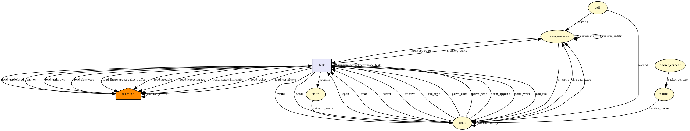 |
__x64_sys_setpriority|["file_send_sigiotask", "task_free", "task_setnice"]|["file_send_sigiotask", "task_free"]|["task_setnice"]|2/3|  |
__x64_sys_getpriority|["file_send_sigiotask", "task_free"]|["file_send_sigiotask", "task_free"]|[]|2/2|  |
__x64_sys_setregid|["file_send_sigiotask", "socket_sock_rcv_skb", "task_free"]|["file_send_sigiotask", "socket_sock_rcv_skb", "task_free"]|[]|3/3|  |
__x64_sys_setgid|["file_send_sigiotask", "socket_sock_rcv_skb", "task_free"]|["file_send_sigiotask", "socket_sock_rcv_skb", "task_free"]|[]|3/3|  |
__x64_sys_setreuid|["file_send_sigiotask", "socket_sock_rcv_skb", "task_fix_setuid", "task_free"]|["file_send_sigiotask", "socket_sock_rcv_skb", "task_fix_setuid", "task_free"]|[]|4/4|  |
__x64_sys_setuid|["file_send_sigiotask", "socket_sock_rcv_skb", "task_fix_setuid", "task_free"]|["file_send_sigiotask", "socket_sock_rcv_skb", "task_fix_setuid", "task_free"]|[]|4/4|  |
__x64_sys_setresuid|["file_send_sigiotask", "socket_sock_rcv_skb", "task_fix_setuid", "task_free"]|["file_send_sigiotask", "socket_sock_rcv_skb", "task_fix_setuid", "task_free"]|[]|4/4|  |
__x64_sys_getresuid|[]|[]|[]|0/0|  |
__x64_sys_setresgid|["file_send_sigiotask", "socket_sock_rcv_skb", "task_free"]|["file_send_sigiotask", "socket_sock_rcv_skb", "task_free"]|[]|3/3|  |
__x64_sys_getresgid|[]|[]|[]|0/0|  |
__x64_sys_setfsuid|["file_send_sigiotask", "socket_sock_rcv_skb", "task_fix_setuid", "task_free"]|["file_send_sigiotask", "socket_sock_rcv_skb", "task_fix_setuid", "task_free"]|[]|4/4|  |
__x64_sys_setfsgid|["file_send_sigiotask", "socket_sock_rcv_skb", "task_free"]|["file_send_sigiotask", "socket_sock_rcv_skb", "task_free"]|[]|3/3|  |
__x64_sys_getpid|[]|[]|[]|0/0|  |
__x64_sys_gettid|[]|[]|[]|0/0|  |
__x64_sys_getppid|[]|[]|[]|0/0|  |
__x64_sys_getuid|[]|[]|[]|0/0|  |
__x64_sys_geteuid|[]|[]|[]|0/0|  |
__x64_sys_getgid|[]|[]|[]|0/0|  |
__x64_sys_getegid|[]|[]|[]|0/0|  |
__x64_sys_times|["file_send_sigiotask", "task_free"]|["file_send_sigiotask", "task_free"]|[]|2/2|  |
__x64_sys_utimes|["file_send_sigiotask", "inode_follow_link", "inode_free", "inode_killpriv", "inode_need_killpriv", "inode_permission", "inode_setattr", "sb_free", "task_free"]|["file_send_sigiotask", "inode_free", "inode_permission", "inode_setattr", "sb_free", "task_free"]|["inode_follow_link", "inode_killpriv", "inode_need_killpriv"]|6/9|  |
__x64_sys_setpgid|["file_send_sigiotask", "task_free", "task_setpgid"]|["file_send_sigiotask", "task_free", "task_setpgid"]|[]|3/3|  |
__x64_sys_getpgid|["task_getpgid"]|["task_getpgid"]|[]|1/1|  |
__x64_sys_getpgrp|["task_getpgid"]|["task_getpgid"]|[]|1/1|  |
__x64_sys_getsid|["task_getsid"]|[]|["task_getsid"]|0/1|  |
__x64_sys_setsid|["file_send_sigiotask", "socket_sock_rcv_skb", "task_free"]|["file_send_sigiotask", "socket_sock_rcv_skb", "task_free"]|[]|3/3|  |
__x64_sys_newuname|["file_send_sigiotask", "task_free"]|["file_send_sigiotask", "task_free"]|[]|2/2|  |
__x64_sys_uname|["file_send_sigiotask", "task_free"]|["file_send_sigiotask", "task_free"]|[]|2/2|  |
__x64_sys_sethostname|["file_send_sigiotask", "task_free"]|["file_send_sigiotask", "task_free"]|[]|2/2|  |
__x64_sys_gethostname|["file_send_sigiotask", "task_free"]|["file_send_sigiotask", "task_free"]|[]|2/2|  |
__x64_sys_setdomainname|["file_send_sigiotask", "task_free"]|["file_send_sigiotask", "task_free"]|[]|2/2|  |
__x64_sys_setrlimit|["file_send_sigiotask", "task_free", "task_setrlimit"]|["file_send_sigiotask", "task_free"]|["task_setrlimit"]|2/3|  |
__x64_sys_getrusage|["file_send_sigiotask", "inode_free", "mmap_addr", "mmap_munmap", "task_free", "vm_enough_memory_mm"]|["file_send_sigiotask", "inode_free", "mmap_munmap", "task_free"]|["mmap_addr", "vm_enough_memory_mm"]|4/6|  |
__x64_sys_umask|[]|[]|[]|0/0|  |
__x64_sys_prctl|["file_send_sigiotask", "inode_permission", "socket_sock_rcv_skb", "task_free", "task_prctl"]|["file_send_sigiotask", "inode_permission", "socket_sock_rcv_skb", "task_free"]|["task_prctl"]|4/5|  |
__x64_sys_getcpu|[]|[]|[]|0/0|  |
__x64_sys_sysinfo|["file_send_sigiotask", "task_free"]|["file_send_sigiotask", "task_free"]|[]|2/2|  |
__x64_sys_iopl|["file_send_sigiotask", "task_free"]|["file_send_sigiotask", "task_free"]|[]|2/2|  |
__x64_sys_ioperm|["file_send_sigiotask", "task_free"]|["file_send_sigiotask", "task_free"]|[]|2/2|  |
__x64_sys_mprotect|["file_mprotect", "file_send_sigiotask", "inode_free", "mmap_addr", "task_free", "vm_enough_memory_mm"]|["file_send_sigiotask", "inode_free", "task_free"]|["file_mprotect", "mmap_addr", "vm_enough_memory_mm"]|3/6|  |
__x64_sys_pkey_mprotect|["file_mprotect", "file_send_sigiotask", "inode_free", "mmap_addr", "task_free", "vm_enough_memory_mm"]|["file_send_sigiotask", "inode_free", "task_free"]|["file_mprotect", "mmap_addr", "vm_enough_memory_mm"]|3/6|  |
__x64_sys_pkey_alloc|["file_send_sigiotask", "task_free"]|["file_send_sigiotask", "task_free"]|[]|2/2|  |
__x64_sys_pkey_free|["file_send_sigiotask", "task_free"]|["file_send_sigiotask", "task_free"]|[]|2/2|  |
__x64_sys_capget|["file_send_sigiotask", "task_free"]|["file_send_sigiotask", "task_free"]|[]|2/2|  |
__x64_sys_capset|["file_send_sigiotask", "socket_sock_rcv_skb", "task_free"]|["file_send_sigiotask", "socket_sock_rcv_skb", "task_free"]|[]|3/3|  |
__x64_sys_brk|["file_send_sigiotask", "inode_free", "mmap_addr", "mmap_munmap", "task_free", "vm_enough_memory_mm"]|["file_send_sigiotask", "inode_free", "mmap_munmap", "task_free"]|["mmap_addr", "vm_enough_memory_mm"]|4/6|  |
__x64_sys_mmap_pgoff|["d_instantiate", "file_send_sigiotask", "inode_alloc", "inode_free", "kernel_module_request", "mmap_addr", "mmap_file", "mmap_munmap", "sb_free", "task_free", "vm_enough_memory_mm"]|["file_send_sigiotask", "inode_alloc", "inode_free", "mmap_file", "mmap_munmap", "sb_free", "task_free"]|["d_instantiate", "kernel_module_request", "mmap_addr", "vm_enough_memory_mm"]|7/11|  |
__x64_sys_munmap|["file_send_sigiotask", "inode_free", "mmap_addr", "mmap_munmap", "task_free", "vm_enough_memory_mm"]|["file_send_sigiotask", "inode_free", "mmap_munmap", "task_free"]|["mmap_addr", "vm_enough_memory_mm"]|4/6|  |
__x64_sys_remap_file_pages|["d_instantiate", "file_send_sigiotask", "inode_alloc", "inode_free", "mmap_addr", "mmap_munmap", "sb_free", "task_free", "vm_enough_memory_mm"]|["file_send_sigiotask", "inode_alloc", "inode_free", "mmap_munmap", "sb_free", "task_free"]|["d_instantiate", "mmap_addr", "vm_enough_memory_mm"]|6/9|  |
__x64_sys_mmap|["d_instantiate", "file_send_sigiotask", "inode_alloc", "inode_free", "kernel_module_request", "mmap_addr", "mmap_file", "mmap_munmap", "sb_free", "task_free", "vm_enough_memory_mm"]|["file_send_sigiotask", "inode_alloc", "inode_free", "mmap_file", "mmap_munmap", "sb_free", "task_free"]|["d_instantiate", "kernel_module_request", "mmap_addr", "vm_enough_memory_mm"]|7/11| 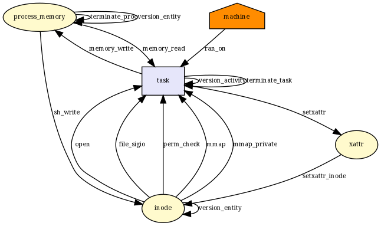 |
__x64_sys_msgsnd|["file_send_sigiotask", "ipc_permission", "msg_msg_alloc", "msg_msg_free", "msg_queue_msgrcv", "msg_queue_msgsnd", "task_free"]|["file_send_sigiotask", "msg_msg_alloc", "msg_msg_free", "msg_queue_msgrcv", "msg_queue_msgsnd", "task_free"]|["ipc_permission"]|6/7| 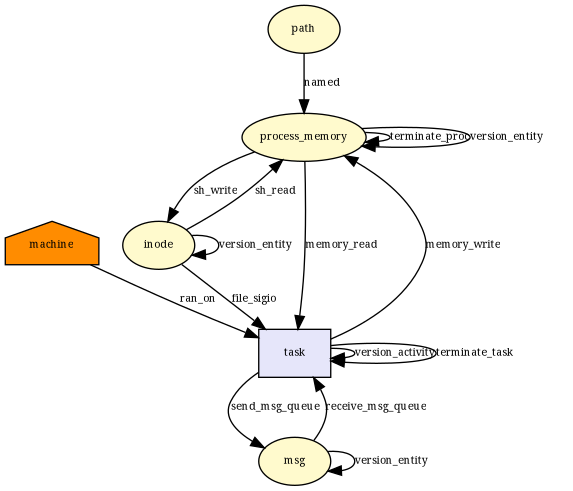 |
__x64_sys_msgrcv|["file_send_sigiotask", "ipc_permission", "msg_msg_alloc", "msg_msg_free", "msg_queue_msgrcv", "task_free"]|["file_send_sigiotask", "msg_msg_alloc", "msg_msg_free", "msg_queue_msgrcv", "task_free"]|["ipc_permission"]|5/6|  |
__x64_sys_msgget|["file_send_sigiotask", "ipc_permission", "task_free"]|["file_send_sigiotask", "task_free"]|["ipc_permission"]|2/3|  |
__x64_sys_msgctl|["file_send_sigiotask", "ipc_permission", "msg_msg_free", "msg_queue_msgctl", "task_free"]|["file_send_sigiotask", "msg_msg_free", "task_free"]|["ipc_permission", "msg_queue_msgctl"]|3/5|  |
__x64_sys_process_vm_readv|["file_send_sigiotask", "inode_free", "mmap_addr", "mmap_munmap", "ptrace_access_check", "task_free", "vm_enough_memory_mm"]|["file_send_sigiotask", "inode_free", "mmap_munmap", "task_free"]|["mmap_addr", "ptrace_access_check", "vm_enough_memory_mm"]|4/7|  |
__x64_sys_process_vm_writev|["file_send_sigiotask", "inode_free", "mmap_addr", "mmap_munmap", "ptrace_access_check", "task_free", "vm_enough_memory_mm"]|["file_send_sigiotask", "inode_free", "mmap_munmap", "task_free"]|["mmap_addr", "ptrace_access_check", "vm_enough_memory_mm"]|4/7|  |
__x64_sys_ptrace|["file_send_sigiotask", "inode_free", "mmap_addr", "mmap_munmap", "ptrace_access_check", "ptrace_traceme", "sb_free", "socket_sock_rcv_skb", "task_free", "vm_enough_memory_mm"]|["file_send_sigiotask", "inode_free", "mmap_munmap", "sb_free", "socket_sock_rcv_skb", "task_free"]|["mmap_addr", "ptrace_access_check", "ptrace_traceme", "vm_enough_memory_mm"]|6/10|  |
__x64_sys_shmget|["file_send_sigiotask", "ipc_permission", "task_free"]|["file_send_sigiotask", "task_free"]|["ipc_permission"]|2/3|  |
__x64_sys_shmctl|["file_send_sigiotask", "ipc_permission", "shm_shmctl", "task_free"]|["file_send_sigiotask", "task_free"]|["ipc_permission", "shm_shmctl"]|2/4|  |
__x64_sys_shmat|["d_instantiate", "file_send_sigiotask", "inode_alloc", "inode_free", "ipc_permission", "kernel_module_request", "mmap_addr", "mmap_file", "mmap_munmap", "sb_free", "shm_shmat", "task_free", "vm_enough_memory_mm"]|["file_send_sigiotask", "inode_alloc", "inode_free", "mmap_file", "mmap_munmap", "sb_free", "shm_shmat", "task_free"]|["d_instantiate", "ipc_permission", "kernel_module_request", "mmap_addr", "vm_enough_memory_mm"]|8/13|  |
__x64_sys_shmdt|["file_send_sigiotask", "inode_free", "mmap_addr", "mmap_munmap", "task_free", "vm_enough_memory_mm"]|["file_send_sigiotask", "inode_free", "mmap_munmap", "task_free"]|["mmap_addr", "vm_enough_memory_mm"]|4/6|  |
__x64_sys_vmsplice|["file_permission", "file_send_sigiotask", "inode_free", "mmap_addr", "task_free", "vm_enough_memory_mm"]|["file_permission", "file_send_sigiotask", "inode_free", "task_free"]|["mmap_addr", "vm_enough_memory_mm"]|4/6|  |
__x64_sys_splice|["file_permission", "file_send_sigiotask", "file_splice_pipe_to_pipe", "inode_free", "task_free"]|["file_permission", "file_send_sigiotask", "file_splice_pipe_to_pipe", "inode_free", "task_free"]|[]|5/5|  |
__x64_sys_tee|["file_send_sigiotask", "file_splice_pipe_to_pipe", "task_free"]|["file_send_sigiotask", "file_splice_pipe_to_pipe", "task_free"]|[]|3/3|  |
__x64_sys_time|[]|[]|[]|0/0|  |
__x64_sys_stime|["file_send_sigiotask", "settime64", "task_free"]|["file_send_sigiotask", "task_free"]|["settime64"]|2/3|  |
__x64_sys_gettimeofday|["file_send_sigiotask", "task_free"]|["file_send_sigiotask", "task_free"]|[]|2/2|  |
__x64_sys_settimeofday|["file_send_sigiotask", "settime64", "task_free"]|["file_send_sigiotask", "task_free"]|["settime64"]|2/3|  |
__x64_sys_adjtimex|["file_send_sigiotask", "task_free"]|["file_send_sigiotask", "task_free"]|[]|2/2|  |
__x64_sys_nanosleep|["file_send_sigiotask", "task_free"]|["file_send_sigiotask", "task_free"]|[]|2/2|  |
__x64_sys_alarm|["file_send_sigiotask", "task_free"]|["file_send_sigiotask", "task_free"]|[]|2/2|  |
__x64_sys_getgroups|[]|[]|[]|0/0|  |
__x64_sys_getgroups16|[]|[]|[]|0/0|  |
__x64_sys_setgroups|["file_send_sigiotask", "socket_sock_rcv_skb", "task_free"]|["file_send_sigiotask", "socket_sock_rcv_skb", "task_free"]|[]|3/3|  |
__x64_sys_setgroups16|["file_send_sigiotask", "socket_sock_rcv_skb", "task_free"]|["file_send_sigiotask", "socket_sock_rcv_skb", "task_free"]|[]|3/3|  |
__x64_sys_acct|["file_open", "file_send_sigiotask", "inode_create", "inode_follow_link", "inode_free", "inode_killpriv", "inode_need_killpriv", "inode_permission", "inode_setattr", "kernel_module_request", "sb_free", "task_free"]|["file_open", "file_send_sigiotask", "inode_create", "inode_free", "inode_permission", "inode_setattr", "sb_free", "task_free"]|["inode_follow_link", "inode_killpriv", "inode_need_killpriv", "kernel_module_request"]|8/12|  |
__x64_sys_personality|[]|[]|[]|0/0|  |
__x64_sys_sigpending|["file_send_sigiotask", "task_free"]|["file_send_sigiotask", "task_free"]|[]|2/2|  |
__x64_sys_sigprocmask|["file_send_sigiotask", "task_free"]|["file_send_sigiotask", "task_free"]|[]|2/2|  |
__x64_sys_sigaltstack|["file_send_sigiotask", "task_free"]|["file_send_sigiotask", "task_free"]|[]|2/2|  |
__x64_sys_getitimer|["file_send_sigiotask", "task_free"]|["file_send_sigiotask", "task_free"]|[]|2/2|  |
__x64_sys_setitimer|["file_send_sigiotask", "task_free"]|["file_send_sigiotask", "task_free"]|[]|2/2|  |
__x64_sys_timer_create|["file_send_sigiotask", "task_free"]|["file_send_sigiotask", "task_free"]|[]|2/2|  |
__x64_sys_timer_gettime|["file_send_sigiotask", "task_free"]|["file_send_sigiotask", "task_free"]|[]|2/2|  |
__x64_sys_timer_getoverrun|[]|[]|[]|0/0|  |
__x64_sys_timer_settime|["file_send_sigiotask", "task_free"]|["file_send_sigiotask", "task_free"]|[]|2/2|  |
__x64_sys_timer_delete|["file_send_sigiotask", "task_free"]|["file_send_sigiotask", "task_free"]|[]|2/2|  |
__x64_sys_clock_settime|["file_send_sigiotask", "task_free"]|["file_send_sigiotask", "task_free"]|[]|2/2|  |
__x64_sys_clock_gettime|["file_send_sigiotask", "task_free"]|["file_send_sigiotask", "task_free"]|[]|2/2|  |
__x64_sys_clock_adjtime|["file_send_sigiotask", "task_free"]|["file_send_sigiotask", "task_free"]|[]|2/2|  |
__x64_sys_clock_getres|["file_send_sigiotask", "task_free"]|["file_send_sigiotask", "task_free"]|[]|2/2|  |
__x64_sys_clock_nanosleep|["file_send_sigiotask", "task_free"]|["file_send_sigiotask", "task_free"]|[]|2/2|  |
__x64_sys_nice|["file_send_sigiotask", "task_free", "task_setnice"]|["file_send_sigiotask", "task_free"]|["task_setnice"]|2/3|  |
__x64_sys_sched_setscheduler|["file_send_sigiotask", "task_free", "task_setscheduler"]|["file_send_sigiotask", "task_free"]|["task_setscheduler"]|2/3|  |
__x64_sys_sched_setparam|["file_send_sigiotask", "task_free", "task_setscheduler"]|["file_send_sigiotask", "task_free"]|["task_setscheduler"]|2/3|  |
__x64_sys_sched_setattr|["file_send_sigiotask", "task_free", "task_setscheduler"]|["file_send_sigiotask", "task_free"]|["task_setscheduler"]|2/3|  |
__x64_sys_sched_getscheduler|["task_getscheduler"]|[]|["task_getscheduler"]|0/1|  |
__x64_sys_sched_getparam|["file_send_sigiotask", "task_free", "task_getscheduler"]|["file_send_sigiotask", "task_free"]|["task_getscheduler"]|2/3|  |
__x64_sys_sched_getattr|["file_send_sigiotask", "task_free", "task_getscheduler"]|["file_send_sigiotask", "task_free"]|["task_getscheduler"]|2/3|  |
__x64_sys_sched_setaffinity|["file_send_sigiotask", "task_free", "task_setscheduler"]|["file_send_sigiotask", "task_free"]|["task_setscheduler"]|2/3|  |
__x64_sys_sched_getaffinity|["file_send_sigiotask", "task_free", "task_getscheduler"]|["file_send_sigiotask", "task_free"]|["task_getscheduler"]|2/3|  |
__x64_sys_sched_yield|["file_send_sigiotask", "task_free"]|["file_send_sigiotask", "task_free"]|[]|2/2|  |
__x64_sys_sched_get_priority_max|[]|[]|[]|0/0|  |
__x64_sys_sched_get_priority_min|[]|[]|[]|0/0|  |
__x64_sys_sched_rr_get_interval|["file_send_sigiotask", "task_free", "task_getscheduler"]|["file_send_sigiotask", "task_free"]|["task_getscheduler"]|2/3|  |
__x64_sys_reboot|["file_send_sigiotask", "file_set_fowner", "inode_alloc", "inode_free", "kernel_module_request", "mmap_addr", "mmap_munmap", "sb_free", "sb_statfs", "socket_sock_rcv_skb", "task_free", "task_kill", "task_setscheduler", "vm_enough_memory_mm"]|["file_send_sigiotask", "inode_alloc", "inode_free", "mmap_munmap", "sb_free", "socket_sock_rcv_skb", "task_free", "task_kill"]|["file_set_fowner", "kernel_module_request", "mmap_addr", "sb_statfs", "task_setscheduler", "vm_enough_memory_mm"]|8/14|  |
__x64_sys_restart_syscall|[]|[]|[]|0/0|  |
__x64_sys_kexec_load|["file_send_sigiotask", "kernel_load_data", "task_free"]|["file_send_sigiotask", "task_free"]|["kernel_load_data"]|2/3|  |
__x64_sys_kexec_file_load|["file_permission", "file_send_sigiotask", "inode_free", "kernel_module_request", "kernel_post_read_file", "kernel_read_file", "task_free"]|["file_permission", "file_send_sigiotask", "inode_free", "task_free"]|["kernel_module_request", "kernel_post_read_file", "kernel_read_file"]|4/7|  |
__x64_sys_exit|["file_send_sigiotask", "file_set_fowner", "inode_free", "kernel_module_request", "mmap_addr", "mmap_munmap", "sb_free", "sb_statfs", "socket_sock_rcv_skb", "task_free", "task_kill", "vm_enough_memory_mm"]|["file_send_sigiotask", "inode_free", "mmap_munmap", "sb_free", "socket_sock_rcv_skb", "task_free", "task_kill"]|["file_set_fowner", "kernel_module_request", "mmap_addr", "sb_statfs", "vm_enough_memory_mm"]|7/12|  |
__x64_sys_exit_group|["file_send_sigiotask", "file_set_fowner", "inode_free", "kernel_module_request", "mmap_addr", "mmap_munmap", "sb_free", "sb_statfs", "socket_sock_rcv_skb", "task_free", "task_kill", "vm_enough_memory_mm"]|["file_send_sigiotask", "inode_free", "mmap_munmap", "sb_free", "socket_sock_rcv_skb", "task_free", "task_kill"]|["file_set_fowner", "kernel_module_request", "mmap_addr", "sb_statfs", "vm_enough_memory_mm"]|7/12|  |
__x64_sys_wait4|["file_send_sigiotask", "inode_free", "mmap_addr", "mmap_munmap", "task_free", "vm_enough_memory_mm"]|["file_send_sigiotask", "inode_free", "mmap_munmap", "task_free"]|["mmap_addr", "vm_enough_memory_mm"]|4/6|  |
__x64_sys_waitid|["file_send_sigiotask", "inode_free", "mmap_addr", "mmap_munmap", "task_free", "vm_enough_memory_mm"]|["file_send_sigiotask", "inode_free", "mmap_munmap", "task_free"]|["mmap_addr", "vm_enough_memory_mm"]|4/6|  |
__x64_sys_waitpid|["file_send_sigiotask", "inode_free", "mmap_addr", "mmap_munmap", "task_free", "vm_enough_memory_mm"]|["file_send_sigiotask", "inode_free", "mmap_munmap", "task_free"]|["mmap_addr", "vm_enough_memory_mm"]|4/6|  |
__x64_sys_set_tid_address|[]|[]|[]|0/0|  |
__x64_sys_futex|["file_send_sigiotask", "inode_free", "mmap_addr", "task_free", "vm_enough_memory_mm"]|["file_send_sigiotask", "inode_free", "task_free"]|["mmap_addr", "vm_enough_memory_mm"]|3/5|  |
__x64_sys_init_module|["file_send_sigiotask", "kernel_load_data", "kernel_module_request", "key_permission", "socket_sock_rcv_skb", "task_free"]|["file_send_sigiotask", "socket_sock_rcv_skb", "task_free"]|["kernel_load_data", "kernel_module_request", "key_permission"]|3/6|  |
__x64_sys_delete_module|["file_send_sigiotask", "task_free"]|["file_send_sigiotask", "task_free"]|[]|2/2|  |
__x64_sys_sigsuspend|["file_send_sigiotask", "task_free"]|["file_send_sigiotask", "task_free"]|[]|2/2|  |
__x64_sys_rt_sigsuspend|["file_send_sigiotask", "task_free"]|["file_send_sigiotask", "task_free"]|[]|2/2|  |
__x64_sys_rt_sigaction|["file_send_sigiotask", "task_free"]|["file_send_sigiotask", "task_free"]|[]|2/2|  |
__x64_sys_rt_sigprocmask|["file_send_sigiotask", "task_free"]|["file_send_sigiotask", "task_free"]|[]|2/2|  |
__x64_sys_rt_sigpending|["file_send_sigiotask", "task_free"]|["file_send_sigiotask", "task_free"]|[]|2/2|  |
__x64_sys_rt_sigtimedwait|["file_send_sigiotask", "task_free"]|["file_send_sigiotask", "task_free"]|[]|2/2|  |
__x64_sys_rt_tgsigqueueinfo|["file_send_sigiotask", "task_free", "task_kill"]|["file_send_sigiotask", "task_free", "task_kill"]|[]|3/3|  |
__x64_sys_kill|["file_send_sigiotask", "task_free", "task_kill"]|["file_send_sigiotask", "task_free", "task_kill"]|[]|3/3|  |
__x64_sys_tgkill|["file_send_sigiotask", "task_free", "task_kill"]|["file_send_sigiotask", "task_free", "task_kill"]|[]|3/3|  |
__x64_sys_tkill|["file_send_sigiotask", "task_free", "task_kill"]|["file_send_sigiotask", "task_free", "task_kill"]|[]|3/3|  |
__x64_sys_rt_sigqueueinfo|["file_send_sigiotask", "task_free", "task_kill"]|["file_send_sigiotask", "task_free", "task_kill"]|[]|3/3|  |
__x64_sys_sgetmask|[]|[]|[]|0/0|  |
__x64_sys_ssetmask|["file_send_sigiotask", "task_free"]|["file_send_sigiotask", "task_free"]|[]|2/2|  |
__x64_sys_signal|["file_send_sigiotask", "task_free"]|["file_send_sigiotask", "task_free"]|[]|2/2|  |
__x64_sys_pause|["file_send_sigiotask", "task_free"]|["file_send_sigiotask", "task_free"]|[]|2/2|  |
__x64_sys_sync|["file_send_sigiotask", "inode_free", "sb_free", "task_free"]|["file_send_sigiotask", "inode_free", "sb_free", "task_free"]|[]|4/4|  |
__x64_sys_fsync|["file_send_sigiotask", "inode_free", "task_free"]|["file_send_sigiotask", "inode_free", "task_free"]|[]|3/3|  |
__x64_sys_fdatasync|["file_send_sigiotask", "inode_free", "task_free"]|["file_send_sigiotask", "inode_free", "task_free"]|[]|3/3|  |
__x64_sys_bdflush|["file_send_sigiotask", "file_set_fowner", "inode_free", "kernel_module_request", "mmap_addr", "mmap_munmap", "sb_free", "sb_statfs", "socket_sock_rcv_skb", "task_free", "task_kill", "vm_enough_memory_mm"]|["file_send_sigiotask", "inode_free", "mmap_munmap", "sb_free", "socket_sock_rcv_skb", "task_free", "task_kill"]|["file_set_fowner", "kernel_module_request", "mmap_addr", "sb_statfs", "vm_enough_memory_mm"]|7/12| 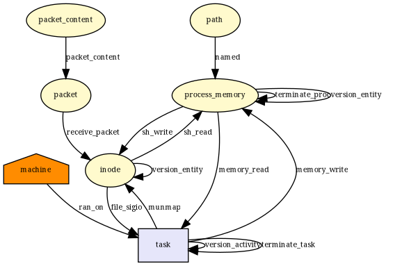 |
__x64_sys_oldumount|["file_send_sigiotask", "inode_follow_link", "inode_free", "inode_permission", "sb_free", "sb_umount", "task_free"]|["file_send_sigiotask", "inode_free", "inode_permission", "sb_free", "task_free"]|["inode_follow_link", "sb_umount"]|5/7|  |
__x64_sys_stat|["file_send_sigiotask", "inode_follow_link", "inode_free", "inode_getattr", "inode_permission", "sb_free", "task_free"]|["file_send_sigiotask", "inode_free", "inode_getattr", "inode_permission", "sb_free", "task_free"]|["inode_follow_link"]|6/7|  |
__x64_sys_statfs|["file_send_sigiotask", "inode_follow_link", "inode_free", "inode_permission", "sb_free", "sb_statfs", "task_free"]|["file_send_sigiotask", "inode_free", "inode_permission", "sb_free", "task_free"]|["inode_follow_link", "sb_statfs"]|5/7|  |
__x64_sys_statfs64|["file_send_sigiotask", "inode_follow_link", "inode_free", "inode_permission", "sb_free", "sb_statfs", "task_free"]|["file_send_sigiotask", "inode_free", "inode_permission", "sb_free", "task_free"]|["inode_follow_link", "sb_statfs"]|5/7|  |
__x64_sys_fstatfs|["file_send_sigiotask", "sb_statfs", "task_free"]|["file_send_sigiotask", "task_free"]|["sb_statfs"]|2/3|  |
__x64_sys_fstatfs64|["file_send_sigiotask", "sb_statfs", "task_free"]|["file_send_sigiotask", "task_free"]|["sb_statfs"]|2/3|  |
__x64_sys_lstat|["file_send_sigiotask", "inode_follow_link", "inode_free", "inode_getattr", "inode_permission", "sb_free", "task_free"]|["file_send_sigiotask", "inode_free", "inode_getattr", "inode_permission", "sb_free", "task_free"]|["inode_follow_link"]|6/7|  |
__x64_sys_fstat|["file_send_sigiotask", "inode_getattr", "task_free"]|["file_send_sigiotask", "inode_getattr", "task_free"]|[]|3/3|  |
__x64_sys_newstat|["file_send_sigiotask", "inode_follow_link", "inode_free", "inode_getattr", "inode_permission", "sb_free", "task_free"]|["file_send_sigiotask", "inode_free", "inode_getattr", "inode_permission", "sb_free", "task_free"]|["inode_follow_link"]|6/7|  |
__x64_sys_newlstat|["file_send_sigiotask", "inode_follow_link", "inode_free", "inode_getattr", "inode_permission", "sb_free", "task_free"]|["file_send_sigiotask", "inode_free", "inode_getattr", "inode_permission", "sb_free", "task_free"]|["inode_follow_link"]|6/7|  |
__x64_sys_newfstat|["file_send_sigiotask", "inode_getattr", "task_free"]|["file_send_sigiotask", "inode_getattr", "task_free"]|[]|3/3|  |
__x64_sys_ustat|["file_send_sigiotask", "sb_free", "sb_statfs", "task_free"]|["file_send_sigiotask", "sb_free", "task_free"]|["sb_statfs"]|3/4|  |
__x64_sys_setxattr|["file_send_sigiotask", "inode_follow_link", "inode_free", "inode_permission", "inode_post_setxattr", "inode_setsecurity", "inode_setxattr", "sb_free", "task_free"]|["file_send_sigiotask", "inode_free", "inode_permission", "inode_post_setxattr", "inode_setxattr", "sb_free", "task_free"]|["inode_follow_link", "inode_setsecurity"]|7/9|  |
__x64_sys_lsetxattr|["file_send_sigiotask", "inode_follow_link", "inode_free", "inode_permission", "inode_post_setxattr", "inode_setsecurity", "inode_setxattr", "sb_free", "task_free"]|["file_send_sigiotask", "inode_free", "inode_permission", "inode_post_setxattr", "inode_setxattr", "sb_free", "task_free"]|["inode_follow_link", "inode_setsecurity"]|7/9|  |
__x64_sys_fsetxattr|["file_send_sigiotask", "inode_free", "inode_permission", "inode_post_setxattr", "inode_setsecurity", "inode_setxattr", "task_free"]|["file_send_sigiotask", "inode_free", "inode_permission", "inode_post_setxattr", "inode_setxattr", "task_free"]|["inode_setsecurity"]|6/7| 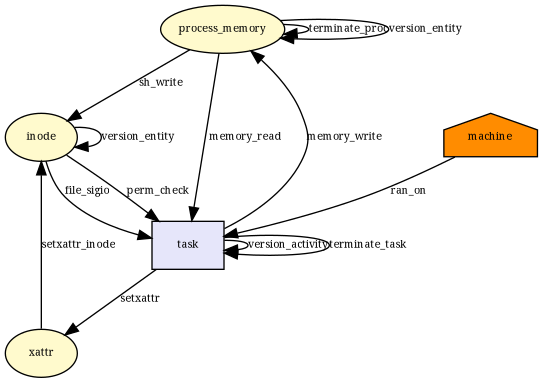 |
__x64_sys_getxattr|["file_send_sigiotask", "inode_follow_link", "inode_free", "inode_getsecurity", "inode_getxattr", "inode_permission", "sb_free", "task_free"]|["file_send_sigiotask", "inode_free", "inode_getsecurity", "inode_getxattr", "inode_permission", "sb_free", "task_free"]|["inode_follow_link"]|7/8| 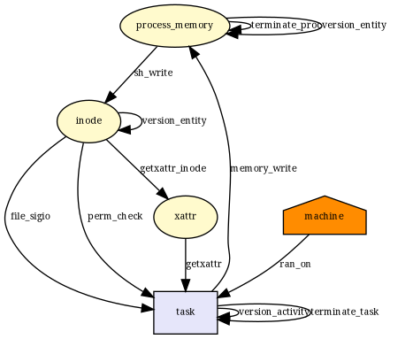 |
__x64_sys_lgetxattr|["file_send_sigiotask", "inode_follow_link", "inode_free", "inode_getsecurity", "inode_getxattr", "inode_permission", "sb_free", "task_free"]|["file_send_sigiotask", "inode_free", "inode_getsecurity", "inode_getxattr", "inode_permission", "sb_free", "task_free"]|["inode_follow_link"]|7/8|  |
__x64_sys_fgetxattr|["file_send_sigiotask", "inode_getsecurity", "inode_getxattr", "inode_permission", "task_free"]|["file_send_sigiotask", "inode_getsecurity", "inode_getxattr", "inode_permission", "task_free"]|[]|5/5|  |
__x64_sys_listxattr|["file_send_sigiotask", "inode_follow_link", "inode_free", "inode_listsecurity", "inode_listxattr", "inode_permission", "sb_free", "task_free"]|["file_send_sigiotask", "inode_free", "inode_listsecurity", "inode_listxattr", "inode_permission", "sb_free", "task_free"]|["inode_follow_link"]|7/8| 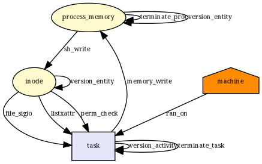 |
__x64_sys_llistxattr|["file_send_sigiotask", "inode_follow_link", "inode_free", "inode_listsecurity", "inode_listxattr", "inode_permission", "sb_free", "task_free"]|["file_send_sigiotask", "inode_free", "inode_listsecurity", "inode_listxattr", "inode_permission", "sb_free", "task_free"]|["inode_follow_link"]|7/8|  |
__x64_sys_flistxattr|["file_send_sigiotask", "inode_listsecurity", "inode_listxattr", "task_free"]|["file_send_sigiotask", "inode_listsecurity", "inode_listxattr", "task_free"]|[]|4/4|  |
__x64_sys_removexattr|["file_send_sigiotask", "inode_follow_link", "inode_free", "inode_permission", "inode_removexattr", "sb_free", "task_free"]|["file_send_sigiotask", "inode_free", "inode_permission", "inode_removexattr", "sb_free", "task_free"]|["inode_follow_link"]|6/7|  |
__x64_sys_lremovexattr|["file_send_sigiotask", "inode_follow_link", "inode_free", "inode_permission", "inode_removexattr", "sb_free", "task_free"]|["file_send_sigiotask", "inode_free", "inode_permission", "inode_removexattr", "sb_free", "task_free"]|["inode_follow_link"]|6/7|  |
__x64_sys_fremovexattr|["file_send_sigiotask", "inode_free", "inode_permission", "inode_removexattr", "task_free"]|["file_send_sigiotask", "inode_free", "inode_permission", "inode_removexattr", "task_free"]|[]|5/5| 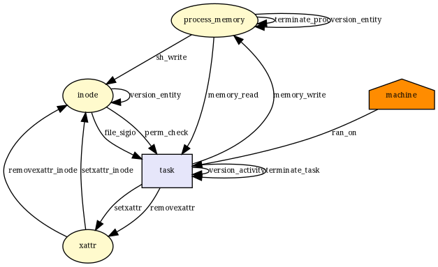 |
__x64_sys_brk|["file_send_sigiotask", "inode_free", "mmap_addr", "mmap_munmap", "task_free", "vm_enough_memory_mm"]|["file_send_sigiotask", "inode_free", "mmap_munmap", "task_free"]|["mmap_addr", "vm_enough_memory_mm"]|4/6|  |
__x64_sys_mremap|["file_send_sigiotask", "inode_free", "mmap_addr", "mmap_munmap", "task_free", "vm_enough_memory_mm"]|["file_send_sigiotask", "inode_free", "mmap_munmap", "task_free"]|["mmap_addr", "vm_enough_memory_mm"]|4/6|  |
__x64_sys_msync|["file_send_sigiotask", "inode_free", "task_free"]|["file_send_sigiotask", "inode_free", "task_free"]|[]|3/3|  |
__x64_sys_fadvise64|["file_send_sigiotask", "task_free"]|["file_send_sigiotask", "task_free"]|[]|2/2|  |
__x64_sys_fadvise64_64|["file_send_sigiotask", "task_free"]|["file_send_sigiotask", "task_free"]|[]|2/2|  |
__x64_sys_mlock|["file_send_sigiotask", "inode_free", "mmap_addr", "task_free", "vm_enough_memory_mm"]|["file_send_sigiotask", "inode_free", "task_free"]|["mmap_addr", "vm_enough_memory_mm"]|3/5|  |
__x64_sys_munlock|["file_send_sigiotask", "inode_free", "mmap_addr", "task_free", "vm_enough_memory_mm"]|["file_send_sigiotask", "inode_free", "task_free"]|["mmap_addr", "vm_enough_memory_mm"]|3/5|  |
__x64_sys_mlockall|["file_send_sigiotask", "inode_free", "mmap_addr", "task_free", "vm_enough_memory_mm"]|["file_send_sigiotask", "inode_free", "task_free"]|["mmap_addr", "vm_enough_memory_mm"]|3/5|  |
__x64_sys_munlockall|["file_send_sigiotask", "inode_free", "mmap_addr", "task_free", "vm_enough_memory_mm"]|["file_send_sigiotask", "inode_free", "task_free"]|["mmap_addr", "vm_enough_memory_mm"]|3/5|  |
__x64_sys_madvise|["file_permission", "file_send_sigiotask", "inode_free", "mmap_addr", "task_free", "vm_enough_memory_mm"]|["file_permission", "file_send_sigiotask", "inode_free", "task_free"]|["mmap_addr", "vm_enough_memory_mm"]|4/6|  |
__x64_sys_mincore|["file_send_sigiotask", "task_free"]|["file_send_sigiotask", "task_free"]|[]|2/2|  |
__x64_sys_pivot_root|["file_send_sigiotask", "inode_follow_link", "inode_free", "inode_permission", "sb_free", "sb_pivotroot", "task_free"]|["file_send_sigiotask", "inode_free", "inode_permission", "sb_free", "task_free"]|["inode_follow_link", "sb_pivotroot"]|5/7|  |
__x64_sys_fcntl|["file_fcntl", "file_lock", "file_send_sigiotask", "file_set_fowner", "inode_free", "task_free"]|["file_lock", "file_send_sigiotask", "inode_free", "task_free"]|["file_fcntl", "file_set_fowner"]|4/6| 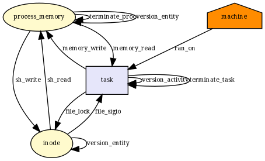 |
__x64_sys_io_setup|["d_instantiate", "file_send_sigiotask", "inode_alloc", "inode_free", "mmap_addr", "mmap_munmap", "sb_free", "task_free", "vm_enough_memory_mm"]|["file_send_sigiotask", "inode_alloc", "inode_free", "mmap_munmap", "sb_free", "task_free"]|["d_instantiate", "mmap_addr", "vm_enough_memory_mm"]|6/9|  |
__x64_sys_io_destroy|["file_send_sigiotask", "inode_free", "mmap_addr", "mmap_munmap", "task_free", "vm_enough_memory_mm"]|["file_send_sigiotask", "inode_free", "mmap_munmap", "task_free"]|["mmap_addr", "vm_enough_memory_mm"]|4/6|  |
__x64_sys_io_getevents|["file_send_sigiotask", "task_free"]|["file_send_sigiotask", "task_free"]|[]|2/2|  |
__x64_sys_io_submit|["file_permission", "file_send_sigiotask", "inode_free", "task_free"]|["file_permission", "file_send_sigiotask", "inode_free", "task_free"]|[]|4/4|  |
__x64_sys_io_cancel|["file_send_sigiotask", "task_free"]|["file_send_sigiotask", "task_free"]|[]|2/2|  |
__x64_sys_readlink|["file_send_sigiotask", "inode_follow_link", "inode_free", "inode_permission", "inode_readlink", "sb_free", "task_free"]|["file_send_sigiotask", "inode_free", "inode_permission", "inode_readlink", "sb_free", "task_free"]|["inode_follow_link"]|6/7| 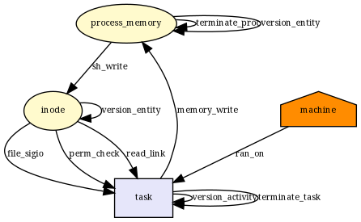 |
__x64_sys_setregid16|["file_send_sigiotask", "socket_sock_rcv_skb", "task_free"]|["file_send_sigiotask", "socket_sock_rcv_skb", "task_free"]|[]|3/3|  |
__x64_sys_setgid16|["file_send_sigiotask", "socket_sock_rcv_skb", "task_free"]|["file_send_sigiotask", "socket_sock_rcv_skb", "task_free"]|[]|3/3|  |
__x64_sys_setreuid16|["file_send_sigiotask", "socket_sock_rcv_skb", "task_fix_setuid", "task_free"]|["file_send_sigiotask", "socket_sock_rcv_skb", "task_fix_setuid", "task_free"]|[]|4/4|  |
__x64_sys_setuid16|["file_send_sigiotask", "socket_sock_rcv_skb", "task_fix_setuid", "task_free"]|["file_send_sigiotask", "socket_sock_rcv_skb", "task_fix_setuid", "task_free"]|[]|4/4|  |
__x64_sys_setresuid16|["file_send_sigiotask", "socket_sock_rcv_skb", "task_fix_setuid", "task_free"]|["file_send_sigiotask", "socket_sock_rcv_skb", "task_fix_setuid", "task_free"]|[]|4/4|  |
__x64_sys_getresuid16|[]|[]|[]|0/0|  |
__x64_sys_setresgid16|["file_send_sigiotask", "socket_sock_rcv_skb", "task_free"]|["file_send_sigiotask", "socket_sock_rcv_skb", "task_free"]|[]|3/3|  |
__x64_sys_getresgid16|[]|[]|[]|0/0|  |
__x64_sys_setfsuid16|["file_send_sigiotask", "socket_sock_rcv_skb", "task_fix_setuid", "task_free"]|["file_send_sigiotask", "socket_sock_rcv_skb", "task_fix_setuid", "task_free"]|[]|4/4|  |
__x64_sys_setfsgid16|["file_send_sigiotask", "socket_sock_rcv_skb", "task_free"]|["file_send_sigiotask", "socket_sock_rcv_skb", "task_free"]|[]|3/3|  |
__x64_sys_getgroups16|[]|[]|[]|0/0|  |
__x64_sys_setgroups16|["file_send_sigiotask", "socket_sock_rcv_skb", "task_free"]|["file_send_sigiotask", "socket_sock_rcv_skb", "task_free"]|[]|3/3|  |
__x64_sys_getuid16|[]|[]|[]|0/0|  |
__x64_sys_geteuid16|[]|[]|[]|0/0|  |
__x64_sys_getgid16|[]|[]|[]|0/0|  |
__x64_sys_getegid16|[]|[]|[]|0/0|  |
__x64_sys_utime|["file_send_sigiotask", "inode_follow_link", "inode_free", "inode_killpriv", "inode_need_killpriv", "inode_permission", "inode_setattr", "sb_free", "task_free"]|["file_send_sigiotask", "inode_free", "inode_permission", "inode_setattr", "sb_free", "task_free"]|["inode_follow_link", "inode_killpriv", "inode_need_killpriv"]|6/9|  |
__x64_sys_readahead|["file_send_sigiotask", "task_free"]|["file_send_sigiotask", "task_free"]|[]|2/2|  |
__x64_sys_getcwd|["file_send_sigiotask", "task_free"]|["file_send_sigiotask", "task_free"]|[]|2/2|  |
__x64_sys_lookup_dcookie|["file_send_sigiotask", "task_free"]|["file_send_sigiotask", "task_free"]|[]|2/2|  |
__x64_sys_quotactl|["file_send_sigiotask", "inode_alloc", "inode_follow_link", "inode_free", "inode_permission", "quotactl", "sb_free", "task_free"]|["file_send_sigiotask", "inode_alloc", "inode_free", "inode_permission", "sb_free", "task_free"]|["inode_follow_link", "quotactl"]|6/8|  |
__x64_sys_getdents|["file_permission", "file_send_sigiotask", "inode_free", "task_free"]|["file_permission", "file_send_sigiotask", "inode_free", "task_free"]|[]|4/4|  |
__x64_sys_getdents64|["file_permission", "file_send_sigiotask", "inode_free", "task_free"]|["file_permission", "file_send_sigiotask", "inode_free", "task_free"]|[]|4/4|  |
__x64_sys_poll|["file_send_sigiotask", "task_free"]|["file_send_sigiotask", "task_free"]|[]|2/2|  |
__x64_sys_epoll_create|["d_instantiate", "file_send_sigiotask", "inode_free", "sb_free", "task_free"]|["file_send_sigiotask", "inode_free", "sb_free", "task_free"]|["d_instantiate"]|4/5|  |
__x64_sys_epoll_create1|["d_instantiate", "file_send_sigiotask", "inode_free", "sb_free", "task_free"]|["file_send_sigiotask", "inode_free", "sb_free", "task_free"]|["d_instantiate"]|4/5|  |
__x64_sys_epoll_ctl|["file_send_sigiotask", "task_free"]|["file_send_sigiotask", "task_free"]|[]|2/2|  |
__x64_sys_epoll_wait|["file_send_sigiotask", "task_free"]|["file_send_sigiotask", "task_free"]|[]|2/2|  |
__x64_sys_epoll_pwait|["file_send_sigiotask", "task_free"]|["file_send_sigiotask", "task_free"]|[]|2/2|  |
__x64_sys_olduname|["file_send_sigiotask", "task_free"]|["file_send_sigiotask", "task_free"]|[]|2/2|  |
__x64_sys_getrlimit|["file_send_sigiotask", "task_free", "task_setrlimit"]|["file_send_sigiotask", "task_free"]|["task_setrlimit"]|2/3|  |
__x64_sys_old_getrlimit|["file_send_sigiotask", "task_free"]|["file_send_sigiotask", "task_free"]|[]|2/2|  |
__x64_sys_prlimit64|["file_send_sigiotask", "task_free", "task_prlimit", "task_setrlimit"]|["file_send_sigiotask", "task_free"]|["task_prlimit", "task_setrlimit"]|2/4|  |
__x64_sys_semget|["file_send_sigiotask", "ipc_permission", "task_free"]|["file_send_sigiotask", "task_free"]|["ipc_permission"]|2/3|  |
__x64_sys_semop|["file_send_sigiotask", "ipc_permission", "sem_semop", "task_free"]|["file_send_sigiotask", "task_free"]|["ipc_permission", "sem_semop"]|2/4|  |
__x64_sys_semctl|["file_send_sigiotask", "ipc_permission", "sem_semctl", "task_free"]|["file_send_sigiotask", "task_free"]|["ipc_permission", "sem_semctl"]|2/4|  |
__x64_sys_semtimedop|["file_send_sigiotask", "ipc_permission", "sem_semop", "task_free"]|["file_send_sigiotask", "task_free"]|["ipc_permission", "sem_semop"]|2/4|  |
__x64_sys_mq_open|["file_open", "file_send_sigiotask", "inode_create", "inode_free", "inode_permission", "sb_free", "task_free"]|["file_open", "file_send_sigiotask", "inode_create", "inode_free", "inode_permission", "sb_free", "task_free"]|[]|7/7|  |
__x64_sys_mq_unlink|["file_send_sigiotask", "inode_free", "inode_permission", "inode_unlink", "task_free"]|["file_send_sigiotask", "inode_free", "inode_permission", "inode_unlink", "task_free"]|[]|5/5| 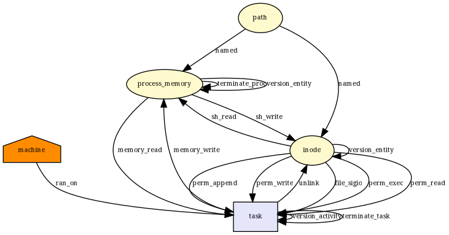 |
__x64_sys_mq_timedsend|["file_send_sigiotask", "mq_timedsend", "msg_msg_alloc", "msg_msg_free", "task_free", "task_kill"]|["file_send_sigiotask", "mq_timedsend", "msg_msg_alloc", "msg_msg_free", "task_free", "task_kill"]|[]|6/6| 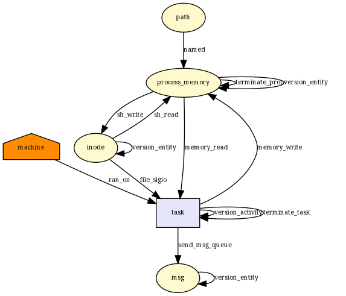 |
__x64_sys_mq_timedreceive|["file_send_sigiotask", "mq_timedreceive", "msg_msg_free", "task_free"]|["file_send_sigiotask", "mq_timedreceive", "msg_msg_free", "task_free"]|[]|4/4|  |
__x64_sys_mq_notify|["file_send_sigiotask", "task_free"]|["file_send_sigiotask", "task_free"]|[]|2/2|  |
__x64_sys_mq_getsetattr|["file_send_sigiotask", "task_free"]|["file_send_sigiotask", "task_free"]|[]|2/2|  |
__x64_sys_swapon|["file_open", "file_send_sigiotask", "inode_alloc", "inode_create", "inode_follow_link", "inode_free", "inode_killpriv", "inode_need_killpriv", "inode_permission", "inode_setattr", "kernel_module_request", "sb_free", "socket_sock_rcv_skb", "task_free"]|["file_open", "file_send_sigiotask", "inode_alloc", "inode_create", "inode_free", "inode_permission", "inode_setattr", "sb_free", "socket_sock_rcv_skb", "task_free"]|["inode_follow_link", "inode_killpriv", "inode_need_killpriv", "kernel_module_request"]|10/14| 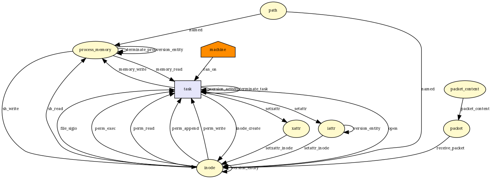 |
__x64_sys_swapoff|["file_open", "file_send_sigiotask", "inode_create", "inode_follow_link", "inode_free", "inode_killpriv", "inode_need_killpriv", "inode_permission", "inode_setattr", "kernel_module_request", "mmap_addr", "mmap_munmap", "sb_free", "task_free", "vm_enough_memory_mm"]|["file_open", "file_send_sigiotask", "inode_create", "inode_free", "inode_permission", "inode_setattr", "mmap_munmap", "sb_free", "task_free"]|["inode_follow_link", "inode_killpriv", "inode_need_killpriv", "kernel_module_request", "mmap_addr", "vm_enough_memory_mm"]|9/15|  |
__x64_sys_sysctl|["file_send_sigiotask", "task_free"]|["file_send_sigiotask", "task_free"]|[]|2/2|  |
__x64_sys_sysinfo|["file_send_sigiotask", "task_free"]|["file_send_sigiotask", "task_free"]|[]|2/2|  |
__x64_sys_sysfs|["file_send_sigiotask", "task_free"]|["file_send_sigiotask", "task_free"]|[]|2/2|  |
__x64_sys_syslog|["file_send_sigiotask", "syslog", "task_free"]|["file_send_sigiotask", "task_free"]|["syslog"]|2/3|  |
__x64_sys_add_key|["file_send_sigiotask", "key_alloc", "key_permission", "socket_sock_rcv_skb", "task_free"]|["file_send_sigiotask", "socket_sock_rcv_skb", "task_free"]|["key_alloc", "key_permission"]|3/5|  |
__x64_sys_request_key|["file_send_sigiotask", "key_alloc", "key_permission", "socket_sock_rcv_skb", "task_free"]|["file_send_sigiotask", "socket_sock_rcv_skb", "task_free"]|["key_alloc", "key_permission"]|3/5|  |
__x64_sys_keyctl|["cred_alloc_blank", "file_send_sigiotask", "kernel_module_request", "key_alloc", "key_getsecurity", "key_permission", "socket_sock_rcv_skb", "task_free"]|["cred_alloc_blank", "file_send_sigiotask", "socket_sock_rcv_skb", "task_free"]|["kernel_module_request", "key_alloc", "key_getsecurity", "key_permission"]|4/8|  |
__x64_sys_ioprio_set|["file_send_sigiotask", "task_free", "task_setioprio"]|["file_send_sigiotask", "task_free"]|["task_setioprio"]|2/3|  |
__x64_sys_ioprio_get|["file_send_sigiotask", "task_free", "task_getioprio"]|["file_send_sigiotask", "task_free"]|["task_getioprio"]|2/3|  |
__x64_sys_set_mempolicy|["file_send_sigiotask", "task_free"]|["file_send_sigiotask", "task_free"]|[]|2/2|  |
__x64_sys_migrate_pages|["file_send_sigiotask", "inode_free", "mmap_addr", "mmap_munmap", "ptrace_access_check", "task_free", "task_movememory", "vm_enough_memory_mm"]|["file_send_sigiotask", "inode_free", "mmap_munmap", "task_free"]|["mmap_addr", "ptrace_access_check", "task_movememory", "vm_enough_memory_mm"]|4/8|  |
__x64_sys_move_pages|["file_send_sigiotask", "inode_free", "mmap_addr", "mmap_munmap", "ptrace_access_check", "task_free", "task_movememory", "vm_enough_memory_mm"]|["file_send_sigiotask", "inode_free", "mmap_munmap", "task_free"]|["mmap_addr", "ptrace_access_check", "task_movememory", "vm_enough_memory_mm"]|4/8|  |
__x64_sys_mbind|["file_send_sigiotask", "inode_free", "mmap_addr", "task_free", "vm_enough_memory_mm"]|["file_send_sigiotask", "inode_free", "task_free"]|["mmap_addr", "vm_enough_memory_mm"]|3/5|  |
__x64_sys_get_mempolicy|["file_send_sigiotask", "mmap_addr", "task_free", "vm_enough_memory_mm"]|["file_send_sigiotask", "task_free"]|["mmap_addr", "vm_enough_memory_mm"]|2/4|  |
__x64_sys_inotify_init|["d_instantiate", "file_send_sigiotask", "inode_free", "sb_free", "task_free"]|["file_send_sigiotask", "inode_free", "sb_free", "task_free"]|["d_instantiate"]|4/5|  |
__x64_sys_inotify_init1|["d_instantiate", "file_send_sigiotask", "inode_free", "sb_free", "task_free"]|["file_send_sigiotask", "inode_free", "sb_free", "task_free"]|["d_instantiate"]|4/5|  |
__x64_sys_inotify_add_watch|["file_send_sigiotask", "inode_follow_link", "inode_free", "inode_permission", "sb_free", "task_free"]|["file_send_sigiotask", "inode_free", "inode_permission", "sb_free", "task_free"]|["inode_follow_link"]|5/6|  |
__x64_sys_inotify_rm_watch|["file_send_sigiotask", "inode_free", "task_free"]|["file_send_sigiotask", "inode_free", "task_free"]|[]|3/3|  |
__x64_sys_futimesat|["file_send_sigiotask", "inode_follow_link", "inode_free", "inode_killpriv", "inode_need_killpriv", "inode_permission", "inode_setattr", "sb_free", "task_free"]|["file_send_sigiotask", "inode_free", "inode_permission", "inode_setattr", "sb_free", "task_free"]|["inode_follow_link", "inode_killpriv", "inode_need_killpriv"]|6/9|  |
__x64_sys_newfstatat|["file_send_sigiotask", "inode_follow_link", "inode_free", "inode_getattr", "inode_permission", "sb_free", "task_free"]|["file_send_sigiotask", "inode_free", "inode_getattr", "inode_permission", "sb_free", "task_free"]|["inode_follow_link"]|6/7|  |
__x64_sys_readlinkat|["file_send_sigiotask", "inode_follow_link", "inode_free", "inode_permission", "inode_readlink", "sb_free", "task_free"]|["file_send_sigiotask", "inode_free", "inode_permission", "inode_readlink", "sb_free", "task_free"]|["inode_follow_link"]|6/7|  |
__x64_sys_utimensat|["file_send_sigiotask", "inode_follow_link", "inode_free", "inode_killpriv", "inode_need_killpriv", "inode_permission", "inode_setattr", "sb_free", "task_free"]|["file_send_sigiotask", "inode_free", "inode_permission", "inode_setattr", "sb_free", "task_free"]|["inode_follow_link", "inode_killpriv", "inode_need_killpriv"]|6/9|  |
__x64_sys_sync_file_range|["file_send_sigiotask", "task_free"]|["file_send_sigiotask", "task_free"]|[]|2/2|  |
__x64_sys_sync_file_range2|["file_send_sigiotask", "task_free"]|["file_send_sigiotask", "task_free"]|[]|2/2|  |
__x64_sys_get_robust_list|["file_send_sigiotask", "ptrace_access_check", "task_free"]|["file_send_sigiotask", "task_free"]|["ptrace_access_check"]|2/3|  |
__x64_sys_set_robust_list|[]|[]|[]|0/0|  |
__x64_sys_signalfd|["d_instantiate", "file_send_sigiotask", "inode_free", "sb_free", "task_free"]|["file_send_sigiotask", "inode_free", "sb_free", "task_free"]|["d_instantiate"]|4/5|  |
__x64_sys_signalfd4|["d_instantiate", "file_send_sigiotask", "inode_free", "sb_free", "task_free"]|["file_send_sigiotask", "inode_free", "sb_free", "task_free"]|["d_instantiate"]|4/5|  |
__x64_sys_timerfd_create|["d_instantiate", "file_send_sigiotask", "inode_free", "sb_free", "task_free"]|["file_send_sigiotask", "inode_free", "sb_free", "task_free"]|["d_instantiate"]|4/5|  |
__x64_sys_timerfd_settime|["file_send_sigiotask", "task_free"]|["file_send_sigiotask", "task_free"]|[]|2/2|  |
__x64_sys_timerfd_gettime|["file_send_sigiotask", "task_free"]|["file_send_sigiotask", "task_free"]|[]|2/2|  |
__x64_sys_eventfd|["d_instantiate", "file_send_sigiotask", "inode_free", "sb_free", "task_free"]|["file_send_sigiotask", "inode_free", "sb_free", "task_free"]|["d_instantiate"]|4/5|  |
__x64_sys_eventfd2|["d_instantiate", "file_send_sigiotask", "inode_free", "sb_free", "task_free"]|["file_send_sigiotask", "inode_free", "sb_free", "task_free"]|["d_instantiate"]|4/5|  |
__x64_sys_memfd_create|["d_instantiate", "file_send_sigiotask", "inode_alloc", "inode_free", "sb_free", "task_free", "vm_enough_memory_mm"]|["file_send_sigiotask", "inode_alloc", "inode_free", "sb_free", "task_free"]|["d_instantiate", "vm_enough_memory_mm"]|5/7|  |
__x64_sys_userfaultfd|["d_instantiate", "file_send_sigiotask", "inode_free", "sb_free", "task_free"]|["file_send_sigiotask", "inode_free", "sb_free", "task_free"]|["d_instantiate"]|4/5|  |
__x64_sys_old_readdir|["file_permission", "file_send_sigiotask", "inode_free", "task_free"]|["file_permission", "file_send_sigiotask", "inode_free", "task_free"]|[]|4/4|  |
__x64_sys_fanotify_init|["d_instantiate", "file_send_sigiotask", "inode_free", "sb_free", "task_free"]|["file_send_sigiotask", "inode_free", "sb_free", "task_free"]|["d_instantiate"]|4/5|  |
__x64_sys_fanotify_mark|["file_send_sigiotask", "inode_follow_link", "inode_free", "inode_permission", "sb_free", "task_free"]|["file_send_sigiotask", "inode_free", "inode_permission", "sb_free", "task_free"]|["inode_follow_link"]|5/6|  |
__x64_sys_syncfs|["file_send_sigiotask", "inode_free", "task_free"]|["file_send_sigiotask", "inode_free", "task_free"]|[]|3/3|  |
__x64_sys_perf_event_open|["d_instantiate", "file_send_sigiotask", "inode_free", "ptrace_access_check", "sb_free", "task_free"]|["file_send_sigiotask", "inode_free", "sb_free", "task_free"]|["d_instantiate", "ptrace_access_check"]|4/6| 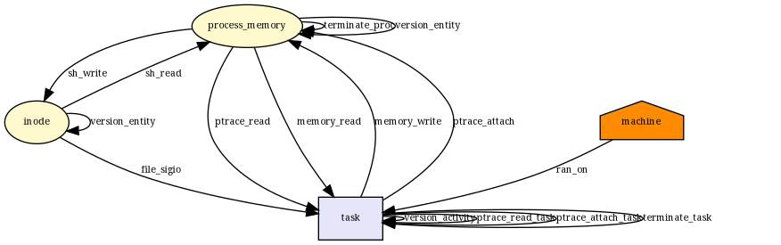 |
__x64_sys_name_to_handle_at|["file_send_sigiotask", "inode_follow_link", "inode_free", "inode_permission", "sb_free", "task_free"]|["file_send_sigiotask", "inode_free", "inode_permission", "sb_free", "task_free"]|["inode_follow_link"]|5/6|  |
__x64_sys_open_by_handle_at|["file_open", "file_permission", "file_send_sigiotask", "inode_create", "inode_follow_link", "inode_free", "inode_killpriv", "inode_need_killpriv", "inode_permission", "inode_setattr", "kernel_module_request", "sb_free", "task_free"]|["file_open", "file_permission", "file_send_sigiotask", "inode_create", "inode_free", "inode_permission", "inode_setattr", "sb_free", "task_free"]|["inode_follow_link", "inode_killpriv", "inode_need_killpriv", "kernel_module_request"]|9/13|  |
__x64_sys_setns|["d_instantiate", "file_send_sigiotask", "inode_alloc", "inode_free", "sb_copy_data", "sb_free", "sb_kern_mount", "socket_sock_rcv_skb", "task_free"]|["file_send_sigiotask", "inode_alloc", "inode_free", "sb_free", "socket_sock_rcv_skb", "task_free"]|["d_instantiate", "sb_copy_data", "sb_kern_mount"]|6/9|  |
__x64_sys_seccomp|["file_send_sigiotask", "socket_sock_rcv_skb", "task_free"]|["file_send_sigiotask", "socket_sock_rcv_skb", "task_free"]|[]|3/3|  |
__x64_sys_getrandom|["file_send_sigiotask", "task_free"]|["file_send_sigiotask", "task_free"]|[]|2/2|  |
__x64_sys_bpf|["bpf", "bpf_map", "bpf_map_alloc", "bpf_map_free", "bpf_prog", "bpf_prog_alloc", "bpf_prog_free", "d_instantiate", "file_send_sigiotask", "inode_alloc", "inode_create", "inode_follow_link", "inode_free", "inode_permission", "sb_free", "socket_sock_rcv_skb", "task_free"]|["file_send_sigiotask", "inode_alloc", "inode_create", "inode_free", "inode_permission", "sb_free", "socket_sock_rcv_skb", "task_free"]|["bpf", "bpf_map", "bpf_map_alloc", "bpf_map_free", "bpf_prog", "bpf_prog_alloc", "bpf_prog_free", "d_instantiate", "inode_follow_link"]|8/17|  |
__x64_sys_membarrier|["file_send_sigiotask", "task_free"]|["file_send_sigiotask", "task_free"]|[]|2/2|  |
__x64_sys_mlock2|["file_send_sigiotask", "inode_free", "mmap_addr", "task_free", "vm_enough_memory_mm"]|["file_send_sigiotask", "inode_free", "task_free"]|["mmap_addr", "vm_enough_memory_mm"]|3/5|  |
__x64_sys_statx|["file_send_sigiotask", "inode_follow_link", "inode_free", "inode_getattr", "inode_permission", "sb_free", "task_free"]|["file_send_sigiotask", "inode_free", "inode_getattr", "inode_permission", "sb_free", "task_free"]|["inode_follow_link"]|6/7| 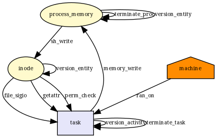 |
__x64_sys_shutdown|["file_send_sigiotask", "socket_shutdown", "task_free"]|["file_send_sigiotask", "task_free"]|["socket_shutdown"]|2/3|  |
__x64_sys_setsockopt|["file_send_sigiotask", "socket_setsockopt", "socket_sock_rcv_skb", "task_free"]|["file_send_sigiotask", "socket_sock_rcv_skb", "task_free"]|["socket_setsockopt"]|3/4|  |
__x64_sys_getsockopt|["file_send_sigiotask", "socket_getpeersec_stream", "socket_getsockopt", "task_free"]|["file_send_sigiotask", "task_free"]|["socket_getpeersec_stream", "socket_getsockopt"]|2/4|  |
__x64_sys_bind|["file_send_sigiotask", "socket_bind", "task_free"]|["file_send_sigiotask", "socket_bind", "task_free"]|[]|3/3|  |
__x64_sys_connect|["file_send_sigiotask", "socket_connect", "task_free"]|["file_send_sigiotask", "socket_connect", "task_free"]|[]|3/3|  |
__x64_sys_accept|["d_instantiate", "file_send_sigiotask", "inode_alloc", "inode_free", "sb_free", "socket_accept", "task_free"]|["file_send_sigiotask", "inode_alloc", "inode_free", "sb_free", "socket_accept", "task_free"]|["d_instantiate"]|6/7|  |
__x64_sys_accept4|["d_instantiate", "file_send_sigiotask", "inode_alloc", "inode_free", "sb_free", "socket_accept", "task_free"]|["file_send_sigiotask", "inode_alloc", "inode_free", "sb_free", "socket_accept", "task_free"]|["d_instantiate"]|6/7| 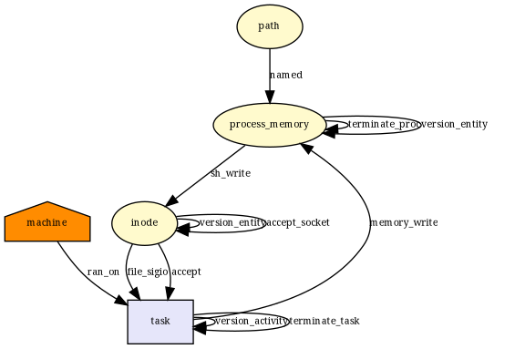 |
__x64_sys_getsockname|["file_send_sigiotask", "socket_getsockname", "task_free"]|["file_send_sigiotask", "task_free"]|["socket_getsockname"]|2/3|  |
__x64_sys_getpeername|["file_send_sigiotask", "socket_getpeername", "task_free"]|["file_send_sigiotask", "task_free"]|["socket_getpeername"]|2/3|  |
__x64_sys_send|["file_send_sigiotask", "socket_sendmsg", "socket_sendmsg_always", "task_free"]|["file_send_sigiotask", "socket_sendmsg", "socket_sendmsg_always", "task_free"]|[]|4/4|  |
__x64_sys_sendto|["file_send_sigiotask", "socket_sendmsg", "socket_sendmsg_always", "task_free"]|["file_send_sigiotask", "socket_sendmsg", "socket_sendmsg_always", "task_free"]|[]|4/4|  |
__x64_sys_sendmsg|["file_send_sigiotask", "socket_sendmsg", "socket_sendmsg_always", "task_free"]|["file_send_sigiotask", "socket_sendmsg", "socket_sendmsg_always", "task_free"]|[]|4/4|  |
__x64_sys_sendmmsg|["file_send_sigiotask", "socket_sendmsg", "socket_sendmsg_always", "task_free"]|["file_send_sigiotask", "socket_sendmsg", "socket_sendmsg_always", "task_free"]|[]|4/4|  |
__x64_sys_recv|["file_send_sigiotask", "socket_recvmsg", "socket_recvmsg_always", "task_free"]|["file_send_sigiotask", "socket_recvmsg", "socket_recvmsg_always", "task_free"]|[]|4/4|  |
__x64_sys_recvfrom|["file_send_sigiotask", "socket_recvmsg", "socket_recvmsg_always", "task_free"]|["file_send_sigiotask", "socket_recvmsg", "socket_recvmsg_always", "task_free"]|[]|4/4| 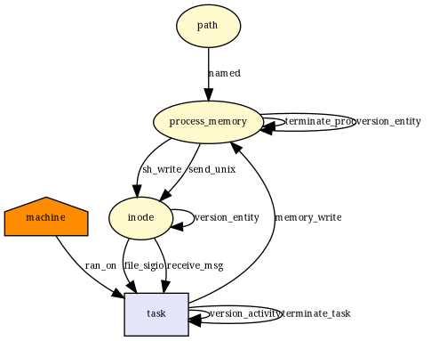 |
__x64_sys_recvmsg|["file_send_sigiotask", "task_free"]|["file_send_sigiotask", "task_free"]|[]|2/2|  |
__x64_sys_recvmmsg|["file_send_sigiotask", "task_free"]|["file_send_sigiotask", "task_free"]|[]|2/2|  |
__x64_sys_socket|["d_instantiate", "file_send_sigiotask", "inode_alloc", "inode_free", "kernel_module_request", "sb_free", "socket_create", "socket_post_create", "task_free"]|["file_send_sigiotask", "inode_alloc", "inode_free", "sb_free", "socket_post_create", "task_free"]|["d_instantiate", "kernel_module_request", "socket_create"]|6/9|  |
__x64_sys_socketpair|["d_instantiate", "file_send_sigiotask", "inode_alloc", "inode_free", "kernel_module_request", "sb_free", "socket_create", "socket_post_create", "socket_socketpair", "task_free"]|["file_send_sigiotask", "inode_alloc", "inode_free", "sb_free", "socket_post_create", "socket_socketpair", "task_free"]|["d_instantiate", "kernel_module_request", "socket_create"]|7/10|  |
__x64_sys_socketcall|["d_instantiate", "file_send_sigiotask", "inode_alloc", "inode_free", "kernel_module_request", "sb_free", "socket_accept", "socket_bind", "socket_connect", "socket_create", "socket_getpeername", "socket_getpeersec_stream", "socket_getsockname", "socket_getsockopt", "socket_listen", "socket_post_create", "socket_recvmsg", "socket_recvmsg_always", "socket_sendmsg", "socket_sendmsg_always", "socket_setsockopt", "socket_shutdown", "socket_sock_rcv_skb", "socket_socketpair", "task_free"]|["file_send_sigiotask", "inode_alloc", "inode_free", "sb_free", "socket_accept", "socket_bind", "socket_connect", "socket_listen", "socket_post_create", "socket_recvmsg", "socket_recvmsg_always", "socket_sendmsg", "socket_sendmsg_always", "socket_sock_rcv_skb", "socket_socketpair", "task_free"]|["d_instantiate", "kernel_module_request", "socket_create", "socket_getpeername", "socket_getpeersec_stream", "socket_getsockname", "socket_getsockopt", "socket_setsockopt", "socket_shutdown"]|16/25| 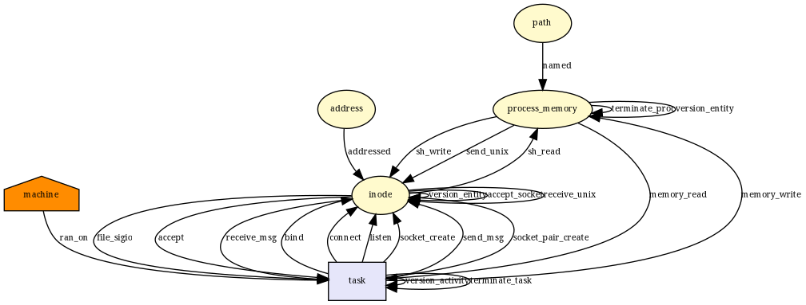 |
__x64_sys_listen|["file_send_sigiotask", "socket_listen", "task_free"]|["file_send_sigiotask", "socket_listen", "task_free"]|[]|3/3| 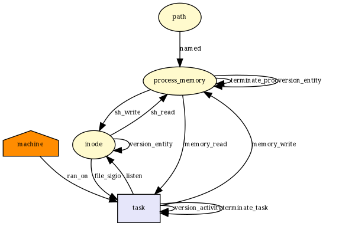 |
