# CamFlow LSM hooks coverage

Automatically generated do not edit!

We build uppon [INRIA tools](http://kayrebt.gforge.inria.fr/).

The following hooks are ignored in this report: ["audit_rule_init", "audit_rule_match", "capable", "capable_noaudit", "capget", "capset", "cred_getsecid", "file_alloc", "file_free", "inode_getsecid", "ipc_getsecid", "path_chmod", "path_chown", "path_chroot", "path_link", "path_mkdir", "path_mknod", "path_rename", "path_rmdir", "path_symlink", "path_truncate", "path_unlink", "release_secctx", "secid_to_secctx", "sk_free", "task_getsecid"]

System Call|Model|Hooks Called|Hooks Implemented|Hooks Not Implemented|Coverage (implemented / total)| 
-----------|-----|------------|-----------------|---------------------|------------------------------| 
__x64_sys_open|  |["file_open", "file_send_sigiotask", "inode_create", "inode_follow_link", "inode_free", "inode_killpriv", "inode_need_killpriv", "inode_permission", "inode_setattr", "kernel_module_request", "sb_free", "task_free"]|["file_open", "file_send_sigiotask", "inode_create", "inode_free", "inode_permission", "inode_setattr", "sb_free", "task_free"]|["inode_follow_link", "inode_killpriv", "inode_need_killpriv", "kernel_module_request"]|8/12|
__x64_sys_openat| 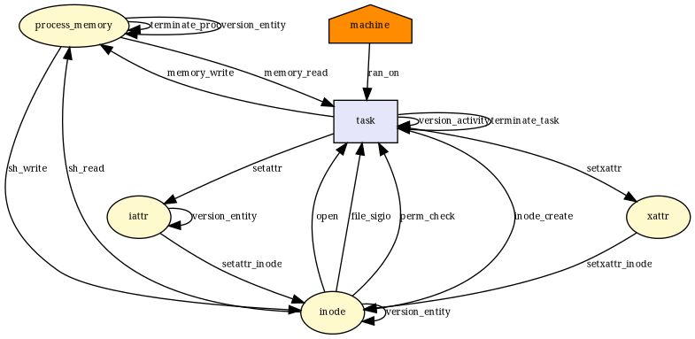 |["file_open", "file_send_sigiotask", "inode_create", "inode_follow_link", "inode_free", "inode_killpriv", "inode_need_killpriv", "inode_permission", "inode_setattr", "kernel_module_request", "sb_free", "task_free"]|["file_open", "file_send_sigiotask", "inode_create", "inode_free", "inode_permission", "inode_setattr", "sb_free", "task_free"]|["inode_follow_link", "inode_killpriv", "inode_need_killpriv", "kernel_module_request"]|8/12|
__x64_sys_execve| 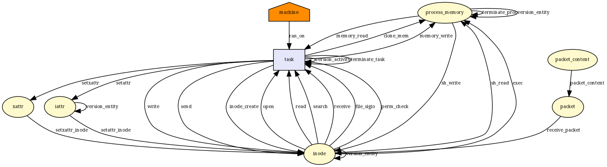 |["bprm_check", "bprm_set_creds", "file_open", "file_permission", "file_send_sigiotask", "inode_create", "inode_follow_link", "inode_free", "inode_killpriv", "inode_need_killpriv", "inode_permission", "inode_setattr", "kernel_module_request", "mmap_addr", "mmap_munmap", "prepare_creds", "sb_free", "sock_rcv_skb", "task_free", "vm_enough_memory_mm"]|["bprm_check", "bprm_set_creds", "file_open", "file_permission", "file_send_sigiotask", "inode_create", "inode_free", "inode_permission", "inode_setattr", "mmap_munmap", "prepare_creds", "sb_free", "sock_rcv_skb", "task_free"]|["inode_follow_link", "inode_killpriv", "inode_need_killpriv", "kernel_module_request", "mmap_addr", "vm_enough_memory_mm"]|14/20|
__x64_sys_execveat| 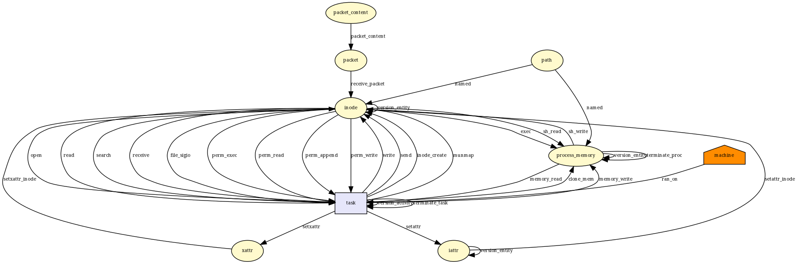 |["bprm_check", "bprm_set_creds", "file_open", "file_permission", "file_send_sigiotask", "inode_create", "inode_follow_link", "inode_free", "inode_killpriv", "inode_need_killpriv", "inode_permission", "inode_setattr", "kernel_module_request", "mmap_addr", "mmap_munmap", "prepare_creds", "sb_free", "sock_rcv_skb", "task_free", "vm_enough_memory_mm"]|["bprm_check", "bprm_set_creds", "file_open", "file_permission", "file_send_sigiotask", "inode_create", "inode_free", "inode_permission", "inode_setattr", "mmap_munmap", "prepare_creds", "sb_free", "sock_rcv_skb", "task_free"]|["inode_follow_link", "inode_killpriv", "inode_need_killpriv", "kernel_module_request", "mmap_addr", "vm_enough_memory_mm"]|14/20|
__x64_sys_fork|  |["d_instantiate", "file_send_sigiotask", "inode_alloc", "inode_free", "key_alloc", "mmap_addr", "mmap_munmap", "prepare_creds", "sb_copy_data", "sb_free", "sb_kern_mount", "sock_rcv_skb", "task_alloc", "task_free", "vm_enough_memory_mm"]|["file_send_sigiotask", "inode_alloc", "inode_free", "mmap_munmap", "prepare_creds", "sb_free", "sock_rcv_skb", "task_alloc", "task_free"]|["d_instantiate", "key_alloc", "mmap_addr", "sb_copy_data", "sb_kern_mount", "vm_enough_memory_mm"]|9/15|
__x64_sys_vfork|  |["d_instantiate", "file_send_sigiotask", "inode_alloc", "inode_free", "key_alloc", "mmap_addr", "mmap_munmap", "prepare_creds", "sb_copy_data", "sb_free", "sb_kern_mount", "sock_rcv_skb", "task_alloc", "task_free", "vm_enough_memory_mm"]|["file_send_sigiotask", "inode_alloc", "inode_free", "mmap_munmap", "prepare_creds", "sb_free", "sock_rcv_skb", "task_alloc", "task_free"]|["d_instantiate", "key_alloc", "mmap_addr", "sb_copy_data", "sb_kern_mount", "vm_enough_memory_mm"]|9/15|
__x64_sys_clone|  |["d_instantiate", "file_send_sigiotask", "inode_alloc", "inode_free", "key_alloc", "mmap_addr", "mmap_munmap", "prepare_creds", "sb_copy_data", "sb_free", "sb_kern_mount", "sock_rcv_skb", "task_alloc", "task_free", "vm_enough_memory_mm"]|["file_send_sigiotask", "inode_alloc", "inode_free", "mmap_munmap", "prepare_creds", "sb_free", "sock_rcv_skb", "task_alloc", "task_free"]|["d_instantiate", "key_alloc", "mmap_addr", "sb_copy_data", "sb_kern_mount", "vm_enough_memory_mm"]|9/15|
__x64_sys_unshare|  |["d_instantiate", "file_send_sigiotask", "inode_alloc", "inode_free", "prepare_creds", "sb_copy_data", "sb_free", "sb_kern_mount", "sock_rcv_skb", "task_free"]|["file_send_sigiotask", "inode_alloc", "inode_free", "prepare_creds", "sb_free", "sock_rcv_skb", "task_free"]|["d_instantiate", "sb_copy_data", "sb_kern_mount"]|7/10|
__x64_sys_dup3|  |["file_send_sigiotask", "inode_free", "task_free"]|["file_send_sigiotask", "inode_free", "task_free"]|[]|3/3|
__x64_sys_dup2|  |["file_send_sigiotask", "inode_free", "task_free"]|["file_send_sigiotask", "inode_free", "task_free"]|[]|3/3|
__x64_sys_dup|  |["file_send_sigiotask", "task_free"]|["file_send_sigiotask", "task_free"]|[]|2/2|
__x64_sys_sysfs|  |["file_send_sigiotask", "task_free"]|["file_send_sigiotask", "task_free"]|[]|2/2|
__x64_sys_ioctl| 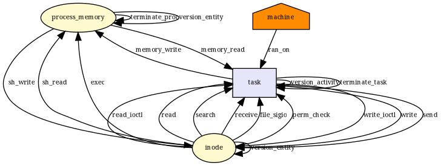 |["file_ioctl", "file_permission", "file_send_sigiotask", "inode_free", "inode_permission", "sb_free", "task_free"]|["file_ioctl", "file_permission", "file_send_sigiotask", "inode_free", "inode_permission", "sb_free", "task_free"]|[]|7/7|
__x64_sys_flock|  |["file_lock", "file_send_sigiotask", "task_free"]|["file_lock", "file_send_sigiotask", "task_free"]|[]|3/3|
__x64_sys_mknodat|  |["file_send_sigiotask", "inode_create", "inode_follow_link", "inode_free", "inode_mknod", "inode_permission", "sb_free", "task_free"]|["file_send_sigiotask", "inode_create", "inode_free", "inode_permission", "sb_free", "task_free"]|["inode_follow_link", "inode_mknod"]|6/8|
__x64_sys_mknod|  |["file_send_sigiotask", "inode_create", "inode_follow_link", "inode_free", "inode_mknod", "inode_permission", "sb_free", "task_free"]|["file_send_sigiotask", "inode_create", "inode_free", "inode_permission", "sb_free", "task_free"]|["inode_follow_link", "inode_mknod"]|6/8|
__x64_sys_mkdir|  |["file_send_sigiotask", "inode_follow_link", "inode_free", "inode_mkdir", "inode_permission", "sb_free", "task_free"]|["file_send_sigiotask", "inode_free", "inode_permission", "sb_free", "task_free"]|["inode_follow_link", "inode_mkdir"]|5/7|
__x64_sys_mkdirat|  |["file_send_sigiotask", "inode_follow_link", "inode_free", "inode_mkdir", "inode_permission", "sb_free", "task_free"]|["file_send_sigiotask", "inode_free", "inode_permission", "sb_free", "task_free"]|["inode_follow_link", "inode_mkdir"]|5/7|
__x64_sys_rmdir|  |["file_send_sigiotask", "inode_follow_link", "inode_free", "inode_permission", "inode_rmdir", "sb_free", "task_free"]|["file_send_sigiotask", "inode_free", "inode_permission", "sb_free", "task_free"]|["inode_follow_link", "inode_rmdir"]|5/7|
__x64_sys_unlinkat|  |["file_send_sigiotask", "inode_follow_link", "inode_free", "inode_permission", "inode_rmdir", "inode_unlink", "sb_free", "task_free"]|["file_send_sigiotask", "inode_free", "inode_permission", "inode_unlink", "sb_free", "task_free"]|["inode_follow_link", "inode_rmdir"]|6/8|
__x64_sys_unlink|  |["file_send_sigiotask", "inode_follow_link", "inode_free", "inode_permission", "inode_unlink", "sb_free", "task_free"]|["file_send_sigiotask", "inode_free", "inode_permission", "inode_unlink", "sb_free", "task_free"]|["inode_follow_link"]|6/7|
__x64_sys_symlinkat|  |["file_send_sigiotask", "inode_follow_link", "inode_free", "inode_permission", "inode_symlink", "sb_free", "task_free"]|["file_send_sigiotask", "inode_free", "inode_permission", "inode_symlink", "sb_free", "task_free"]|["inode_follow_link"]|6/7|
__x64_sys_symlink| 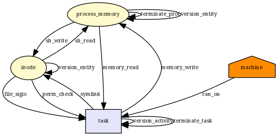 |["file_send_sigiotask", "inode_follow_link", "inode_free", "inode_permission", "inode_symlink", "sb_free", "task_free"]|["file_send_sigiotask", "inode_free", "inode_permission", "inode_symlink", "sb_free", "task_free"]|["inode_follow_link"]|6/7|
__x64_sys_linkat|  |["file_send_sigiotask", "inode_follow_link", "inode_free", "inode_link", "inode_permission", "sb_free", "task_free"]|["file_send_sigiotask", "inode_free", "inode_link", "inode_permission", "sb_free", "task_free"]|["inode_follow_link"]|6/7|
__x64_sys_link| 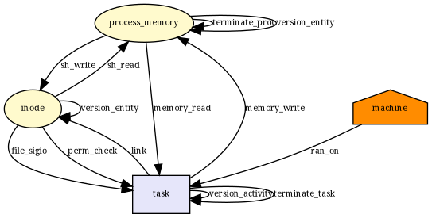 |["file_send_sigiotask", "inode_follow_link", "inode_free", "inode_link", "inode_permission", "sb_free", "task_free"]|["file_send_sigiotask", "inode_free", "inode_link", "inode_permission", "sb_free", "task_free"]|["inode_follow_link"]|6/7|
__x64_sys_renameat2|  |["file_send_sigiotask", "inode_follow_link", "inode_free", "inode_permission", "inode_rename", "sb_free", "task_free"]|["file_send_sigiotask", "inode_free", "inode_permission", "inode_rename", "sb_free", "task_free"]|["inode_follow_link"]|6/7|
__x64_sys_renameat|  |["file_send_sigiotask", "inode_follow_link", "inode_free", "inode_permission", "inode_rename", "sb_free", "task_free"]|["file_send_sigiotask", "inode_free", "inode_permission", "inode_rename", "sb_free", "task_free"]|["inode_follow_link"]|6/7|
__x64_sys_rename|  |["file_send_sigiotask", "inode_follow_link", "inode_free", "inode_permission", "inode_rename", "sb_free", "task_free"]|["file_send_sigiotask", "inode_free", "inode_permission", "inode_rename", "sb_free", "task_free"]|["inode_follow_link"]|6/7|
__x64_sys_lseek|  |["file_send_sigiotask", "task_free"]|["file_send_sigiotask", "task_free"]|[]|2/2|
__x64_sys_llseek|  |["file_send_sigiotask", "task_free"]|["file_send_sigiotask", "task_free"]|[]|2/2|
__x64_sys_read|  |["file_permission", "file_send_sigiotask", "inode_free", "task_free"]|["file_permission", "file_send_sigiotask", "inode_free", "task_free"]|[]|4/4|
__x64_sys_write|  |["file_permission", "file_send_sigiotask", "inode_free", "task_free"]|["file_permission", "file_send_sigiotask", "inode_free", "task_free"]|[]|4/4|
__x64_sys_truncate|  |["file_send_sigiotask", "inode_follow_link", "inode_free", "inode_killpriv", "inode_need_killpriv", "inode_permission", "inode_setattr", "sb_free", "task_free"]|["file_send_sigiotask", "inode_free", "inode_permission", "inode_setattr", "sb_free", "task_free"]|["inode_follow_link", "inode_killpriv", "inode_need_killpriv"]|6/9|
__x64_sys_ftruncate|  |["file_send_sigiotask", "inode_free", "inode_killpriv", "inode_need_killpriv", "inode_permission", "inode_setattr", "task_free"]|["file_send_sigiotask", "inode_free", "inode_permission", "inode_setattr", "task_free"]|["inode_killpriv", "inode_need_killpriv"]|5/7|
__x64_sys_fallocate|  |["file_permission", "file_send_sigiotask", "inode_free", "task_free"]|["file_permission", "file_send_sigiotask", "inode_free", "task_free"]|[]|4/4|
__x64_sys_creat|  |["file_open", "file_send_sigiotask", "inode_create", "inode_follow_link", "inode_free", "inode_killpriv", "inode_need_killpriv", "inode_permission", "inode_setattr", "kernel_module_request", "sb_free", "task_free"]|["file_open", "file_send_sigiotask", "inode_create", "inode_free", "inode_permission", "inode_setattr", "sb_free", "task_free"]|["inode_follow_link", "inode_killpriv", "inode_need_killpriv", "kernel_module_request"]|8/12|
__x64_sys_close|  |["file_send_sigiotask", "inode_free", "task_free"]|["file_send_sigiotask", "inode_free", "task_free"]|[]|3/3|
__x64_sys_access|  |["file_send_sigiotask", "inode_follow_link", "inode_free", "inode_permission", "prepare_creds", "sb_free", "task_free"]|["file_send_sigiotask", "inode_free", "inode_permission", "prepare_creds", "sb_free", "task_free"]|["inode_follow_link"]|6/7|
__x64_sys_faccessat|  |["file_send_sigiotask", "inode_follow_link", "inode_free", "inode_permission", "prepare_creds", "sb_free", "task_free"]|["file_send_sigiotask", "inode_free", "inode_permission", "prepare_creds", "sb_free", "task_free"]|["inode_follow_link"]|6/7|
__x64_sys_chdir|  |["file_send_sigiotask", "inode_follow_link", "inode_free", "inode_permission", "sb_free", "task_free"]|["file_send_sigiotask", "inode_free", "inode_permission", "sb_free", "task_free"]|["inode_follow_link"]|5/6|
__x64_sys_fchdir|  |["file_send_sigiotask", "inode_free", "inode_permission", "sb_free", "task_free"]|["file_send_sigiotask", "inode_free", "inode_permission", "sb_free", "task_free"]|[]|5/5|
__x64_sys_chroot|  |["file_send_sigiotask", "inode_follow_link", "inode_free", "inode_permission", "sb_free", "task_free"]|["file_send_sigiotask", "inode_free", "inode_permission", "sb_free", "task_free"]|["inode_follow_link"]|5/6|
__x64_sys_fchmod|  |["file_send_sigiotask", "inode_free", "inode_killpriv", "inode_need_killpriv", "inode_permission", "inode_setattr", "task_free"]|["file_send_sigiotask", "inode_free", "inode_permission", "inode_setattr", "task_free"]|["inode_killpriv", "inode_need_killpriv"]|5/7|
__x64_sys_fchmodat|  |["file_send_sigiotask", "inode_follow_link", "inode_free", "inode_killpriv", "inode_need_killpriv", "inode_permission", "inode_setattr", "sb_free", "task_free"]|["file_send_sigiotask", "inode_free", "inode_permission", "inode_setattr", "sb_free", "task_free"]|["inode_follow_link", "inode_killpriv", "inode_need_killpriv"]|6/9|
__x64_sys_chmod|  |["file_send_sigiotask", "inode_follow_link", "inode_free", "inode_killpriv", "inode_need_killpriv", "inode_permission", "inode_setattr", "sb_free", "task_free"]|["file_send_sigiotask", "inode_free", "inode_permission", "inode_setattr", "sb_free", "task_free"]|["inode_follow_link", "inode_killpriv", "inode_need_killpriv"]|6/9|
__x64_sys_chown|  |["file_send_sigiotask", "inode_follow_link", "inode_free", "inode_killpriv", "inode_need_killpriv", "inode_permission", "inode_setattr", "sb_free", "task_free"]|["file_send_sigiotask", "inode_free", "inode_permission", "inode_setattr", "sb_free", "task_free"]|["inode_follow_link", "inode_killpriv", "inode_need_killpriv"]|6/9|
__x64_sys_lchown|  |["file_send_sigiotask", "inode_follow_link", "inode_free", "inode_killpriv", "inode_need_killpriv", "inode_permission", "inode_setattr", "sb_free", "task_free"]|["file_send_sigiotask", "inode_free", "inode_permission", "inode_setattr", "sb_free", "task_free"]|["inode_follow_link", "inode_killpriv", "inode_need_killpriv"]|6/9|
__x64_sys_lchown16| 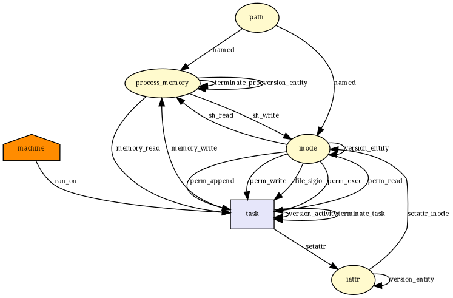 |["file_send_sigiotask", "inode_follow_link", "inode_free", "inode_killpriv", "inode_need_killpriv", "inode_permission", "inode_setattr", "sb_free", "task_free"]|["file_send_sigiotask", "inode_free", "inode_permission", "inode_setattr", "sb_free", "task_free"]|["inode_follow_link", "inode_killpriv", "inode_need_killpriv"]|6/9|
__x64_sys_fchownat|  |["file_send_sigiotask", "inode_follow_link", "inode_free", "inode_killpriv", "inode_need_killpriv", "inode_permission", "inode_setattr", "sb_free", "task_free"]|["file_send_sigiotask", "inode_free", "inode_permission", "inode_setattr", "sb_free", "task_free"]|["inode_follow_link", "inode_killpriv", "inode_need_killpriv"]|6/9|
__x64_sys_fchown|  |["file_send_sigiotask", "inode_free", "inode_killpriv", "inode_need_killpriv", "inode_permission", "inode_setattr", "task_free"]|["file_send_sigiotask", "inode_free", "inode_permission", "inode_setattr", "task_free"]|["inode_killpriv", "inode_need_killpriv"]|5/7|
__x64_sys_chown16|  |["file_send_sigiotask", "inode_follow_link", "inode_free", "inode_killpriv", "inode_need_killpriv", "inode_permission", "inode_setattr", "sb_free", "task_free"]|["file_send_sigiotask", "inode_free", "inode_permission", "inode_setattr", "sb_free", "task_free"]|["inode_follow_link", "inode_killpriv", "inode_need_killpriv"]|6/9|
__x64_sys_fchown16|  |["file_send_sigiotask", "inode_free", "inode_killpriv", "inode_need_killpriv", "inode_permission", "inode_setattr", "task_free"]|["file_send_sigiotask", "inode_free", "inode_permission", "inode_setattr", "task_free"]|["inode_killpriv", "inode_need_killpriv"]|5/7|
__x64_sys_pipe|  |["d_instantiate", "file_send_sigiotask", "inode_alloc", "inode_free", "sb_free", "task_free"]|["file_send_sigiotask", "inode_alloc", "inode_free", "sb_free", "task_free"]|["d_instantiate"]|5/6|
__x64_sys_pipe2|  |["d_instantiate", "file_send_sigiotask", "inode_alloc", "inode_free", "sb_free", "task_free"]|["file_send_sigiotask", "inode_alloc", "inode_free", "sb_free", "task_free"]|["d_instantiate"]|5/6|
__x64_sys_pread64|  |["file_permission", "file_send_sigiotask", "inode_free", "task_free"]|["file_permission", "file_send_sigiotask", "inode_free", "task_free"]|[]|4/4|
__x64_sys_pwrite64|  |["file_permission", "file_send_sigiotask", "inode_free", "task_free"]|["file_permission", "file_send_sigiotask", "inode_free", "task_free"]|[]|4/4|
__x64_sys_readv|  |["file_permission", "file_send_sigiotask", "inode_free", "task_free"]|["file_permission", "file_send_sigiotask", "inode_free", "task_free"]|[]|4/4|
__x64_sys_writev|  |["file_permission", "file_send_sigiotask", "inode_free", "task_free"]|["file_permission", "file_send_sigiotask", "inode_free", "task_free"]|[]|4/4|
__x64_sys_preadv|  |["file_permission", "file_send_sigiotask", "inode_free", "task_free"]|["file_permission", "file_send_sigiotask", "inode_free", "task_free"]|[]|4/4|
__x64_sys_preadv2|  |["file_permission", "file_send_sigiotask", "inode_free", "task_free"]|["file_permission", "file_send_sigiotask", "inode_free", "task_free"]|[]|4/4|
__x64_sys_pwritev|  |["file_permission", "file_send_sigiotask", "inode_free", "task_free"]|["file_permission", "file_send_sigiotask", "inode_free", "task_free"]|[]|4/4|
__x64_sys_pwritev2|  |["file_permission", "file_send_sigiotask", "inode_free", "task_free"]|["file_permission", "file_send_sigiotask", "inode_free", "task_free"]|[]|4/4|
__x64_sys_sendfile|  |["file_permission", "file_send_sigiotask", "inode_free", "task_free"]|["file_permission", "file_send_sigiotask", "inode_free", "task_free"]|[]|4/4|
__x64_sys_sendfile64|  |["file_permission", "file_send_sigiotask", "inode_free", "task_free"]|["file_permission", "file_send_sigiotask", "inode_free", "task_free"]|[]|4/4|
__x64_sys_copy_file_range|  |["file_permission", "file_send_sigiotask", "inode_free", "task_free"]|["file_permission", "file_send_sigiotask", "inode_free", "task_free"]|[]|4/4|
__x64_sys_select|  |["file_send_sigiotask", "task_free"]|["file_send_sigiotask", "task_free"]|[]|2/2|
__x64_sys_pselect6|  |["file_send_sigiotask", "task_free"]|["file_send_sigiotask", "task_free"]|[]|2/2|
__x64_sys_poll|  |["file_send_sigiotask", "task_free"]|["file_send_sigiotask", "task_free"]|[]|2/2|
__x64_sys_ppoll|  |["file_send_sigiotask", "task_free"]|["file_send_sigiotask", "task_free"]|[]|2/2|
__x64_sys_umount|  |["file_send_sigiotask", "inode_follow_link", "inode_free", "inode_permission", "sb_free", "sb_umount", "task_free"]|["file_send_sigiotask", "inode_free", "inode_permission", "sb_free", "task_free"]|["inode_follow_link", "sb_umount"]|5/7|
__x64_sys_mount|  |["file_send_sigiotask", "inode_follow_link", "inode_free", "inode_permission", "kernel_module_request", "sb_copy_data", "sb_free", "sb_kern_mount", "sb_mount", "sb_remount", "task_free"]|["file_send_sigiotask", "inode_free", "inode_permission", "sb_free", "task_free"]|["inode_follow_link", "kernel_module_request", "sb_copy_data", "sb_kern_mount", "sb_mount", "sb_remount"]|5/11|
__x64_sys_pivot_root|  |["file_send_sigiotask", "inode_follow_link", "inode_free", "inode_permission", "sb_free", "sb_pivotroot", "task_free"]|["file_send_sigiotask", "inode_free", "inode_permission", "sb_free", "task_free"]|["inode_follow_link", "sb_pivotroot"]|5/7|
__x64_sys_delete_module|  |["file_send_sigiotask", "task_free"]|["file_send_sigiotask", "task_free"]|[]|2/2|
__x64_sys_init_module|  |["file_send_sigiotask", "kernel_load_data", "kernel_module_request", "key_permission", "sock_rcv_skb", "task_free"]|["file_send_sigiotask", "sock_rcv_skb", "task_free"]|["kernel_load_data", "kernel_module_request", "key_permission"]|3/6|
__x64_sys_finit_module|  |["file_open", "file_permission", "file_send_sigiotask", "inode_free", "kernel_module_request", "kernel_post_read_file", "kernel_read_file", "key_permission", "sb_free", "sock_rcv_skb", "task_free"]|["file_open", "file_permission", "file_send_sigiotask", "inode_free", "kernel_read_file", "sb_free", "sock_rcv_skb", "task_free"]|["kernel_module_request", "kernel_post_read_file", "key_permission"]|8/11|
__x64_sys_setpriority|  |["file_send_sigiotask", "task_free", "task_setnice"]|["file_send_sigiotask", "task_free"]|["task_setnice"]|2/3|
__x64_sys_getpriority|  |["file_send_sigiotask", "task_free"]|["file_send_sigiotask", "task_free"]|[]|2/2|
__x64_sys_setregid|  |["file_send_sigiotask", "prepare_creds", "sock_rcv_skb", "task_free"]|["file_send_sigiotask", "prepare_creds", "sock_rcv_skb", "task_free"]|[]|4/4|
__x64_sys_setgid|  |["file_send_sigiotask", "prepare_creds", "sock_rcv_skb", "task_free"]|["file_send_sigiotask", "prepare_creds", "sock_rcv_skb", "task_free"]|[]|4/4|
__x64_sys_setreuid|  |["file_send_sigiotask", "prepare_creds", "sock_rcv_skb", "task_fix_setuid", "task_free"]|["file_send_sigiotask", "prepare_creds", "sock_rcv_skb", "task_fix_setuid", "task_free"]|[]|5/5|
__x64_sys_setuid|  |["file_send_sigiotask", "prepare_creds", "sock_rcv_skb", "task_fix_setuid", "task_free"]|["file_send_sigiotask", "prepare_creds", "sock_rcv_skb", "task_fix_setuid", "task_free"]|[]|5/5|
__x64_sys_setresuid|  |["file_send_sigiotask", "prepare_creds", "sock_rcv_skb", "task_fix_setuid", "task_free"]|["file_send_sigiotask", "prepare_creds", "sock_rcv_skb", "task_fix_setuid", "task_free"]|[]|5/5|
__x64_sys_getresuid|  |[]|[]|[]|0/0|
__x64_sys_setresgid|  |["file_send_sigiotask", "prepare_creds", "sock_rcv_skb", "task_free"]|["file_send_sigiotask", "prepare_creds", "sock_rcv_skb", "task_free"]|[]|4/4|
__x64_sys_getresgid|  |[]|[]|[]|0/0|
__x64_sys_setfsuid| 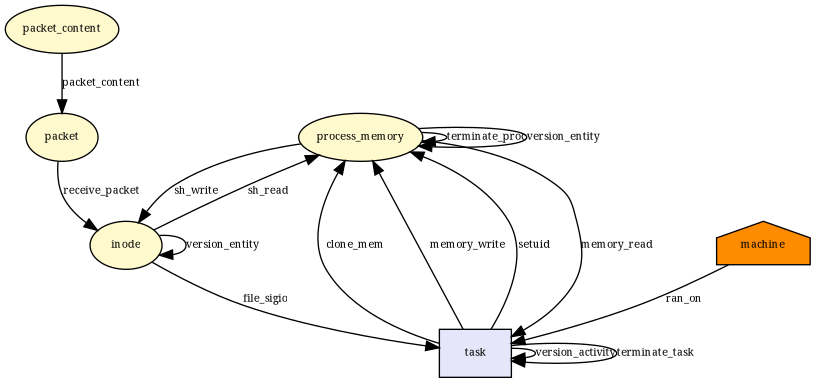 |["file_send_sigiotask", "prepare_creds", "sock_rcv_skb", "task_fix_setuid", "task_free"]|["file_send_sigiotask", "prepare_creds", "sock_rcv_skb", "task_fix_setuid", "task_free"]|[]|5/5|
__x64_sys_setfsgid|  |["file_send_sigiotask", "prepare_creds", "sock_rcv_skb", "task_free"]|["file_send_sigiotask", "prepare_creds", "sock_rcv_skb", "task_free"]|[]|4/4|
__x64_sys_getpid|  |[]|[]|[]|0/0|
__x64_sys_gettid|  |[]|[]|[]|0/0|
__x64_sys_getppid|  |[]|[]|[]|0/0|
__x64_sys_getuid|  |[]|[]|[]|0/0|
__x64_sys_geteuid|  |[]|[]|[]|0/0|
__x64_sys_getgid|  |[]|[]|[]|0/0|
__x64_sys_getegid|  |[]|[]|[]|0/0|
__x64_sys_times|  |["file_send_sigiotask", "task_free"]|["file_send_sigiotask", "task_free"]|[]|2/2|
__x64_sys_utimes|  |["file_send_sigiotask", "inode_follow_link", "inode_free", "inode_killpriv", "inode_need_killpriv", "inode_permission", "inode_setattr", "sb_free", "task_free"]|["file_send_sigiotask", "inode_free", "inode_permission", "inode_setattr", "sb_free", "task_free"]|["inode_follow_link", "inode_killpriv", "inode_need_killpriv"]|6/9|
__x64_sys_setpgid| 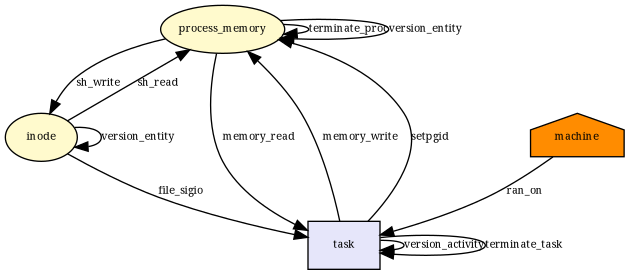 |["file_send_sigiotask", "task_free", "task_setpgid"]|["file_send_sigiotask", "task_free", "task_setpgid"]|[]|3/3|
__x64_sys_getpgid| 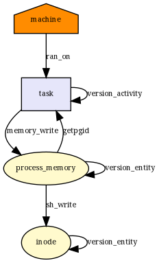 |["task_getpgid"]|["task_getpgid"]|[]|1/1|
__x64_sys_getpgrp| 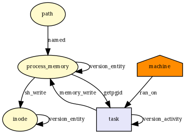 |["task_getpgid"]|["task_getpgid"]|[]|1/1|
__x64_sys_getsid|  |["task_getsid"]|[]|["task_getsid"]|0/1|
__x64_sys_setsid|  |["file_send_sigiotask", "sock_rcv_skb", "task_free"]|["file_send_sigiotask", "sock_rcv_skb", "task_free"]|[]|3/3|
__x64_sys_newuname|  |["file_send_sigiotask", "task_free"]|["file_send_sigiotask", "task_free"]|[]|2/2|
__x64_sys_uname|  |["file_send_sigiotask", "task_free"]|["file_send_sigiotask", "task_free"]|[]|2/2|
__x64_sys_sethostname|  |["file_send_sigiotask", "task_free"]|["file_send_sigiotask", "task_free"]|[]|2/2|
__x64_sys_gethostname|  |["file_send_sigiotask", "task_free"]|["file_send_sigiotask", "task_free"]|[]|2/2|
__x64_sys_setdomainname|  |["file_send_sigiotask", "task_free"]|["file_send_sigiotask", "task_free"]|[]|2/2|
__x64_sys_setrlimit|  |["file_send_sigiotask", "task_free", "task_setrlimit"]|["file_send_sigiotask", "task_free"]|["task_setrlimit"]|2/3|
__x64_sys_getrusage|  |["file_send_sigiotask", "inode_free", "mmap_addr", "mmap_munmap", "task_free", "vm_enough_memory_mm"]|["file_send_sigiotask", "inode_free", "mmap_munmap", "task_free"]|["mmap_addr", "vm_enough_memory_mm"]|4/6|
__x64_sys_umask|  |[]|[]|[]|0/0|
__x64_sys_prctl| 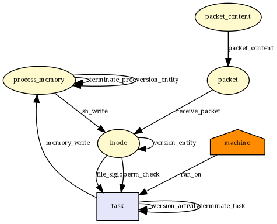 |["file_send_sigiotask", "inode_permission", "sock_rcv_skb", "task_free", "task_prctl"]|["file_send_sigiotask", "inode_permission", "sock_rcv_skb", "task_free"]|["task_prctl"]|4/5|
__x64_sys_getcpu|  |[]|[]|[]|0/0|
__x64_sys_sysinfo|  |["file_send_sigiotask", "task_free"]|["file_send_sigiotask", "task_free"]|[]|2/2|
__x64_sys_iopl|  |["file_send_sigiotask", "task_free"]|["file_send_sigiotask", "task_free"]|[]|2/2|
__x64_sys_ioperm|  |["file_send_sigiotask", "task_free"]|["file_send_sigiotask", "task_free"]|[]|2/2|
__x64_sys_mprotect|  |["file_mprotect", "file_send_sigiotask", "inode_free", "mmap_addr", "task_free", "vm_enough_memory_mm"]|["file_send_sigiotask", "inode_free", "task_free"]|["file_mprotect", "mmap_addr", "vm_enough_memory_mm"]|3/6|
__x64_sys_pkey_mprotect|  |["file_mprotect", "file_send_sigiotask", "inode_free", "mmap_addr", "task_free", "vm_enough_memory_mm"]|["file_send_sigiotask", "inode_free", "task_free"]|["file_mprotect", "mmap_addr", "vm_enough_memory_mm"]|3/6|
__x64_sys_pkey_alloc|  |["file_send_sigiotask", "task_free"]|["file_send_sigiotask", "task_free"]|[]|2/2|
__x64_sys_pkey_free|  |["file_send_sigiotask", "task_free"]|["file_send_sigiotask", "task_free"]|[]|2/2|
__x64_sys_capget|  |["file_send_sigiotask", "task_free"]|["file_send_sigiotask", "task_free"]|[]|2/2|
__x64_sys_capset|  |["file_send_sigiotask", "prepare_creds", "sock_rcv_skb", "task_free"]|["file_send_sigiotask", "prepare_creds", "sock_rcv_skb", "task_free"]|[]|4/4|
__x64_sys_brk|  |["file_send_sigiotask", "inode_free", "mmap_addr", "mmap_munmap", "task_free", "vm_enough_memory_mm"]|["file_send_sigiotask", "inode_free", "mmap_munmap", "task_free"]|["mmap_addr", "vm_enough_memory_mm"]|4/6|
__x64_sys_mmap_pgoff|  |["d_instantiate", "file_open", "file_send_sigiotask", "inode_alloc", "inode_free", "kernel_module_request", "mmap_addr", "mmap_file", "mmap_munmap", "sb_free", "task_free", "vm_enough_memory_mm"]|["file_open", "file_send_sigiotask", "inode_alloc", "inode_free", "mmap_file", "mmap_munmap", "sb_free", "task_free"]|["d_instantiate", "kernel_module_request", "mmap_addr", "vm_enough_memory_mm"]|8/12|
__x64_sys_munmap|  |["file_send_sigiotask", "inode_free", "mmap_addr", "mmap_munmap", "task_free", "vm_enough_memory_mm"]|["file_send_sigiotask", "inode_free", "mmap_munmap", "task_free"]|["mmap_addr", "vm_enough_memory_mm"]|4/6|
__x64_sys_remap_file_pages|  |["d_instantiate", "file_send_sigiotask", "inode_alloc", "inode_free", "mmap_addr", "mmap_munmap", "sb_free", "task_free", "vm_enough_memory_mm"]|["file_send_sigiotask", "inode_alloc", "inode_free", "mmap_munmap", "sb_free", "task_free"]|["d_instantiate", "mmap_addr", "vm_enough_memory_mm"]|6/9|
__x64_sys_mmap|  |["d_instantiate", "file_open", "file_send_sigiotask", "inode_alloc", "inode_free", "kernel_module_request", "mmap_addr", "mmap_file", "mmap_munmap", "sb_free", "task_free", "vm_enough_memory_mm"]|["file_open", "file_send_sigiotask", "inode_alloc", "inode_free", "mmap_file", "mmap_munmap", "sb_free", "task_free"]|["d_instantiate", "kernel_module_request", "mmap_addr", "vm_enough_memory_mm"]|8/12|
__x64_sys_msgsnd|  |["file_send_sigiotask", "ipc_permission", "msg_msg_alloc", "msg_msg_free", "msg_queue_msgrcv", "msg_queue_msgsnd", "task_free"]|["file_send_sigiotask", "msg_msg_alloc", "msg_msg_free", "msg_queue_msgrcv", "msg_queue_msgsnd", "task_free"]|["ipc_permission"]|6/7|
__x64_sys_msgrcv|  |["file_send_sigiotask", "ipc_permission", "msg_msg_alloc", "msg_msg_free", "msg_queue_msgrcv", "task_free"]|["file_send_sigiotask", "msg_msg_alloc", "msg_msg_free", "msg_queue_msgrcv", "task_free"]|["ipc_permission"]|5/6|
__x64_sys_msgget|  |["file_send_sigiotask", "ipc_permission", "task_free"]|["file_send_sigiotask", "task_free"]|["ipc_permission"]|2/3|
__x64_sys_msgctl|  |["file_send_sigiotask", "ipc_permission", "msg_msg_free", "msg_queue_msgctl", "task_free"]|["file_send_sigiotask", "msg_msg_free", "task_free"]|["ipc_permission", "msg_queue_msgctl"]|3/5|
__x64_sys_process_vm_readv|  |["file_send_sigiotask", "inode_free", "mmap_addr", "mmap_munmap", "ptrace_access_check", "task_free", "vm_enough_memory_mm"]|["file_send_sigiotask", "inode_free", "mmap_munmap", "task_free"]|["mmap_addr", "ptrace_access_check", "vm_enough_memory_mm"]|4/7|
__x64_sys_process_vm_writev|  |["file_send_sigiotask", "inode_free", "mmap_addr", "mmap_munmap", "ptrace_access_check", "task_free", "vm_enough_memory_mm"]|["file_send_sigiotask", "inode_free", "mmap_munmap", "task_free"]|["mmap_addr", "ptrace_access_check", "vm_enough_memory_mm"]|4/7|
__x64_sys_ptrace|  |["file_send_sigiotask", "inode_free", "mmap_addr", "mmap_munmap", "ptrace_access_check", "ptrace_traceme", "sb_free", "sock_rcv_skb", "task_free", "vm_enough_memory_mm"]|["file_send_sigiotask", "inode_free", "mmap_munmap", "sb_free", "sock_rcv_skb", "task_free"]|["mmap_addr", "ptrace_access_check", "ptrace_traceme", "vm_enough_memory_mm"]|6/10|
__x64_sys_shmget|  |["file_send_sigiotask", "ipc_permission", "task_free"]|["file_send_sigiotask", "task_free"]|["ipc_permission"]|2/3|
__x64_sys_shmctl|  |["file_send_sigiotask", "ipc_permission", "shm_shmctl", "task_free"]|["file_send_sigiotask", "task_free"]|["ipc_permission", "shm_shmctl"]|2/4|
__x64_sys_shmat| 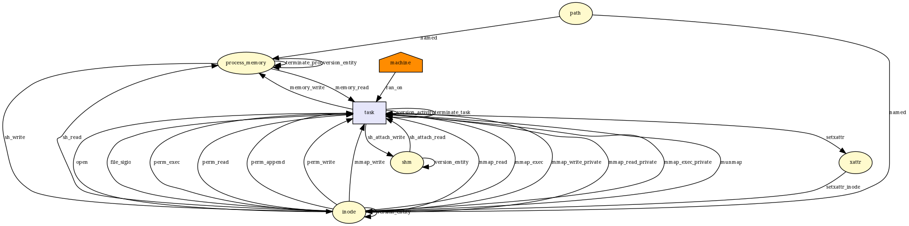 |["d_instantiate", "file_open", "file_send_sigiotask", "inode_alloc", "inode_free", "ipc_permission", "kernel_module_request", "mmap_addr", "mmap_file", "mmap_munmap", "sb_free", "shm_shmat", "task_free", "vm_enough_memory_mm"]|["file_open", "file_send_sigiotask", "inode_alloc", "inode_free", "mmap_file", "mmap_munmap", "sb_free", "shm_shmat", "task_free"]|["d_instantiate", "ipc_permission", "kernel_module_request", "mmap_addr", "vm_enough_memory_mm"]|9/14|
__x64_sys_shmdt|  |["file_send_sigiotask", "inode_free", "mmap_addr", "mmap_munmap", "task_free", "vm_enough_memory_mm"]|["file_send_sigiotask", "inode_free", "mmap_munmap", "task_free"]|["mmap_addr", "vm_enough_memory_mm"]|4/6|
__x64_sys_vmsplice| 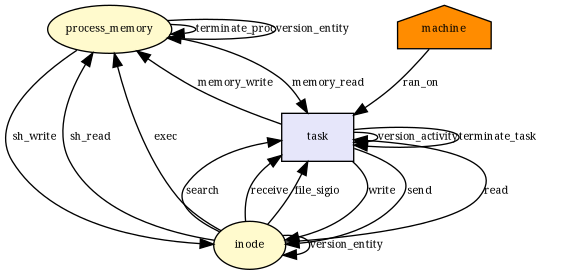 |["file_permission", "file_send_sigiotask", "inode_free", "mmap_addr", "task_free", "vm_enough_memory_mm"]|["file_permission", "file_send_sigiotask", "inode_free", "task_free"]|["mmap_addr", "vm_enough_memory_mm"]|4/6|
__x64_sys_splice|  |["file_permission", "file_send_sigiotask", "file_splice_pipe_to_pipe", "inode_free", "task_free"]|["file_permission", "file_send_sigiotask", "file_splice_pipe_to_pipe", "inode_free", "task_free"]|[]|5/5|
__x64_sys_tee|  |["file_send_sigiotask", "file_splice_pipe_to_pipe", "task_free"]|["file_send_sigiotask", "file_splice_pipe_to_pipe", "task_free"]|[]|3/3|
__x64_sys_time|  |[]|[]|[]|0/0|
__x64_sys_stime|  |["file_send_sigiotask", "settime64", "task_free"]|["file_send_sigiotask", "task_free"]|["settime64"]|2/3|
__x64_sys_gettimeofday|  |["file_send_sigiotask", "task_free"]|["file_send_sigiotask", "task_free"]|[]|2/2|
__x64_sys_settimeofday|  |["file_send_sigiotask", "settime64", "task_free"]|["file_send_sigiotask", "task_free"]|["settime64"]|2/3|
__x64_sys_adjtimex|  |["file_send_sigiotask", "task_free"]|["file_send_sigiotask", "task_free"]|[]|2/2|
__x64_sys_nanosleep|  |["file_send_sigiotask", "task_free"]|["file_send_sigiotask", "task_free"]|[]|2/2|
__x64_sys_alarm|  |["file_send_sigiotask", "task_free"]|["file_send_sigiotask", "task_free"]|[]|2/2|
__x64_sys_getgroups|  |[]|[]|[]|0/0|
__x64_sys_getgroups16|  |[]|[]|[]|0/0|
__x64_sys_setgroups|  |["file_send_sigiotask", "prepare_creds", "sock_rcv_skb", "task_free"]|["file_send_sigiotask", "prepare_creds", "sock_rcv_skb", "task_free"]|[]|4/4|
__x64_sys_setgroups16|  |["file_send_sigiotask", "prepare_creds", "sock_rcv_skb", "task_free"]|["file_send_sigiotask", "prepare_creds", "sock_rcv_skb", "task_free"]|[]|4/4|
__x64_sys_acct|  |["file_open", "file_send_sigiotask", "inode_create", "inode_follow_link", "inode_free", "inode_killpriv", "inode_need_killpriv", "inode_permission", "inode_setattr", "kernel_module_request", "sb_free", "task_free"]|["file_open", "file_send_sigiotask", "inode_create", "inode_free", "inode_permission", "inode_setattr", "sb_free", "task_free"]|["inode_follow_link", "inode_killpriv", "inode_need_killpriv", "kernel_module_request"]|8/12|
__x64_sys_personality|  |[]|[]|[]|0/0|
__x64_sys_sigpending|  |["file_send_sigiotask", "task_free"]|["file_send_sigiotask", "task_free"]|[]|2/2|
__x64_sys_sigprocmask|  |["file_send_sigiotask", "task_free"]|["file_send_sigiotask", "task_free"]|[]|2/2|
__x64_sys_sigaltstack|  |["file_send_sigiotask", "task_free"]|["file_send_sigiotask", "task_free"]|[]|2/2|
__x64_sys_getitimer|  |["file_send_sigiotask", "task_free"]|["file_send_sigiotask", "task_free"]|[]|2/2|
__x64_sys_setitimer|  |["file_send_sigiotask", "task_free"]|["file_send_sigiotask", "task_free"]|[]|2/2|
__x64_sys_timer_create|  |["file_send_sigiotask", "task_free"]|["file_send_sigiotask", "task_free"]|[]|2/2|
__x64_sys_timer_gettime|  |["file_send_sigiotask", "task_free"]|["file_send_sigiotask", "task_free"]|[]|2/2|
__x64_sys_timer_getoverrun|  |[]|[]|[]|0/0|
__x64_sys_timer_settime|  |["file_send_sigiotask", "task_free"]|["file_send_sigiotask", "task_free"]|[]|2/2|
__x64_sys_timer_delete|  |["file_send_sigiotask", "task_free"]|["file_send_sigiotask", "task_free"]|[]|2/2|
__x64_sys_clock_settime|  |["file_send_sigiotask", "task_free"]|["file_send_sigiotask", "task_free"]|[]|2/2|
__x64_sys_clock_gettime|  |["file_send_sigiotask", "task_free"]|["file_send_sigiotask", "task_free"]|[]|2/2|
__x64_sys_clock_adjtime|  |["file_send_sigiotask", "task_free"]|["file_send_sigiotask", "task_free"]|[]|2/2|
__x64_sys_clock_getres|  |["file_send_sigiotask", "task_free"]|["file_send_sigiotask", "task_free"]|[]|2/2|
__x64_sys_clock_nanosleep|  |["file_send_sigiotask", "task_free"]|["file_send_sigiotask", "task_free"]|[]|2/2|
__x64_sys_nice|  |["file_send_sigiotask", "task_free", "task_setnice"]|["file_send_sigiotask", "task_free"]|["task_setnice"]|2/3|
__x64_sys_sched_setscheduler|  |["file_send_sigiotask", "task_free", "task_setscheduler"]|["file_send_sigiotask", "task_free"]|["task_setscheduler"]|2/3|
__x64_sys_sched_setparam|  |["file_send_sigiotask", "task_free", "task_setscheduler"]|["file_send_sigiotask", "task_free"]|["task_setscheduler"]|2/3|
__x64_sys_sched_setattr|  |["file_send_sigiotask", "task_free", "task_setscheduler"]|["file_send_sigiotask", "task_free"]|["task_setscheduler"]|2/3|
__x64_sys_sched_getscheduler|  |["task_getscheduler"]|[]|["task_getscheduler"]|0/1|
__x64_sys_sched_getparam|  |["file_send_sigiotask", "task_free", "task_getscheduler"]|["file_send_sigiotask", "task_free"]|["task_getscheduler"]|2/3|
__x64_sys_sched_getattr|  |["file_send_sigiotask", "task_free", "task_getscheduler"]|["file_send_sigiotask", "task_free"]|["task_getscheduler"]|2/3|
__x64_sys_sched_setaffinity|  |["file_send_sigiotask", "task_free", "task_setscheduler"]|["file_send_sigiotask", "task_free"]|["task_setscheduler"]|2/3|
__x64_sys_sched_getaffinity|  |["file_send_sigiotask", "task_free", "task_getscheduler"]|["file_send_sigiotask", "task_free"]|["task_getscheduler"]|2/3|
__x64_sys_sched_yield|  |["file_send_sigiotask", "task_free"]|["file_send_sigiotask", "task_free"]|[]|2/2|
__x64_sys_sched_get_priority_max|  |[]|[]|[]|0/0|
__x64_sys_sched_get_priority_min|  |[]|[]|[]|0/0|
__x64_sys_sched_rr_get_interval|  |["file_send_sigiotask", "task_free", "task_getscheduler"]|["file_send_sigiotask", "task_free"]|["task_getscheduler"]|2/3|
__x64_sys_reboot|  |["file_send_sigiotask", "file_set_fowner", "inode_alloc", "inode_free", "kernel_module_request", "mmap_addr", "mmap_munmap", "sb_free", "sb_statfs", "sock_rcv_skb", "task_free", "task_kill", "task_setscheduler", "vm_enough_memory_mm"]|["file_send_sigiotask", "inode_alloc", "inode_free", "mmap_munmap", "sb_free", "sock_rcv_skb", "task_free", "task_kill"]|["file_set_fowner", "kernel_module_request", "mmap_addr", "sb_statfs", "task_setscheduler", "vm_enough_memory_mm"]|8/14|
__x64_sys_restart_syscall|  |[]|[]|[]|0/0|
__x64_sys_kexec_load|  |["file_send_sigiotask", "kernel_load_data", "task_free"]|["file_send_sigiotask", "task_free"]|["kernel_load_data"]|2/3|
__x64_sys_kexec_file_load|  |["file_open", "file_permission", "file_send_sigiotask", "inode_free", "kernel_module_request", "kernel_post_read_file", "kernel_read_file", "sb_free", "task_free"]|["file_open", "file_permission", "file_send_sigiotask", "inode_free", "kernel_read_file", "sb_free", "task_free"]|["kernel_module_request", "kernel_post_read_file"]|7/9|
__x64_sys_exit|  |["file_send_sigiotask", "file_set_fowner", "inode_free", "kernel_module_request", "mmap_addr", "mmap_munmap", "sb_free", "sb_statfs", "sock_rcv_skb", "task_free", "task_kill", "vm_enough_memory_mm"]|["file_send_sigiotask", "inode_free", "mmap_munmap", "sb_free", "sock_rcv_skb", "task_free", "task_kill"]|["file_set_fowner", "kernel_module_request", "mmap_addr", "sb_statfs", "vm_enough_memory_mm"]|7/12|
__x64_sys_exit_group|  |["file_send_sigiotask", "file_set_fowner", "inode_free", "kernel_module_request", "mmap_addr", "mmap_munmap", "sb_free", "sb_statfs", "sock_rcv_skb", "task_free", "task_kill", "vm_enough_memory_mm"]|["file_send_sigiotask", "inode_free", "mmap_munmap", "sb_free", "sock_rcv_skb", "task_free", "task_kill"]|["file_set_fowner", "kernel_module_request", "mmap_addr", "sb_statfs", "vm_enough_memory_mm"]|7/12|
__x64_sys_wait4|  |["file_send_sigiotask", "inode_free", "mmap_addr", "mmap_munmap", "task_free", "vm_enough_memory_mm"]|["file_send_sigiotask", "inode_free", "mmap_munmap", "task_free"]|["mmap_addr", "vm_enough_memory_mm"]|4/6|
__x64_sys_waitid|  |["file_send_sigiotask", "inode_free", "mmap_addr", "mmap_munmap", "task_free", "vm_enough_memory_mm"]|["file_send_sigiotask", "inode_free", "mmap_munmap", "task_free"]|["mmap_addr", "vm_enough_memory_mm"]|4/6|
__x64_sys_waitpid|  |["file_send_sigiotask", "inode_free", "mmap_addr", "mmap_munmap", "task_free", "vm_enough_memory_mm"]|["file_send_sigiotask", "inode_free", "mmap_munmap", "task_free"]|["mmap_addr", "vm_enough_memory_mm"]|4/6|
__x64_sys_set_tid_address|  |[]|[]|[]|0/0|
__x64_sys_futex|  |["file_send_sigiotask", "inode_free", "mmap_addr", "task_free", "vm_enough_memory_mm"]|["file_send_sigiotask", "inode_free", "task_free"]|["mmap_addr", "vm_enough_memory_mm"]|3/5|
__x64_sys_init_module|  |["file_send_sigiotask", "kernel_load_data", "kernel_module_request", "key_permission", "sock_rcv_skb", "task_free"]|["file_send_sigiotask", "sock_rcv_skb", "task_free"]|["kernel_load_data", "kernel_module_request", "key_permission"]|3/6|
__x64_sys_delete_module|  |["file_send_sigiotask", "task_free"]|["file_send_sigiotask", "task_free"]|[]|2/2|
__x64_sys_sigsuspend|  |["file_send_sigiotask", "task_free"]|["file_send_sigiotask", "task_free"]|[]|2/2|
__x64_sys_rt_sigsuspend|  |["file_send_sigiotask", "task_free"]|["file_send_sigiotask", "task_free"]|[]|2/2|
__x64_sys_rt_sigaction|  |["file_send_sigiotask", "task_free"]|["file_send_sigiotask", "task_free"]|[]|2/2|
__x64_sys_rt_sigprocmask|  |["file_send_sigiotask", "task_free"]|["file_send_sigiotask", "task_free"]|[]|2/2|
__x64_sys_rt_sigpending|  |["file_send_sigiotask", "task_free"]|["file_send_sigiotask", "task_free"]|[]|2/2|
__x64_sys_rt_sigtimedwait|  |["file_send_sigiotask", "task_free"]|["file_send_sigiotask", "task_free"]|[]|2/2|
__x64_sys_rt_tgsigqueueinfo|  |["file_send_sigiotask", "task_free", "task_kill"]|["file_send_sigiotask", "task_free", "task_kill"]|[]|3/3|
__x64_sys_kill|  |["file_send_sigiotask", "task_free", "task_kill"]|["file_send_sigiotask", "task_free", "task_kill"]|[]|3/3|
__x64_sys_tgkill|  |["file_send_sigiotask", "task_free", "task_kill"]|["file_send_sigiotask", "task_free", "task_kill"]|[]|3/3|
__x64_sys_tkill|  |["file_send_sigiotask", "task_free", "task_kill"]|["file_send_sigiotask", "task_free", "task_kill"]|[]|3/3|
__x64_sys_rt_sigqueueinfo|  |["file_send_sigiotask", "task_free", "task_kill"]|["file_send_sigiotask", "task_free", "task_kill"]|[]|3/3|
__x64_sys_sgetmask|  |[]|[]|[]|0/0|
__x64_sys_ssetmask|  |["file_send_sigiotask", "task_free"]|["file_send_sigiotask", "task_free"]|[]|2/2|
__x64_sys_signal|  |["file_send_sigiotask", "task_free"]|["file_send_sigiotask", "task_free"]|[]|2/2|
__x64_sys_pause|  |["file_send_sigiotask", "task_free"]|["file_send_sigiotask", "task_free"]|[]|2/2|
__x64_sys_sync|  |["file_send_sigiotask", "inode_free", "sb_free", "task_free"]|["file_send_sigiotask", "inode_free", "sb_free", "task_free"]|[]|4/4|
__x64_sys_fsync|  |["file_send_sigiotask", "inode_free", "task_free"]|["file_send_sigiotask", "inode_free", "task_free"]|[]|3/3|
__x64_sys_fdatasync|  |["file_send_sigiotask", "inode_free", "task_free"]|["file_send_sigiotask", "inode_free", "task_free"]|[]|3/3|
__x64_sys_bdflush|  |["file_send_sigiotask", "file_set_fowner", "inode_free", "kernel_module_request", "mmap_addr", "mmap_munmap", "sb_free", "sb_statfs", "sock_rcv_skb", "task_free", "task_kill", "vm_enough_memory_mm"]|["file_send_sigiotask", "inode_free", "mmap_munmap", "sb_free", "sock_rcv_skb", "task_free", "task_kill"]|["file_set_fowner", "kernel_module_request", "mmap_addr", "sb_statfs", "vm_enough_memory_mm"]|7/12|
__x64_sys_oldumount|  |["file_send_sigiotask", "inode_follow_link", "inode_free", "inode_permission", "sb_free", "sb_umount", "task_free"]|["file_send_sigiotask", "inode_free", "inode_permission", "sb_free", "task_free"]|["inode_follow_link", "sb_umount"]|5/7|
__x64_sys_stat|  |["file_send_sigiotask", "inode_follow_link", "inode_free", "inode_getattr", "inode_permission", "sb_free", "task_free"]|["file_send_sigiotask", "inode_free", "inode_getattr", "inode_permission", "sb_free", "task_free"]|["inode_follow_link"]|6/7|
__x64_sys_statfs|  |["file_send_sigiotask", "inode_follow_link", "inode_free", "inode_permission", "sb_free", "sb_statfs", "task_free"]|["file_send_sigiotask", "inode_free", "inode_permission", "sb_free", "task_free"]|["inode_follow_link", "sb_statfs"]|5/7|
__x64_sys_statfs64|  |["file_send_sigiotask", "inode_follow_link", "inode_free", "inode_permission", "sb_free", "sb_statfs", "task_free"]|["file_send_sigiotask", "inode_free", "inode_permission", "sb_free", "task_free"]|["inode_follow_link", "sb_statfs"]|5/7|
__x64_sys_fstatfs|  |["file_send_sigiotask", "sb_statfs", "task_free"]|["file_send_sigiotask", "task_free"]|["sb_statfs"]|2/3|
__x64_sys_fstatfs64|  |["file_send_sigiotask", "sb_statfs", "task_free"]|["file_send_sigiotask", "task_free"]|["sb_statfs"]|2/3|
__x64_sys_lstat|  |["file_send_sigiotask", "inode_follow_link", "inode_free", "inode_getattr", "inode_permission", "sb_free", "task_free"]|["file_send_sigiotask", "inode_free", "inode_getattr", "inode_permission", "sb_free", "task_free"]|["inode_follow_link"]|6/7|
__x64_sys_fstat|  |["file_send_sigiotask", "inode_getattr", "task_free"]|["file_send_sigiotask", "inode_getattr", "task_free"]|[]|3/3|
__x64_sys_newstat|  |["file_send_sigiotask", "inode_follow_link", "inode_free", "inode_getattr", "inode_permission", "sb_free", "task_free"]|["file_send_sigiotask", "inode_free", "inode_getattr", "inode_permission", "sb_free", "task_free"]|["inode_follow_link"]|6/7|
__x64_sys_newlstat|  |["file_send_sigiotask", "inode_follow_link", "inode_free", "inode_getattr", "inode_permission", "sb_free", "task_free"]|["file_send_sigiotask", "inode_free", "inode_getattr", "inode_permission", "sb_free", "task_free"]|["inode_follow_link"]|6/7|
__x64_sys_newfstat| 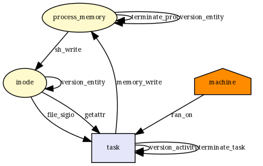 |["file_send_sigiotask", "inode_getattr", "task_free"]|["file_send_sigiotask", "inode_getattr", "task_free"]|[]|3/3|
__x64_sys_ustat|  |["file_send_sigiotask", "sb_free", "sb_statfs", "task_free"]|["file_send_sigiotask", "sb_free", "task_free"]|["sb_statfs"]|3/4|
__x64_sys_setxattr|  |["file_send_sigiotask", "inode_follow_link", "inode_free", "inode_permission", "inode_post_setxattr", "inode_setsecurity", "inode_setxattr", "sb_free", "task_free"]|["file_send_sigiotask", "inode_free", "inode_permission", "inode_post_setxattr", "inode_setxattr", "sb_free", "task_free"]|["inode_follow_link", "inode_setsecurity"]|7/9|
__x64_sys_lsetxattr|  |["file_send_sigiotask", "inode_follow_link", "inode_free", "inode_permission", "inode_post_setxattr", "inode_setsecurity", "inode_setxattr", "sb_free", "task_free"]|["file_send_sigiotask", "inode_free", "inode_permission", "inode_post_setxattr", "inode_setxattr", "sb_free", "task_free"]|["inode_follow_link", "inode_setsecurity"]|7/9|
__x64_sys_fsetxattr|  |["file_send_sigiotask", "inode_free", "inode_permission", "inode_post_setxattr", "inode_setsecurity", "inode_setxattr", "task_free"]|["file_send_sigiotask", "inode_free", "inode_permission", "inode_post_setxattr", "inode_setxattr", "task_free"]|["inode_setsecurity"]|6/7|
__x64_sys_getxattr|  |["file_send_sigiotask", "inode_follow_link", "inode_free", "inode_getsecurity", "inode_getxattr", "inode_permission", "sb_free", "task_free"]|["file_send_sigiotask", "inode_free", "inode_getsecurity", "inode_getxattr", "inode_permission", "sb_free", "task_free"]|["inode_follow_link"]|7/8|
__x64_sys_lgetxattr|  |["file_send_sigiotask", "inode_follow_link", "inode_free", "inode_getsecurity", "inode_getxattr", "inode_permission", "sb_free", "task_free"]|["file_send_sigiotask", "inode_free", "inode_getsecurity", "inode_getxattr", "inode_permission", "sb_free", "task_free"]|["inode_follow_link"]|7/8|
__x64_sys_fgetxattr|  |["file_send_sigiotask", "inode_getsecurity", "inode_getxattr", "inode_permission", "task_free"]|["file_send_sigiotask", "inode_getsecurity", "inode_getxattr", "inode_permission", "task_free"]|[]|5/5|
__x64_sys_listxattr|  |["file_send_sigiotask", "inode_follow_link", "inode_free", "inode_listsecurity", "inode_listxattr", "inode_permission", "sb_free", "task_free"]|["file_send_sigiotask", "inode_free", "inode_listsecurity", "inode_listxattr", "inode_permission", "sb_free", "task_free"]|["inode_follow_link"]|7/8|
__x64_sys_llistxattr|  |["file_send_sigiotask", "inode_follow_link", "inode_free", "inode_listsecurity", "inode_listxattr", "inode_permission", "sb_free", "task_free"]|["file_send_sigiotask", "inode_free", "inode_listsecurity", "inode_listxattr", "inode_permission", "sb_free", "task_free"]|["inode_follow_link"]|7/8|
__x64_sys_flistxattr| 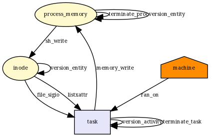 |["file_send_sigiotask", "inode_listsecurity", "inode_listxattr", "task_free"]|["file_send_sigiotask", "inode_listsecurity", "inode_listxattr", "task_free"]|[]|4/4|
__x64_sys_removexattr|  |["file_send_sigiotask", "inode_follow_link", "inode_free", "inode_permission", "inode_removexattr", "sb_free", "task_free"]|["file_send_sigiotask", "inode_free", "inode_permission", "inode_removexattr", "sb_free", "task_free"]|["inode_follow_link"]|6/7|
__x64_sys_lremovexattr|  |["file_send_sigiotask", "inode_follow_link", "inode_free", "inode_permission", "inode_removexattr", "sb_free", "task_free"]|["file_send_sigiotask", "inode_free", "inode_permission", "inode_removexattr", "sb_free", "task_free"]|["inode_follow_link"]|6/7|
__x64_sys_fremovexattr|  |["file_send_sigiotask", "inode_free", "inode_permission", "inode_removexattr", "task_free"]|["file_send_sigiotask", "inode_free", "inode_permission", "inode_removexattr", "task_free"]|[]|5/5|
__x64_sys_brk|  |["file_send_sigiotask", "inode_free", "mmap_addr", "mmap_munmap", "task_free", "vm_enough_memory_mm"]|["file_send_sigiotask", "inode_free", "mmap_munmap", "task_free"]|["mmap_addr", "vm_enough_memory_mm"]|4/6|
__x64_sys_mremap|  |["file_send_sigiotask", "inode_free", "mmap_addr", "mmap_munmap", "task_free", "vm_enough_memory_mm"]|["file_send_sigiotask", "inode_free", "mmap_munmap", "task_free"]|["mmap_addr", "vm_enough_memory_mm"]|4/6|
__x64_sys_msync|  |["file_send_sigiotask", "inode_free", "task_free"]|["file_send_sigiotask", "inode_free", "task_free"]|[]|3/3|
__x64_sys_fadvise64|  |["file_send_sigiotask", "task_free"]|["file_send_sigiotask", "task_free"]|[]|2/2|
__x64_sys_fadvise64_64|  |["file_send_sigiotask", "task_free"]|["file_send_sigiotask", "task_free"]|[]|2/2|
__x64_sys_mlock|  |["file_send_sigiotask", "inode_free", "mmap_addr", "task_free", "vm_enough_memory_mm"]|["file_send_sigiotask", "inode_free", "task_free"]|["mmap_addr", "vm_enough_memory_mm"]|3/5|
__x64_sys_munlock|  |["file_send_sigiotask", "inode_free", "mmap_addr", "task_free", "vm_enough_memory_mm"]|["file_send_sigiotask", "inode_free", "task_free"]|["mmap_addr", "vm_enough_memory_mm"]|3/5|
__x64_sys_mlockall|  |["file_send_sigiotask", "inode_free", "mmap_addr", "task_free", "vm_enough_memory_mm"]|["file_send_sigiotask", "inode_free", "task_free"]|["mmap_addr", "vm_enough_memory_mm"]|3/5|
__x64_sys_munlockall|  |["file_send_sigiotask", "inode_free", "mmap_addr", "task_free", "vm_enough_memory_mm"]|["file_send_sigiotask", "inode_free", "task_free"]|["mmap_addr", "vm_enough_memory_mm"]|3/5|
__x64_sys_madvise|  |["file_permission", "file_send_sigiotask", "inode_free", "mmap_addr", "task_free", "vm_enough_memory_mm"]|["file_permission", "file_send_sigiotask", "inode_free", "task_free"]|["mmap_addr", "vm_enough_memory_mm"]|4/6|
__x64_sys_mincore|  |["file_send_sigiotask", "task_free"]|["file_send_sigiotask", "task_free"]|[]|2/2|
__x64_sys_pivot_root|  |["file_send_sigiotask", "inode_follow_link", "inode_free", "inode_permission", "sb_free", "sb_pivotroot", "task_free"]|["file_send_sigiotask", "inode_free", "inode_permission", "sb_free", "task_free"]|["inode_follow_link", "sb_pivotroot"]|5/7|
__x64_sys_fcntl|  |["file_fcntl", "file_lock", "file_send_sigiotask", "file_set_fowner", "inode_free", "task_free"]|["file_lock", "file_send_sigiotask", "inode_free", "task_free"]|["file_fcntl", "file_set_fowner"]|4/6|
__x64_sys_io_setup|  |["d_instantiate", "file_send_sigiotask", "inode_alloc", "inode_free", "mmap_addr", "mmap_munmap", "sb_free", "task_free", "vm_enough_memory_mm"]|["file_send_sigiotask", "inode_alloc", "inode_free", "mmap_munmap", "sb_free", "task_free"]|["d_instantiate", "mmap_addr", "vm_enough_memory_mm"]|6/9|
__x64_sys_io_destroy|  |["file_send_sigiotask", "inode_free", "mmap_addr", "mmap_munmap", "task_free", "vm_enough_memory_mm"]|["file_send_sigiotask", "inode_free", "mmap_munmap", "task_free"]|["mmap_addr", "vm_enough_memory_mm"]|4/6|
__x64_sys_io_getevents|  |["file_send_sigiotask", "task_free"]|["file_send_sigiotask", "task_free"]|[]|2/2|
__x64_sys_io_submit|  |["file_permission", "file_send_sigiotask", "inode_free", "task_free"]|["file_permission", "file_send_sigiotask", "inode_free", "task_free"]|[]|4/4|
__x64_sys_io_cancel|  |["file_send_sigiotask", "task_free"]|["file_send_sigiotask", "task_free"]|[]|2/2|
__x64_sys_readlink|  |["file_send_sigiotask", "inode_follow_link", "inode_free", "inode_permission", "inode_readlink", "sb_free", "task_free"]|["file_send_sigiotask", "inode_free", "inode_permission", "inode_readlink", "sb_free", "task_free"]|["inode_follow_link"]|6/7|
__x64_sys_setregid16|  |["file_send_sigiotask", "prepare_creds", "sock_rcv_skb", "task_free"]|["file_send_sigiotask", "prepare_creds", "sock_rcv_skb", "task_free"]|[]|4/4|
__x64_sys_setgid16|  |["file_send_sigiotask", "prepare_creds", "sock_rcv_skb", "task_free"]|["file_send_sigiotask", "prepare_creds", "sock_rcv_skb", "task_free"]|[]|4/4|
__x64_sys_setreuid16|  |["file_send_sigiotask", "prepare_creds", "sock_rcv_skb", "task_fix_setuid", "task_free"]|["file_send_sigiotask", "prepare_creds", "sock_rcv_skb", "task_fix_setuid", "task_free"]|[]|5/5|
__x64_sys_setuid16|  |["file_send_sigiotask", "prepare_creds", "sock_rcv_skb", "task_fix_setuid", "task_free"]|["file_send_sigiotask", "prepare_creds", "sock_rcv_skb", "task_fix_setuid", "task_free"]|[]|5/5|
__x64_sys_setresuid16|  |["file_send_sigiotask", "prepare_creds", "sock_rcv_skb", "task_fix_setuid", "task_free"]|["file_send_sigiotask", "prepare_creds", "sock_rcv_skb", "task_fix_setuid", "task_free"]|[]|5/5|
__x64_sys_getresuid16|  |[]|[]|[]|0/0|
__x64_sys_setresgid16|  |["file_send_sigiotask", "prepare_creds", "sock_rcv_skb", "task_free"]|["file_send_sigiotask", "prepare_creds", "sock_rcv_skb", "task_free"]|[]|4/4|
__x64_sys_getresgid16|  |[]|[]|[]|0/0|
__x64_sys_setfsuid16|  |["file_send_sigiotask", "prepare_creds", "sock_rcv_skb", "task_fix_setuid", "task_free"]|["file_send_sigiotask", "prepare_creds", "sock_rcv_skb", "task_fix_setuid", "task_free"]|[]|5/5|
__x64_sys_setfsgid16|  |["file_send_sigiotask", "prepare_creds", "sock_rcv_skb", "task_free"]|["file_send_sigiotask", "prepare_creds", "sock_rcv_skb", "task_free"]|[]|4/4|
__x64_sys_getgroups16|  |[]|[]|[]|0/0|
__x64_sys_setgroups16|  |["file_send_sigiotask", "prepare_creds", "sock_rcv_skb", "task_free"]|["file_send_sigiotask", "prepare_creds", "sock_rcv_skb", "task_free"]|[]|4/4|
__x64_sys_getuid16|  |[]|[]|[]|0/0|
__x64_sys_geteuid16|  |[]|[]|[]|0/0|
__x64_sys_getgid16|  |[]|[]|[]|0/0|
__x64_sys_getegid16|  |[]|[]|[]|0/0|
__x64_sys_utime|  |["file_send_sigiotask", "inode_follow_link", "inode_free", "inode_killpriv", "inode_need_killpriv", "inode_permission", "inode_setattr", "sb_free", "task_free"]|["file_send_sigiotask", "inode_free", "inode_permission", "inode_setattr", "sb_free", "task_free"]|["inode_follow_link", "inode_killpriv", "inode_need_killpriv"]|6/9|
__x64_sys_readahead|  |["file_send_sigiotask", "task_free"]|["file_send_sigiotask", "task_free"]|[]|2/2|
__x64_sys_getcwd|  |["file_send_sigiotask", "task_free"]|["file_send_sigiotask", "task_free"]|[]|2/2|
__x64_sys_lookup_dcookie|  |["file_send_sigiotask", "task_free"]|["file_send_sigiotask", "task_free"]|[]|2/2|
__x64_sys_quotactl|  |["file_send_sigiotask", "inode_alloc", "inode_follow_link", "inode_free", "inode_permission", "quotactl", "sb_free", "task_free"]|["file_send_sigiotask", "inode_alloc", "inode_free", "inode_permission", "sb_free", "task_free"]|["inode_follow_link", "quotactl"]|6/8|
__x64_sys_getdents|  |["file_permission", "file_send_sigiotask", "inode_free", "task_free"]|["file_permission", "file_send_sigiotask", "inode_free", "task_free"]|[]|4/4|
__x64_sys_getdents64|  |["file_permission", "file_send_sigiotask", "inode_free", "task_free"]|["file_permission", "file_send_sigiotask", "inode_free", "task_free"]|[]|4/4|
__x64_sys_poll|  |["file_send_sigiotask", "task_free"]|["file_send_sigiotask", "task_free"]|[]|2/2|
__x64_sys_epoll_create|  |["d_instantiate", "file_send_sigiotask", "inode_free", "sb_free", "task_free"]|["file_send_sigiotask", "inode_free", "sb_free", "task_free"]|["d_instantiate"]|4/5|
__x64_sys_epoll_create1|  |["d_instantiate", "file_send_sigiotask", "inode_free", "sb_free", "task_free"]|["file_send_sigiotask", "inode_free", "sb_free", "task_free"]|["d_instantiate"]|4/5|
__x64_sys_epoll_ctl|  |["file_send_sigiotask", "task_free"]|["file_send_sigiotask", "task_free"]|[]|2/2|
__x64_sys_epoll_wait|  |["file_send_sigiotask", "task_free"]|["file_send_sigiotask", "task_free"]|[]|2/2|
__x64_sys_epoll_pwait|  |["file_send_sigiotask", "task_free"]|["file_send_sigiotask", "task_free"]|[]|2/2|
__x64_sys_olduname|  |["file_send_sigiotask", "task_free"]|["file_send_sigiotask", "task_free"]|[]|2/2|
__x64_sys_getrlimit|  |["file_send_sigiotask", "task_free", "task_setrlimit"]|["file_send_sigiotask", "task_free"]|["task_setrlimit"]|2/3|
__x64_sys_old_getrlimit|  |["file_send_sigiotask", "task_free"]|["file_send_sigiotask", "task_free"]|[]|2/2|
__x64_sys_prlimit64|  |["file_send_sigiotask", "task_free", "task_prlimit", "task_setrlimit"]|["file_send_sigiotask", "task_free"]|["task_prlimit", "task_setrlimit"]|2/4|
__x64_sys_semget|  |["file_send_sigiotask", "ipc_permission", "task_free"]|["file_send_sigiotask", "task_free"]|["ipc_permission"]|2/3|
__x64_sys_semop|  |["file_send_sigiotask", "ipc_permission", "sem_semop", "task_free"]|["file_send_sigiotask", "task_free"]|["ipc_permission", "sem_semop"]|2/4|
__x64_sys_semctl|  |["file_send_sigiotask", "ipc_permission", "sem_semctl", "task_free"]|["file_send_sigiotask", "task_free"]|["ipc_permission", "sem_semctl"]|2/4|
__x64_sys_semtimedop|  |["file_send_sigiotask", "ipc_permission", "sem_semop", "task_free"]|["file_send_sigiotask", "task_free"]|["ipc_permission", "sem_semop"]|2/4|
__x64_sys_mq_open|  |["file_open", "file_send_sigiotask", "inode_create", "inode_free", "inode_permission", "sb_free", "task_free"]|["file_open", "file_send_sigiotask", "inode_create", "inode_free", "inode_permission", "sb_free", "task_free"]|[]|7/7|
__x64_sys_mq_unlink|  |["file_send_sigiotask", "inode_free", "inode_permission", "inode_unlink", "task_free"]|["file_send_sigiotask", "inode_free", "inode_permission", "inode_unlink", "task_free"]|[]|5/5|
__x64_sys_mq_timedsend|  |["file_send_sigiotask", "mq_timedsend", "msg_msg_alloc", "msg_msg_free", "task_free", "task_kill"]|["file_send_sigiotask", "mq_timedsend", "msg_msg_alloc", "msg_msg_free", "task_free", "task_kill"]|[]|6/6|
__x64_sys_mq_timedreceive|  |["file_send_sigiotask", "mq_timedreceive", "msg_msg_free", "task_free"]|["file_send_sigiotask", "mq_timedreceive", "msg_msg_free", "task_free"]|[]|4/4|
__x64_sys_mq_notify|  |["file_send_sigiotask", "task_free"]|["file_send_sigiotask", "task_free"]|[]|2/2|
__x64_sys_mq_getsetattr|  |["file_send_sigiotask", "task_free"]|["file_send_sigiotask", "task_free"]|[]|2/2|
__x64_sys_swapon|  |["file_open", "file_send_sigiotask", "inode_alloc", "inode_create", "inode_follow_link", "inode_free", "inode_killpriv", "inode_need_killpriv", "inode_permission", "inode_setattr", "kernel_module_request", "sb_free", "sock_rcv_skb", "task_free"]|["file_open", "file_send_sigiotask", "inode_alloc", "inode_create", "inode_free", "inode_permission", "inode_setattr", "sb_free", "sock_rcv_skb", "task_free"]|["inode_follow_link", "inode_killpriv", "inode_need_killpriv", "kernel_module_request"]|10/14|
__x64_sys_swapoff| 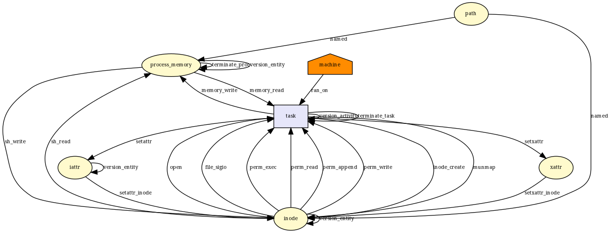 |["file_open", "file_send_sigiotask", "inode_create", "inode_follow_link", "inode_free", "inode_killpriv", "inode_need_killpriv", "inode_permission", "inode_setattr", "kernel_module_request", "mmap_addr", "mmap_munmap", "sb_free", "task_free", "vm_enough_memory_mm"]|["file_open", "file_send_sigiotask", "inode_create", "inode_free", "inode_permission", "inode_setattr", "mmap_munmap", "sb_free", "task_free"]|["inode_follow_link", "inode_killpriv", "inode_need_killpriv", "kernel_module_request", "mmap_addr", "vm_enough_memory_mm"]|9/15|
__x64_sys_sysctl|  |["file_send_sigiotask", "task_free"]|["file_send_sigiotask", "task_free"]|[]|2/2|
__x64_sys_sysinfo|  |["file_send_sigiotask", "task_free"]|["file_send_sigiotask", "task_free"]|[]|2/2|
__x64_sys_sysfs|  |["file_send_sigiotask", "task_free"]|["file_send_sigiotask", "task_free"]|[]|2/2|
__x64_sys_syslog|  |["file_send_sigiotask", "syslog", "task_free"]|["file_send_sigiotask", "task_free"]|["syslog"]|2/3|
__x64_sys_add_key|  |["file_send_sigiotask", "key_alloc", "key_permission", "prepare_creds", "sock_rcv_skb", "task_free"]|["file_send_sigiotask", "prepare_creds", "sock_rcv_skb", "task_free"]|["key_alloc", "key_permission"]|4/6|
__x64_sys_request_key|  |["file_send_sigiotask", "key_alloc", "key_permission", "prepare_creds", "sock_rcv_skb", "task_free"]|["file_send_sigiotask", "prepare_creds", "sock_rcv_skb", "task_free"]|["key_alloc", "key_permission"]|4/6|
__x64_sys_keyctl|  |["cred_alloc_blank", "file_send_sigiotask", "kernel_module_request", "key_alloc", "key_getsecurity", "key_permission", "prepare_creds", "sock_rcv_skb", "task_free"]|["cred_alloc_blank", "file_send_sigiotask", "prepare_creds", "sock_rcv_skb", "task_free"]|["kernel_module_request", "key_alloc", "key_getsecurity", "key_permission"]|5/9|
__x64_sys_ioprio_set|  |["file_send_sigiotask", "task_free", "task_setioprio"]|["file_send_sigiotask", "task_free"]|["task_setioprio"]|2/3|
__x64_sys_ioprio_get|  |["file_send_sigiotask", "task_free", "task_getioprio"]|["file_send_sigiotask", "task_free"]|["task_getioprio"]|2/3|
__x64_sys_set_mempolicy|  |["file_send_sigiotask", "task_free"]|["file_send_sigiotask", "task_free"]|[]|2/2|
__x64_sys_migrate_pages|  |["file_send_sigiotask", "inode_free", "mmap_addr", "mmap_munmap", "ptrace_access_check", "task_free", "task_movememory", "vm_enough_memory_mm"]|["file_send_sigiotask", "inode_free", "mmap_munmap", "task_free"]|["mmap_addr", "ptrace_access_check", "task_movememory", "vm_enough_memory_mm"]|4/8|
__x64_sys_move_pages|  |["file_send_sigiotask", "inode_free", "mmap_addr", "mmap_munmap", "ptrace_access_check", "task_free", "task_movememory", "vm_enough_memory_mm"]|["file_send_sigiotask", "inode_free", "mmap_munmap", "task_free"]|["mmap_addr", "ptrace_access_check", "task_movememory", "vm_enough_memory_mm"]|4/8|
__x64_sys_mbind|  |["file_send_sigiotask", "inode_free", "mmap_addr", "task_free", "vm_enough_memory_mm"]|["file_send_sigiotask", "inode_free", "task_free"]|["mmap_addr", "vm_enough_memory_mm"]|3/5|
__x64_sys_get_mempolicy|  |["file_send_sigiotask", "mmap_addr", "task_free", "vm_enough_memory_mm"]|["file_send_sigiotask", "task_free"]|["mmap_addr", "vm_enough_memory_mm"]|2/4|
__x64_sys_inotify_init|  |["d_instantiate", "file_send_sigiotask", "inode_free", "sb_free", "task_free"]|["file_send_sigiotask", "inode_free", "sb_free", "task_free"]|["d_instantiate"]|4/5|
__x64_sys_inotify_init1|  |["d_instantiate", "file_send_sigiotask", "inode_free", "sb_free", "task_free"]|["file_send_sigiotask", "inode_free", "sb_free", "task_free"]|["d_instantiate"]|4/5|
__x64_sys_inotify_add_watch|  |["file_send_sigiotask", "inode_follow_link", "inode_free", "inode_permission", "sb_free", "task_free"]|["file_send_sigiotask", "inode_free", "inode_permission", "sb_free", "task_free"]|["inode_follow_link"]|5/6|
__x64_sys_inotify_rm_watch|  |["file_send_sigiotask", "inode_free", "task_free"]|["file_send_sigiotask", "inode_free", "task_free"]|[]|3/3|
__x64_sys_futimesat|  |["file_send_sigiotask", "inode_follow_link", "inode_free", "inode_killpriv", "inode_need_killpriv", "inode_permission", "inode_setattr", "sb_free", "task_free"]|["file_send_sigiotask", "inode_free", "inode_permission", "inode_setattr", "sb_free", "task_free"]|["inode_follow_link", "inode_killpriv", "inode_need_killpriv"]|6/9|
__x64_sys_newfstatat|  |["file_send_sigiotask", "inode_follow_link", "inode_free", "inode_getattr", "inode_permission", "sb_free", "task_free"]|["file_send_sigiotask", "inode_free", "inode_getattr", "inode_permission", "sb_free", "task_free"]|["inode_follow_link"]|6/7|
__x64_sys_readlinkat|  |["file_send_sigiotask", "inode_follow_link", "inode_free", "inode_permission", "inode_readlink", "sb_free", "task_free"]|["file_send_sigiotask", "inode_free", "inode_permission", "inode_readlink", "sb_free", "task_free"]|["inode_follow_link"]|6/7|
__x64_sys_utimensat|  |["file_send_sigiotask", "inode_follow_link", "inode_free", "inode_killpriv", "inode_need_killpriv", "inode_permission", "inode_setattr", "sb_free", "task_free"]|["file_send_sigiotask", "inode_free", "inode_permission", "inode_setattr", "sb_free", "task_free"]|["inode_follow_link", "inode_killpriv", "inode_need_killpriv"]|6/9|
__x64_sys_sync_file_range|  |["file_send_sigiotask", "task_free"]|["file_send_sigiotask", "task_free"]|[]|2/2|
__x64_sys_sync_file_range2|  |["file_send_sigiotask", "task_free"]|["file_send_sigiotask", "task_free"]|[]|2/2|
__x64_sys_get_robust_list|  |["file_send_sigiotask", "ptrace_access_check", "task_free"]|["file_send_sigiotask", "task_free"]|["ptrace_access_check"]|2/3|
__x64_sys_set_robust_list|  |[]|[]|[]|0/0|
__x64_sys_signalfd|  |["d_instantiate", "file_send_sigiotask", "inode_free", "sb_free", "task_free"]|["file_send_sigiotask", "inode_free", "sb_free", "task_free"]|["d_instantiate"]|4/5|
__x64_sys_signalfd4|  |["d_instantiate", "file_send_sigiotask", "inode_free", "sb_free", "task_free"]|["file_send_sigiotask", "inode_free", "sb_free", "task_free"]|["d_instantiate"]|4/5|
__x64_sys_timerfd_create|  |["d_instantiate", "file_send_sigiotask", "inode_free", "sb_free", "task_free"]|["file_send_sigiotask", "inode_free", "sb_free", "task_free"]|["d_instantiate"]|4/5|
__x64_sys_timerfd_settime|  |["file_send_sigiotask", "task_free"]|["file_send_sigiotask", "task_free"]|[]|2/2|
__x64_sys_timerfd_gettime|  |["file_send_sigiotask", "task_free"]|["file_send_sigiotask", "task_free"]|[]|2/2|
__x64_sys_eventfd|  |["d_instantiate", "file_send_sigiotask", "inode_free", "sb_free", "task_free"]|["file_send_sigiotask", "inode_free", "sb_free", "task_free"]|["d_instantiate"]|4/5|
__x64_sys_eventfd2|  |["d_instantiate", "file_send_sigiotask", "inode_free", "sb_free", "task_free"]|["file_send_sigiotask", "inode_free", "sb_free", "task_free"]|["d_instantiate"]|4/5|
__x64_sys_memfd_create|  |["d_instantiate", "file_send_sigiotask", "inode_alloc", "inode_free", "sb_free", "task_free", "vm_enough_memory_mm"]|["file_send_sigiotask", "inode_alloc", "inode_free", "sb_free", "task_free"]|["d_instantiate", "vm_enough_memory_mm"]|5/7|
__x64_sys_userfaultfd|  |["d_instantiate", "file_send_sigiotask", "inode_free", "sb_free", "task_free"]|["file_send_sigiotask", "inode_free", "sb_free", "task_free"]|["d_instantiate"]|4/5|
__x64_sys_old_readdir|  |["file_permission", "file_send_sigiotask", "inode_free", "task_free"]|["file_permission", "file_send_sigiotask", "inode_free", "task_free"]|[]|4/4|
__x64_sys_fanotify_init|  |["d_instantiate", "file_send_sigiotask", "inode_free", "sb_free", "task_free"]|["file_send_sigiotask", "inode_free", "sb_free", "task_free"]|["d_instantiate"]|4/5|
__x64_sys_fanotify_mark|  |["file_send_sigiotask", "inode_follow_link", "inode_free", "inode_permission", "sb_free", "task_free"]|["file_send_sigiotask", "inode_free", "inode_permission", "sb_free", "task_free"]|["inode_follow_link"]|5/6|
__x64_sys_syncfs|  |["file_send_sigiotask", "inode_free", "task_free"]|["file_send_sigiotask", "inode_free", "task_free"]|[]|3/3|
__x64_sys_perf_event_open|  |["d_instantiate", "file_send_sigiotask", "inode_free", "ptrace_access_check", "sb_free", "task_free"]|["file_send_sigiotask", "inode_free", "sb_free", "task_free"]|["d_instantiate", "ptrace_access_check"]|4/6|
__x64_sys_name_to_handle_at|  |["file_send_sigiotask", "inode_follow_link", "inode_free", "inode_permission", "sb_free", "task_free"]|["file_send_sigiotask", "inode_free", "inode_permission", "sb_free", "task_free"]|["inode_follow_link"]|5/6|
__x64_sys_open_by_handle_at|  |["file_open", "file_permission", "file_send_sigiotask", "inode_create", "inode_follow_link", "inode_free", "inode_killpriv", "inode_need_killpriv", "inode_permission", "inode_setattr", "kernel_module_request", "sb_free", "task_free"]|["file_open", "file_permission", "file_send_sigiotask", "inode_create", "inode_free", "inode_permission", "inode_setattr", "sb_free", "task_free"]|["inode_follow_link", "inode_killpriv", "inode_need_killpriv", "kernel_module_request"]|9/13|
__x64_sys_setns|  |["d_instantiate", "file_send_sigiotask", "inode_alloc", "inode_free", "sb_copy_data", "sb_free", "sb_kern_mount", "sock_rcv_skb", "task_free"]|["file_send_sigiotask", "inode_alloc", "inode_free", "sb_free", "sock_rcv_skb", "task_free"]|["d_instantiate", "sb_copy_data", "sb_kern_mount"]|6/9|
__x64_sys_seccomp|  |["file_send_sigiotask", "sock_rcv_skb", "task_free"]|["file_send_sigiotask", "sock_rcv_skb", "task_free"]|[]|3/3|
__x64_sys_getrandom|  |["file_send_sigiotask", "task_free"]|["file_send_sigiotask", "task_free"]|[]|2/2|
__x64_sys_bpf|  |["bpf", "bpf_map", "bpf_map_alloc", "bpf_map_free", "bpf_prog", "bpf_prog_alloc", "bpf_prog_free", "d_instantiate", "file_send_sigiotask", "inode_alloc", "inode_create", "inode_follow_link", "inode_free", "inode_permission", "sb_free", "sock_rcv_skb", "task_free"]|["file_send_sigiotask", "inode_alloc", "inode_create", "inode_free", "inode_permission", "sb_free", "sock_rcv_skb", "task_free"]|["bpf", "bpf_map", "bpf_map_alloc", "bpf_map_free", "bpf_prog", "bpf_prog_alloc", "bpf_prog_free", "d_instantiate", "inode_follow_link"]|8/17|
__x64_sys_membarrier|  |["file_send_sigiotask", "task_free"]|["file_send_sigiotask", "task_free"]|[]|2/2|
__x64_sys_mlock2|  |["file_send_sigiotask", "inode_free", "mmap_addr", "task_free", "vm_enough_memory_mm"]|["file_send_sigiotask", "inode_free", "task_free"]|["mmap_addr", "vm_enough_memory_mm"]|3/5|
__x64_sys_statx|  |["file_send_sigiotask", "inode_follow_link", "inode_free", "inode_getattr", "inode_permission", "sb_free", "task_free"]|["file_send_sigiotask", "inode_free", "inode_getattr", "inode_permission", "sb_free", "task_free"]|["inode_follow_link"]|6/7|
__x64_sys_shutdown|  |["file_send_sigiotask", "socket_shutdown", "task_free"]|["file_send_sigiotask", "task_free"]|["socket_shutdown"]|2/3|
__x64_sys_setsockopt|  |["file_send_sigiotask", "sock_rcv_skb", "socket_setsockopt", "task_free"]|["file_send_sigiotask", "sock_rcv_skb", "task_free"]|["socket_setsockopt"]|3/4|
__x64_sys_getsockopt|  |["file_send_sigiotask", "socket_getpeersec_stream", "socket_getsockopt", "task_free"]|["file_send_sigiotask", "task_free"]|["socket_getpeersec_stream", "socket_getsockopt"]|2/4|
__x64_sys_bind| 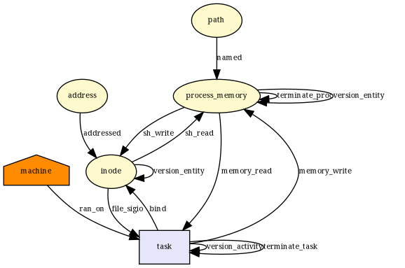 |["file_send_sigiotask", "socket_bind", "task_free"]|["file_send_sigiotask", "socket_bind", "task_free"]|[]|3/3|
__x64_sys_connect|  |["file_send_sigiotask", "socket_connect", "task_free"]|["file_send_sigiotask", "socket_connect", "task_free"]|[]|3/3|
__x64_sys_accept|  |["d_instantiate", "file_send_sigiotask", "inode_alloc", "inode_free", "sb_free", "socket_accept", "task_free"]|["file_send_sigiotask", "inode_alloc", "inode_free", "sb_free", "socket_accept", "task_free"]|["d_instantiate"]|6/7|
__x64_sys_accept4|  |["d_instantiate", "file_send_sigiotask", "inode_alloc", "inode_free", "sb_free", "socket_accept", "task_free"]|["file_send_sigiotask", "inode_alloc", "inode_free", "sb_free", "socket_accept", "task_free"]|["d_instantiate"]|6/7|
__x64_sys_getsockname|  |["file_send_sigiotask", "socket_getsockname", "task_free"]|["file_send_sigiotask", "task_free"]|["socket_getsockname"]|2/3|
__x64_sys_getpeername|  |["file_send_sigiotask", "socket_getpeername", "task_free"]|["file_send_sigiotask", "task_free"]|["socket_getpeername"]|2/3|
__x64_sys_send|  |["file_send_sigiotask", "socket_sendmsg", "socket_sendmsg_always", "task_free"]|["file_send_sigiotask", "socket_sendmsg", "socket_sendmsg_always", "task_free"]|[]|4/4|
__x64_sys_sendto|  |["file_send_sigiotask", "socket_sendmsg", "socket_sendmsg_always", "task_free"]|["file_send_sigiotask", "socket_sendmsg", "socket_sendmsg_always", "task_free"]|[]|4/4|
__x64_sys_sendmsg|  |["file_send_sigiotask", "socket_sendmsg", "socket_sendmsg_always", "task_free"]|["file_send_sigiotask", "socket_sendmsg", "socket_sendmsg_always", "task_free"]|[]|4/4|
__x64_sys_sendmmsg| 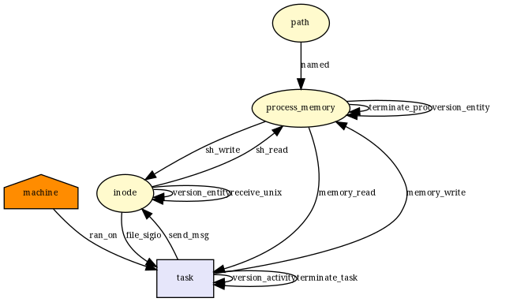 |["file_send_sigiotask", "socket_sendmsg", "socket_sendmsg_always", "task_free"]|["file_send_sigiotask", "socket_sendmsg", "socket_sendmsg_always", "task_free"]|[]|4/4|
__x64_sys_recv|  |["file_send_sigiotask", "socket_recvmsg", "socket_recvmsg_always", "task_free"]|["file_send_sigiotask", "socket_recvmsg", "socket_recvmsg_always", "task_free"]|[]|4/4|
__x64_sys_recvfrom|  |["file_send_sigiotask", "socket_recvmsg", "socket_recvmsg_always", "task_free"]|["file_send_sigiotask", "socket_recvmsg", "socket_recvmsg_always", "task_free"]|[]|4/4|
__x64_sys_recvmsg|  |["file_send_sigiotask", "task_free"]|["file_send_sigiotask", "task_free"]|[]|2/2|
__x64_sys_recvmmsg|  |["file_send_sigiotask", "task_free"]|["file_send_sigiotask", "task_free"]|[]|2/2|
__x64_sys_socket|  |["d_instantiate", "file_send_sigiotask", "inode_alloc", "inode_free", "kernel_module_request", "sb_free", "socket_create", "socket_post_create", "task_free"]|["file_send_sigiotask", "inode_alloc", "inode_free", "sb_free", "socket_post_create", "task_free"]|["d_instantiate", "kernel_module_request", "socket_create"]|6/9|
__x64_sys_socketpair| 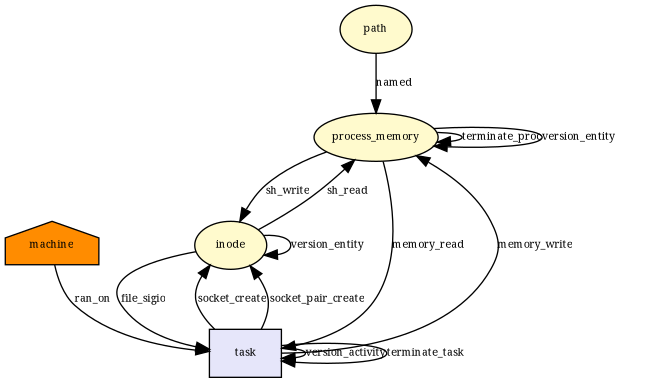 |["d_instantiate", "file_send_sigiotask", "inode_alloc", "inode_free", "kernel_module_request", "sb_free", "socket_create", "socket_post_create", "socket_socketpair", "task_free"]|["file_send_sigiotask", "inode_alloc", "inode_free", "sb_free", "socket_post_create", "socket_socketpair", "task_free"]|["d_instantiate", "kernel_module_request", "socket_create"]|7/10|
__x64_sys_socketcall|  |["d_instantiate", "file_send_sigiotask", "inode_alloc", "inode_free", "kernel_module_request", "sb_free", "sock_rcv_skb", "socket_accept", "socket_bind", "socket_connect", "socket_create", "socket_getpeername", "socket_getpeersec_stream", "socket_getsockname", "socket_getsockopt", "socket_listen", "socket_post_create", "socket_recvmsg", "socket_recvmsg_always", "socket_sendmsg", "socket_sendmsg_always", "socket_setsockopt", "socket_shutdown", "socket_socketpair", "task_free"]|["file_send_sigiotask", "inode_alloc", "inode_free", "sb_free", "sock_rcv_skb", "socket_accept", "socket_bind", "socket_connect", "socket_listen", "socket_post_create", "socket_recvmsg", "socket_recvmsg_always", "socket_sendmsg", "socket_sendmsg_always", "socket_socketpair", "task_free"]|["d_instantiate", "kernel_module_request", "socket_create", "socket_getpeername", "socket_getpeersec_stream", "socket_getsockname", "socket_getsockopt", "socket_setsockopt", "socket_shutdown"]|16/25|
__x64_sys_listen|  |["file_send_sigiotask", "socket_listen", "task_free"]|["file_send_sigiotask", "socket_listen", "task_free"]|[]|3/3|
