# LSM hooks implemented by CamFlow

Automatically generated do not edit!

LSM Hook|Graph|
--------|-----|
cred_free| 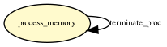|
cred_alloc_blank| |
cred_prepare| 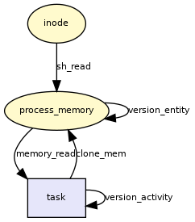|
cred_transfer| |
task_alloc| 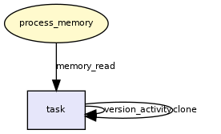|
task_free| |
task_fix_setuid| 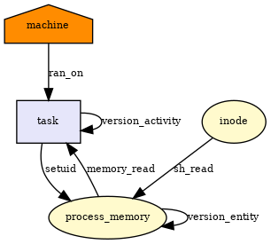|
task_setpgid| 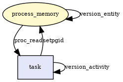|
task_getpgid| 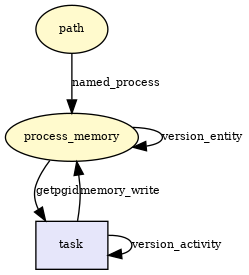|
task_kill| 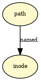|
ptrace_access_check| 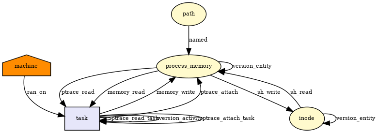|
ptrace_traceme| 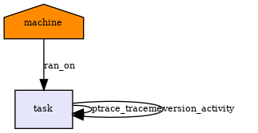|
inode_alloc_security| |
inode_create| 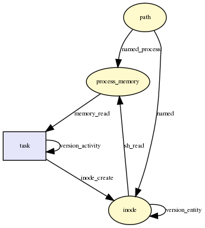|
inode_free_security| 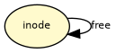|
inode_permission| 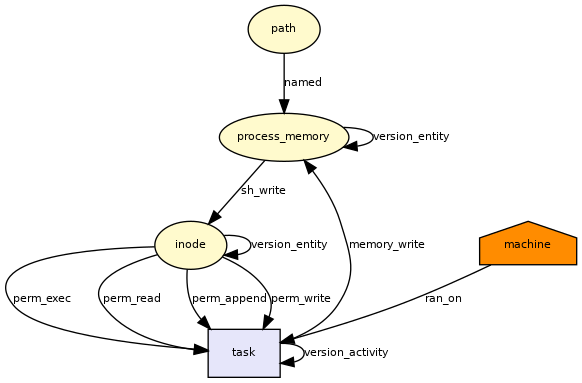|
inode_link| 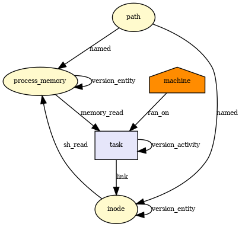|
inode_unlink| 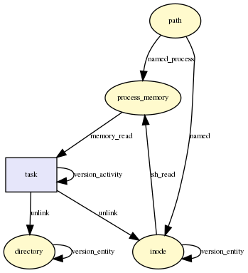|
inode_symlink| 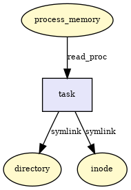|
inode_rename| 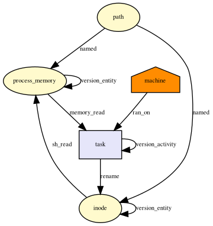|
inode_setattr| 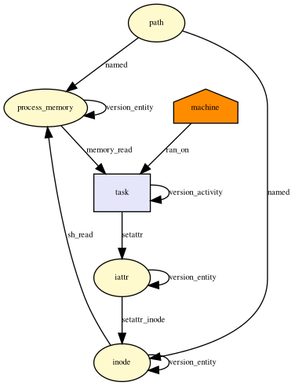|
inode_getattr| |
inode_readlink| 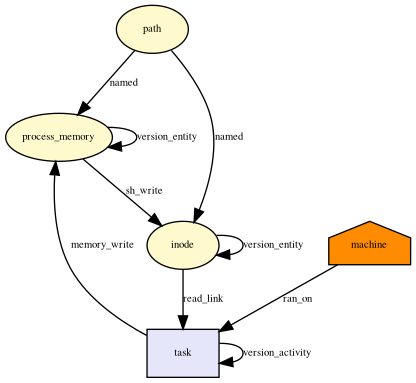|
inode_setxattr| 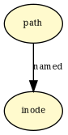|
inode_post_setxattr| 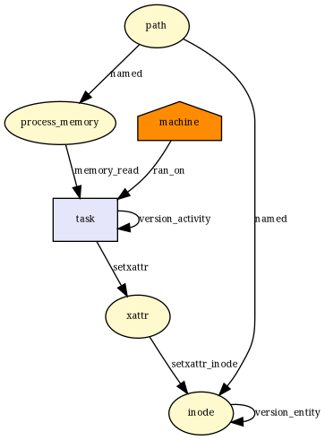|
inode_getxattr| 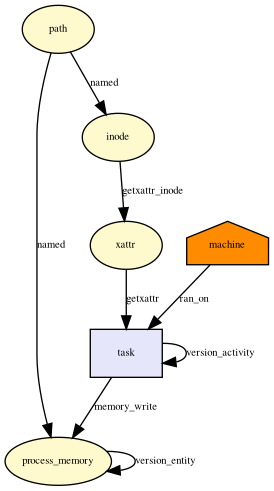|
inode_listxattr| |
inode_removexattr| 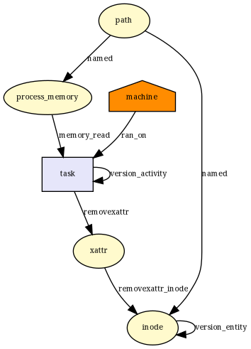|
inode_getsecurity| 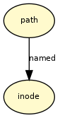|
inode_listsecurity| |
file_permission| 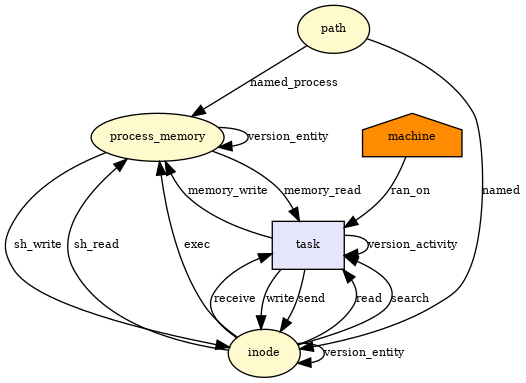|
mmap_file| 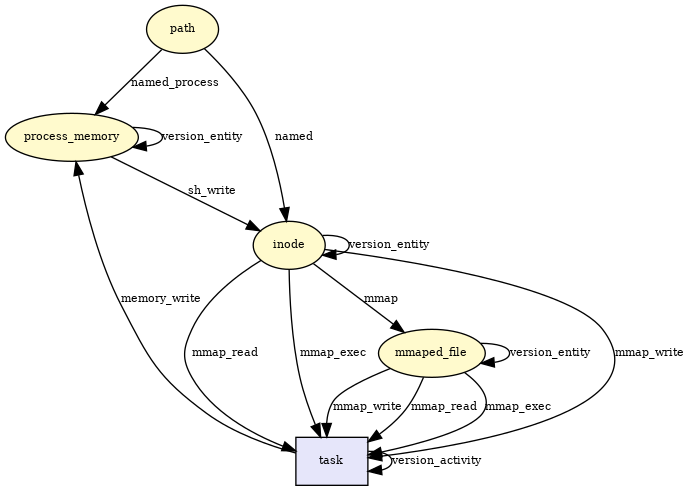|
mmap_munmap| 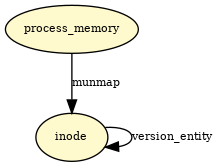|
file_ioctl| 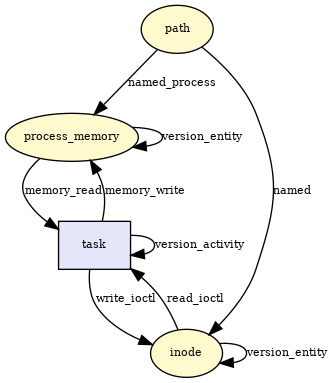|
file_open| 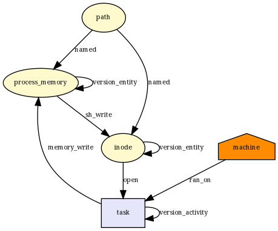|
file_receive| |
file_lock| 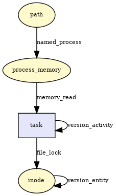|
file_send_sigiotask| 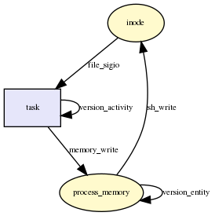|
file_splice_pipe_to_pipe| 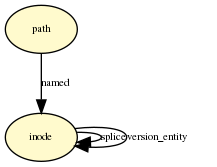|
kernel_read_file| 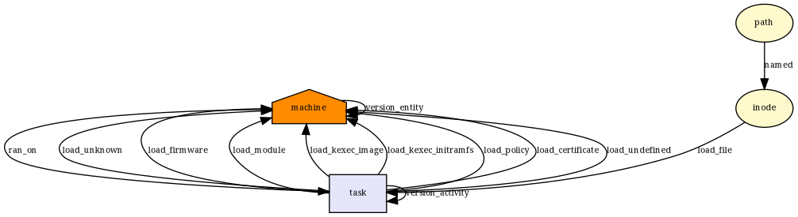|
msg_msg_alloc_security| 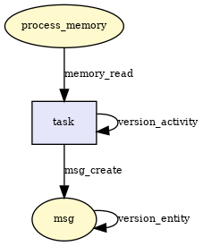|
msg_msg_free_security| 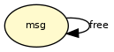|
msg_queue_msgsnd| 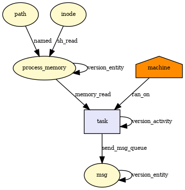|
msg_queue_msgrcv| 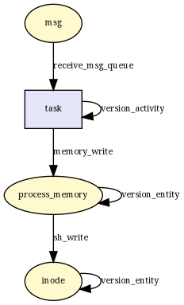|
shm_alloc_security| 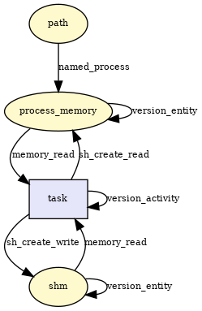|
shm_free_security| 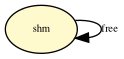|
shm_shmat| 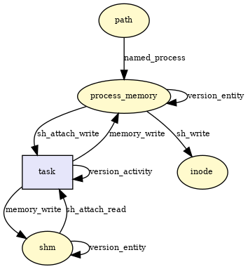|
shm_shmdt| 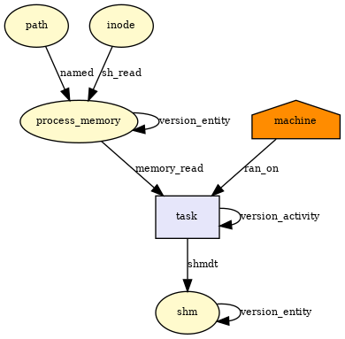|
sk_alloc_security| 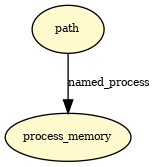|
socket_post_create| 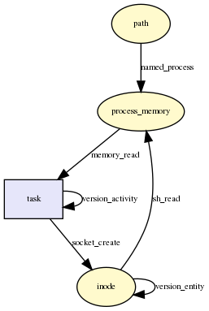|
socket_socketpair| 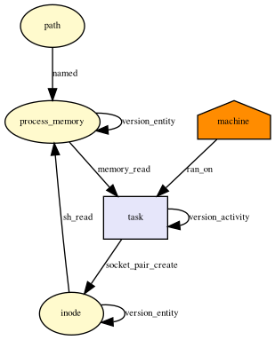|
socket_bind| 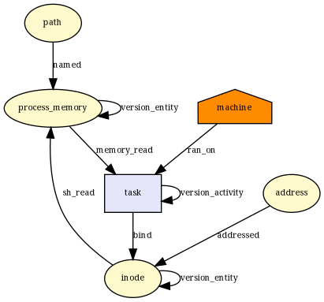|
socket_connect| 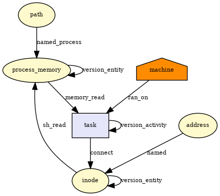|
socket_listen| |
socket_accept| 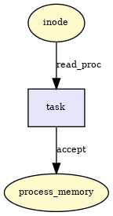|
socket_sendmsg_always| 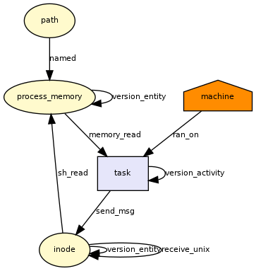|
socket_recvmsg_always| 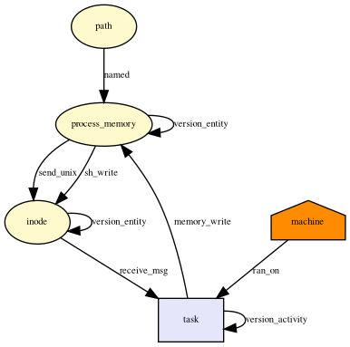|
mq_timedreceive| 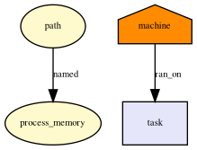|
mq_timedsend| 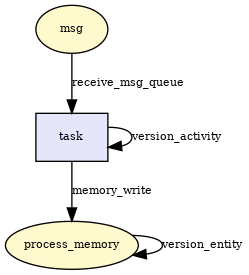|
socket_sendmsg| |
socket_recvmsg| |
socket_sock_rcv_skb| |
unix_stream_connect| |
unix_may_send| |
bprm_check_security| |
bprm_creds_for_exec| |
bprm_committing_creds| |
sb_alloc_security| |
sb_free_security| |
